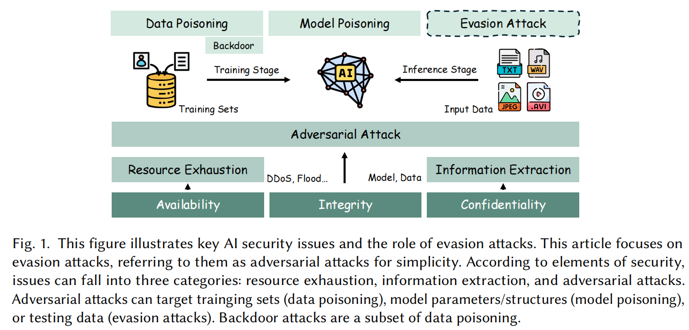
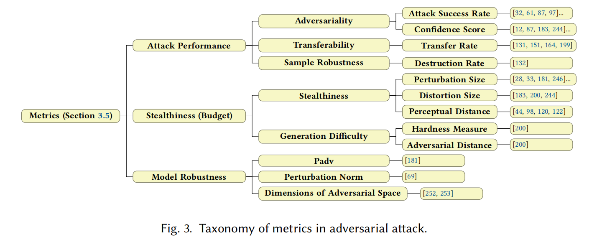

---

date: 2025-10-24
category:
  - 码头
tag:
  - 对抗攻击样本
  - 经典论文
---

# 对抗攻击推荐论文

## [Adversarial Attacks of Vision Tasks in the Past 10 Years: A Survey（2025）](https://arxiv.org/abs/2410.23687)

<b>背景</b>

深度学习的安全性可从三个维度来划分：可用性（availability）、机密性（confidentiality）与完整性（integrity）。

- 可用性攻击 旨在耗尽系统资源（如 DDoS 、Flood 或针对 GPU 资源的能耗-延迟攻击 [76]）。

- 机密性攻击 涉及窃取内部数据，如通过模型或数据提取 [254] 获得模型参数或训练集。若目标是个体数据或统计信息，数据提取可进一步划分为成员推理攻击（membership inference [238]）与模型反演攻击（model inversion [71]）。

- 完整性攻击 主要受到对抗攻击的威胁。对抗攻击一般可分为 **投毒（poisoning）与逃避（evasion）** 两类。

在投毒攻击中，攻击者可：向**训练集注入恶意数据（数据投毒）**，或直接**篡改模型结构或参数（模型投毒）**，从而破坏预测行为。

逃避攻击则发生在推理阶段，攻击者在输入端施加微小扰动，使模型产生错误输出。投毒攻击的一个子类是后门攻击（backdoor attack），即在模型中植入隐藏触发器，使模型仅在特定模式下误判，从而提高隐蔽性。

<b>对抗性、可迁移性与泛化性</b>

作者认为对抗样本有三个关键属性：
- 对抗性（Adversariality）：指样本导致模型产生错误预测的特性；
- 可迁移性（Transferability）：指对抗样本（Adversarial Examples, AEs）对多个模型都有效的能力；
- 泛化性（Generalization）：进一步扩展到跨图像与跨环境的普适性。

**对抗性：**
1. 神经网络的线性本质：尽管 DNN 含有非线性激活函数，但在高维空间中仍表现出强线性行为，这在很大程度上导致了对抗样本的存在。考虑线性模型 $y=(w+\delta)+b$，当扰动 $\delta$ 的方向与模型参数 $w$ 一致时，即使 $\delta$ 极小也会使得输出 $y$ 发生巨大的变化。

1. 高维空间盲点与模型过拟合（Blind Spots or Overfitting）：由于训练数据无法覆盖整个输入域，模型会在未学习到的区域产生“盲点”，或在数据流形附近过拟合

1. 决策边界附近的高梯度（Large Gradient Around Decision Boundaries）：在决策边界附近，微小的输入扰动可能引起预测结果的大幅变化，因而这些点极易成为 AEs。

1. 神经网络对高频信号的敏感性（Sensitivity to High-Frequency Signals）：数据集中高频成分（High-Frequency Components, HFC）往往与图像语义信息存在相关性，模型在学习时容易依赖这些高频细节。由于 HFC 对人类几乎不可察觉，模型若对其依赖，就容易生成利用这种高频敏感性的对抗样本。因此，HFC 解释了模型泛化行为与人类直觉相悖的根源。

**可迁移性：**
1. 不同模型学习了相似的知识
1. AEs 在高维空间的密集区域聚集
1. 不同模型的对抗子空间存在重叠

**泛化性：**
1. 跨模型泛化（Cross-Model, 即可迁移性）：样本在不同模型间仍保持对抗性，这也是常说的迁移性

1. 跨图像泛化（Cross-Image, 即通用扰动）：指单一扰动可对多张图像产生攻击效果，即通用对抗扰动：（Universal Adversarial Perturbation, UAP）

1. 跨环境泛化（Cross-Environment, 即物理鲁棒性）：样本在不同距离、角度、光照及设备条件下仍保持对抗性，通常称为物理鲁棒性（physical robustness）

1. 跨提示泛化（Cross-Prompt）：使图像在不同文本提示（prompts）下仍能保持对抗性

1. 跨语料泛化（Cross-Corpus）：通过与恶意语料对齐，使图像学习到通用的对抗语义，从而在不同提示下都能起作用。

<b>问题设置</b>

**攻击者的能力：**

- 白盒（White-box）攻击：攻击者拥有对受害模型的完全访问权限，包括模型架构、参数、训练数据集、优化策略等全部信息。

- 灰盒（Gray-box）攻击：攻击者仅能获得部分信息，或能通过查询获取有限反馈（如预测标签或置信度）。部分知识可包括模型部分结构、部分参数、部分数据集或部分训练策略。

- 黑盒（Black-box）攻击：攻击者对目标模型完全不了解，只能依赖公开信息或经验进行推测。

::: note 更细致的区分
基于查询（Query-based） 的方法被视为灰盒攻击，因为攻击者可从模型中直接获取部分信息；

基于迁移（Transfer-based） 的方法被划为黑盒攻击，因为攻击者仅利用代理模型生成样本，从未直接接触或查询目标模型。
:::

**攻击者的目标：**

- 定向攻击（Targeted Attack）：强迫模型输出攻击者指定的目标类别。
- 非定向攻击（Untargeted Attack）：仅要求模型的输出偏离原正确结果即可。

**受害模型：**

- 普通模型（Normal Models, N）：无防护机制的模型，包括：不可微模型（如决策树、kNN）；各类深度网络结构：全连接（FC）、卷积神经网络（CNN）、视觉Transformer（ViT）、CLIP、以及生成模型如 VAE和 GAN。

- 对抗训练模型（Adversarially Trained Models, AT）；通过在训练阶段引入 AEs 进行数据增强来提高鲁棒性。使用多模型的对抗样本进行增强，或引入平滑扰动、平滑分类样本以进一步强化鲁棒性。

- 防御模型（Defensive Models, DD / DM）：具有防御策略的模型分为两类：检测型防御（Detection-based, DD）：识别并检测输入是否为 AE；修正型防御（Modification-based, DM）：通过图像变换“清洗”输入以破坏扰动。此外还有基于去噪器（denoiser）的防御方法，例如 U-Net 或扩散模型 DiffPure，可恢复“干净”样本。综合防御（如 DeM、NIPS-r3）通常将对抗训练与这些机制结合使用。

::: note 常见的图像变换与去噪策略
图像变换（Transformation）：位深压缩【95, 168, 291】、平滑【291】、裁剪【95】、缩放【95】、填充【284】、重组【95】；

去噪（Denoising）：利用 U-Net 自动编码器去除扰动【115, 155, 184】；

DiffPure 通过扩散模型进行去噪【188】；

选择性分类器 可通过拒绝预测【83】或重新训练【22】过滤可疑样本，从而提升鲁棒性。
:::

| 模型类别| 代表模型 | 特征说明| 
| :---- | :----- | :---- | 
|ND 模型|决策树、kNN|不可微|
|N-Basic CNNs|VGG、WRN|基础卷积网络|
|N-Basic ViTs|ViT-B、Swin|视觉Transformer|
|CLIP||对比学习+Transformer|
|VAE/VAE-GAN||自编码或生成模型|
|AT 模型|Inc-v3adv、IncRes-v2adv 等|单模型对抗训练|
|Ensemble ATs|Inc-v3ens3, ens4, IncRes-v2ens|集成对抗训练|
|RS / ARS / ALP||各种鲁棒训练方案|
|DD / DM 模型|Bit-Red、JPEG、R&P、FD、NRP、HGD、ComDefend、DiffPure、DeM、NIPS-r3|检测与变换/去噪型防御|

（表格译注：N, AT, Archi, Trans, Deno 分别表示普通、对抗训练、结构、变换、去噪。）

**任务与数据集**

任务大致可分为两类：

1. 以分类为中心的任务：分类、检测、分割、人脸识别；

1. 多模态任务：图文检索（Image-Text Retrieval, ITR）。

分类任务历来是对抗攻击的核心研究方向，而多模态任务是新兴热点。常用数据集如下：

| 数据集 | 规模 | 任务类型 | 特征/关键词 |
|---|---:|:---:|---|
| CIFAR-10 / 100 | 6万 | C | 自然图像 |
| ImageNet | 1400万 | C | 自然图像 |
| ILSVRC 2012 | 120万 | C | ImageNet子集 |
| ImgNet-Com | 1k | C | NIPS2017竞赛使用 |
| MNIST | 7万 | C | 手写数字 |
| SVHN | 10万 | C | 门牌号 |
| GTSRB | 5.1万 | C | 交通标志 |
| LISA | 7.3k | C | 道路标志 |
| CelebA / LFW / PubFig | 13k–58k | FR | 人脸识别 |
| Pascal VOC | 11k | D / S | 图像检测、分割 |
| Cityscapes | 25k | S | 城市街景分割 |
| Wikipedia / NUS-WIDE / XmediaNet | 45k–270k | ITR | 图文对齐任务 |

（注：C = 分类，D = 检测，S = 分割，FR = 人脸识别，ITR = 图文检索。）

**评估指标**

对抗攻击常用的评价指标体系，主要分为三大类：

::: info 攻击性能指标（Attack Performance）
1. 对抗性（Adversariality）
- 攻击成功率（Attack Success Rate, ASR）;
- 模型置信度（Confidence Score）

2. 迁移性（Transferability）
- 迁移率（Transfer Rate）

3. 样本鲁棒性（Sample Robustness）
- 破坏率（Destruction Rate）：样本经物理变换后失效的比例
:::

::: info 隐蔽性与扰动预算（Stealthiness / Budget）
- 扰动幅度（Perturbation Size）：常以 $L_p$ 范数衡量
- 失真范围（Distortion Size）：受影响像素数量
- 感知距离（Perceptual Distance）：如 SSIM、LPIPS 等
:::

::: info 模型鲁棒性指标（Model Robustness）
- Padv：测试样本到最近决策边界的平均距离
- 扰动范数（Perturbation Norm）：衡量模型抗扰能力
- 对抗子空间维度（Dimensions of Adversarial Space）：维度越高，模型越脆弱
:::

## 另：经典论文推荐
[Nicholas Carlini](https://nicholas.carlini.com/)推荐阅读的[论文列表](https://nicholas.carlini.com/writing/2018/adversarial-machine-learning-reading-list.html)，可熟悉机器学习系统对抗攻击的特定子领域

### Preliminary Papers

#### [Evasion Attacks against Machine Learning at Test Time(*LNCS 2017*)](https://arxiv.org/abs/1708.06131)

本文选择了一种直接的方式来研究分类算法的脆弱性：通过构造逃避攻击（evasion attack），让攻击者在测试阶段通过修改恶意样本来逃避检测。

#### [Intriguing properties of neural networks(*2014*)](https://arxiv.org/abs/1312.6199)

#### [Explaining and Harnessing Adversarial Examples(*ICLR 2015*)](https://arxiv.org/abs/1412.6572)

#### [论文题目(简写) [*会议/期刊名 年份*]](下载链接)

**MOTIVATION：**

---

### Attacks [requires Preliminary Papers]

