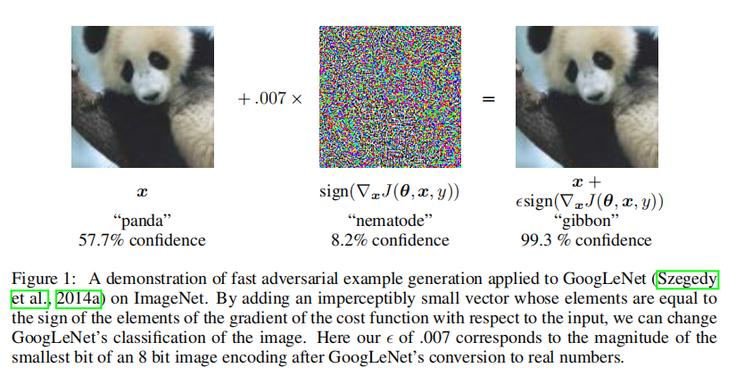
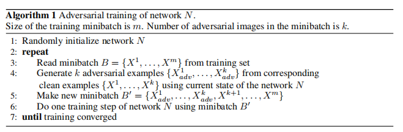
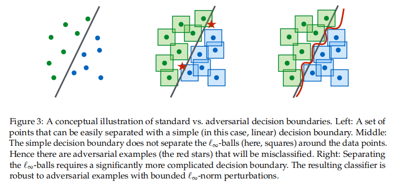
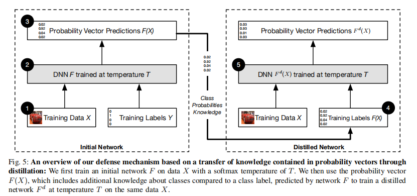

---

date: 2025-09-29
category:
  - 码头
tag:
  - 对抗攻击样本
  - 经典论文
---


# 对抗攻击经典论文

---
## [Explaining and harnessing adversarial examples(FGSM) [ *ICLR 2015* ]](https://arxiv.org/abs/1412.6572)     

**MOTIVATION:**
机器学习模型容易受到对抗性扰动的根本原因在于网络的线性部分(可能还源于模型平均不足或者监督学习问题正则化不足) 。
作者认为，在高维空间中，即使是微小的线性扰动，也会在最终输出上累积成一个巨大的变化。

本文找出了网络的共性：由于训练资源的不足，因此大部分网络都是以"线性"的方式呈现(那当前LLM基于transformer的共性？)。



### 代码实现：

``` PYTHON
def attack(self):
    perturbed_img=[]
    perturbed_label=[]
    org_img=[]
    org_label=[]
    wrong=0
    right=0
    success=0
    for i,(img,label) in enumerate(self.data()):
        if i==self.num_size:
            break
        tensor_img = paddle.to_tensor(img)
        tensor_label=paddle.to_tensor(label)
        tensor_img.stop_gradient = False
        predict = self.model(tensor_img)
        pred=predict.argmax(axis=1)
        if pred == tensor_label:#如果被正确分类则执行攻击
            right+=1
            loss = self.criterion(predict, tensor_label)
            loss.backward()
            grad = paddle.to_tensor(tensor_img.grad)
            grad = paddle.sign(grad)
            adv_img = tensor_img + self.epsilon * grad
            #攻击完成之后再次预测
            predict = self.model(adv_img)
            pred=predict.argmax(axis=1)
            if pred!=tensor_label:
                success+=1
                #将攻击后的图片保存下来
                adv_img=paddle.transpose(adv_img,perm=[0,2,3,1]).numpy()
                tensor_img=paddle.transpose(tensor_img,perm=[0,2,3,1]).numpy()
                adv_img=np.squeeze(adv_img)
                tensor_img=np.squeeze(tensor_img)
                adv_img=adv_img*127.5+127.5
                tensor_img=tensor_img*127.5+127.5
                adv_img=adv_img.astype(np.int64)
                perturbed_img.append(adv_img)
                tensor_img=tensor_img.astype(np.int64)
                org_img.append(tensor_img)
                org_label.append(tensor_label.numpy())
                perturbed_label.append(pred.numpy())
        else:
            wrong+=1
            continue
    if right:        
        succ_rate=success/right
    else :
        print("全都预测错误")
        return 
    print(right)
    return succ_rate,perturbed_img,org_img,perturbed_label,org_label
```


>**论文笔记：** 
包括最先进的神经网络在内的几种机器学习模型都容易受到对抗性样本的攻击 。也就是说，这些机器学习模型会将与正确分类样本只有微小差异的输入错误分类 。在许多情况下，各种具有不同架构或在不同训练数据子集上训练的多个模型，都会对同一个对抗性样本进行错误分类。（这些网络的共同点是在于都具有庞大的线性结构）

---

## [ADVERSARIAL MACHINE LEARNING AT SCALE (BIM) [ *ICLR 2017* ]](https://arxiv.org/abs/1611.01236)

**MOTIVATION:**
以往的研究主要将对抗训练应用于像 MNIST 和 CIFAR10 这样相对较小的数据集上，而本文则将对抗训练应用于 ImageNet，并对Inception模型进行了研究。并且模型1错误分类的对抗样本，往往也会被模型2错误分类，说明对抗样本的 **可迁移性** 意味着在不知道目标模型参数的情况下，可以生成对抗样本并对机器学习系统发起误分类攻击。




### 迭代最不可能类别 伪代码： 
目标每一步都朝使模型将输入分类为当前最不可能类别的方向移动

输入：干净图像 X，扰动上限 ε，步长 α（例如1），迭代次数 T（可用上面经验公式）
输出：对抗图像 X_adv
```
1. 计算 y_LL = argmin_y p(y | X)   # 最不可能类别（基于原始 X 的预测）
2. X_adv = X
3.  for t in 1..T:
4.     g = ∇_X J(X_adv, y_LL)      # 对当前输入关于目标类的损失求梯度
5.     X_adv = X_adv - α * sign(g) # 朝使概率变大的方向小步移动
6.     X_adv = Clip_{X, ε}(X_adv)  # 保证不超出 L∞ 限制并保持像素合法
7. end
8. 返回 X_adv
```
### 代码实现

```PYTHON
    if pred== tensor_label:#如果被正确分类则执行攻击
        right+=1
        # Add code
        for iter in range(self.num_iters):# 多次迭代
            adv_img.stop_gradient = False
            predict=model(adv_img)
            loss = self.criterion(predict, tensor_label)
            for parameter in self.model.parameters():
                parameter.clear_grad()
            loss.backward(retain_graph=True)
            grad = paddle.to_tensor(adv_img.grad)
            delta = self.alpha * paddle.sign(grad)
            tmp_img = adv_img + delta
            tensor_img=paddle.to_tensor(img)
            clip_delta = paddle.clip(tmp_img-tensor_img, min=-self.epsilon, max=self.epsilon)
            adv_img=adv_img+clip_delta
            #攻击完成之后再次预测
            predict = self.model(adv_img)
            pred=predict.argmax(axis=1)
            if pred!=tensor_label:
                success+=1
                #将攻击后的图片保存下来
                adv_img=paddle.transpose(adv_img,perm=[0,2,3,1]).numpy()
                tensor_img=paddle.transpose(tensor_img,perm=[0,2,3,1]).numpy()
                adv_img=np.squeeze(adv_img)
                tensor_img=np.squeeze(tensor_img)
                adv_img=adv_img*127.5+127.5
                tensor_img=tensor_img*127.5+127.5
                adv_img=adv_img.astype(np.int64)
                perturbed_img.append(adv_img)
                tensor_img=tensor_img.astype(np.int64)
                org_img.append(tensor_img)
                org_label.append(tensor_label.numpy())
                perturbed_label.append(pred.numpy())
                break# 成功的退出迭代
        #end addcode
```

>**论文笔记：** 
同期研究侧重在 ImageNet 上研究攻击机制，重点关注对抗样本在不同类型模型之间迁移效果如何，
而本文则侧重于防御，并研究不同类型的对抗样本生成程序在相对相似的模型之间迁移效果如何 。 

>**实验总结：**
> - 攻击性强的样本往往更依赖于源模型，不易迁移； 即 **对抗样本同样存在" 泛化性 "**
>
> - 较大容量的模型 在对抗样本上的鲁棒性更强；
>
> - 标签泄露：使用真实标签的单步生成方法（如FGSM）会产生一种简单且可预测的转换模式，模型可以学会识别这种模式。
>
>因此，对抗性样本的构建过程无意中将真实标签的信息泄露到了输入中。

---
## [Towards Deep Learning Models Resistant to Adversarial Attacks [ ICLR 2018 ]](https://arxiv.org/abs/1706.06083)

**MOTIVATION:**
目前的各种攻击防御机制（防御蒸馏、特征压缩、对抗性样本检测）的安全保证不够清晰，研究者无法确定攻击是否找到了"最具对抗性"的样本，也无法确定某个防御机制是否真正地阻止某类对抗攻击的存在。因此，本文尝试通过鲁棒优化的视角来研究神经网络的对抗鲁棒性。作者提出一种 **鞍点问题（min-max formulation）** 来刻画对抗攻击下的安全性。这种形式化方法能帮助我们明确需要实现的安全保证，即要抵御哪一类攻击，而不仅仅是防御某些已知的特定攻击。同时，它也能把攻击与防御统一在同一个理论框架下。




对抗鲁棒性要求分类器不仅能正确分开数据点，还要能正确覆盖每个点周围的扰动空间（对抗性样本），因此需要更复杂的决策边界以及更大容量的模型。

**鞍点问题：**
$\min_{\theta} \rho(\theta), \ \text{其中 } \rho(\theta) = \mathbb{E}_{(x,y)\sim D}\!\left[ \max_{\delta \in S} L(\theta, x+\delta, y) \right]$
 
攻击（内层最大化）：给定一个样本，攻击者希望在允许的扰动范围内，找到能让模型损失尽可能大的扰动。

防御（外层最小化）：外层最小化的目标是找到一组模型参数 𝜃，使得即便面对最坏情况的扰动，整体的期望损失仍然最小化。
这意味着模型的训练过程不仅要在自然样本上表现良好，还必须考虑到攻击者可能施加的所有潜在扰动。

**解决：** 如何生成强有力的对抗样本，即在保持微小扰动的同时，以高置信度欺骗模型？ 
以及 如何训练出一种模型，使得对抗样本不存在，或者至少让攻击者难以找到它们？

**PGD的思想是：** 从一个随机初始化的点开始，沿着损失函数的梯度方向反复迭代更新扰动，并在每一步把结果投影回允许的扰动集合 𝑆 中。作者发现，PGD能够持续提升损失，且相比于单步方法（如 FGSM）能够找到更强的对抗样本。更重要的是，本文的实验证明，PGD 在多次随机重启后，几乎总能收敛到相似的高损失点。这表明，PGD攻击是对内层最大化的一个近似最优解，因此可以被视作一种“通用的一阶攻击者”。

### 代码实现
```PYTHON
if pred== tensor_label:#如果被正确分类则执行攻击
    right+=1
    delta_init = paddle.uniform(img.shape, dtype='float32', min=-self.epsilon, max=self.epsilon)
    clip_delta = paddle.clip(delta_init, -self.epsilon, self.epsilon)
    tensor_img_iter = tensor_img+clip_delta
    for iter in range(self.num_iters):
        tensor_img_iter.stop_gradient=False
        predict=self.model(tensor_img_iter)
        loss = self.criterion(predict, tensor_label)
        for param in self.model.parameters():
            param.clear_grad()
        loss.backward(retain_graph=True)
        grad = paddle.to_tensor(tensor_img_iter.grad)
        delta = self.alpha * paddle.sign(grad)
        tensor_img = paddle.to_tensor(img)
        tmp_img = tensor_img_iter+delta
        clip_delta = paddle.clip(tmp_img-tensor_img, min=-self.epsilon, max=self.epsilon)
        adv_img = tensor_img_iter+clip_delta
        #攻击完成之后再次预测
        predict = self.model(adv_img)
        pred = predict.argmax(axis=1)
        if pred != tensor_label:
            success += 1
            #将攻击后的图片保存下来
            adv_img = paddle.transpose(adv_img,perm=[0,2,3,1]).numpy()
            # tensor_img = paddle.to_tensor(img)
            tensor_img = paddle.transpose(tensor_img,perm=[0,2,3,1]).numpy()
            adv_img = np.squeeze(adv_img)
            tensor_img = np.squeeze(tensor_img)
            adv_img = adv_img*127.5+127.5
            tensor_img = tensor_img*127.5+127.5
            adv_img = adv_img.astype(np.int64)
            perturbed_img.append(adv_img)
            tensor_img = tensor_img.astype(np.int64)
            org_img.append(tensor_img)
            org_label.append(tensor_label.numpy())
            perturbed_label.append(pred.numpy())
            break
        tensor_img_iter = adv_img
```

>**论文笔记：** 本文工作相较于BIM的方法仅在对抗样本上多了随机噪声以及迭代轮数增加

---

## [Towards evaluating the robustness of neural networks(C&W) [ IEEE 2017 ]](https://ieeexplore.ieee.org/abstract/document/7958570)

**MOTIVATION：** 本文是针对 防御性蒸馏（Defensive Distillation）网络 所提出的。作者认为评估神经网络鲁棒性的方法有两类：一种是尝试证明鲁棒性的下界，另一种是构造攻击来展示鲁棒性的上界。前者虽然理论上严谨，但在实践中实现困难，且通常需要近似 。而后者如果攻击方法不够强大，频繁失败，那么给出的上界也就没有参考价值。因此，在本文提出了一组新的攻击方法，可用于构建神经网络鲁棒性的上界。作为案例研究，我们利用这些攻击证明防御性蒸馏并不能真正消除对抗样本。

>**NOTE：** 本文数学符号说明详细，并且对此前的经典对抗攻击方法做了简要总结 **[ 建议精读 ]**


### 本文的$L_2$攻击：

**原始目标：** 想在不改变图像太多的前提下，把一张图像 𝑥 改成被分类器判为某个指定目标类 𝑡 。数学上可写作带约束的问题：

$$
\min_{x'} \; \|x' - x\|_2  
$$
$$
\quad \text{s.t } C(x') = t,\;\; x' \in [0,1]^n.
$$

也就是说——在所有会被判为 𝑡 的图像中，找一个与原图 𝑥 最接近的（$L_2$ 最小）

**为什么把约束变成无约束（用加罚项）——Lagrange/罚函数思想：** 直接带着离散（分类）约束去优化很难。
常用的处理方式是把约束用惩罚项写到目标里，变成无约束优化：

$$
\min_{x'} \; \|x' - x\|_2^2 + c \cdot f(x') \quad \text{且 } x' \in [0,1]^n
$$

其中 $f(x')$ 是个标量化的“违规度”——当且仅当 $C(x')=t$ 时表示 （或满足某个判别 margin）。
参数 $c>0$ 控制“距离”与“达成目标类别”这两项的权衡（类似拉格朗日乘子）。
通过对 $c$ 搜索（例如二分）可以找到最小扰动的解。

**变量替换：** 为保证像素值始终在 $[0,1]$ (针对盒约束，不需要每步clip), 文章引入新变量 $w \in \mathbb{R}^n$ 定义光滑映射：

$$
x'(w) = \tfrac{1}{2}\big(\tanh(w) + 1\big)
$$

此时，无论 $w$ 取何值， $x'(w)$ 都自动落在$[0,1]$ 之间，则原问题变为$w$ 空间的无约束优化问题(方便使用Adamn/L-BFGS 等优化器)，
这也是公式中出现 $\tfrac{1}{2}\big(\tanh(w) + 1\big)$ 的原因，同时$L_2$距离关于 $w$ 的形式为：

$$
\|\tfrac{1}{2}\big(tanh(w)+1\big)-x\|_2^2
$$

**目标函数：**

$$
f(x') = \max\!\left( \max_{i \ne t} Z(x')_i - Z(x')_t,\; -\kappa \right)
$$

$Z(x')$ 表示网络在 softmax 前的 logits（未归一化的得分）。  

$\max_{i \ne t} Z_i - Z_t$ 是“非目标类的最高 logit 与目标类 logit 的差值”。  
- 若这个差值 $< 0$，说明 $Z_t$ 已经大于所有其它类（即网络把 $x'$ 预测为 $t$）；数值越小说明 margin 越大。  

通过取 $\max(\cdot, -\kappa)$ 引入 **置信度参数** $\kappa$：  
- 需要 $f(x') \leq 0$ 才算满足约束 $\;\Rightarrow\; \max_{i \ne t} Z_i - Z_t \leq -\kappa \;\Rightarrow\; Z_t \geq \max_{i \ne t} Z_i + \kappa$。  
- 换句话说，是希望目标类领先其它类的 **最小 margin**。  
  - $\kappa = 0$ 要求只要 $Z_t$ 最大就行；  
  - $\kappa > 0$ 要求有一定置信度（更稳健、可迁移性更强）。


**最终优化问题写为：**
$$
\min_{w} \;
\underbrace{\left\| \tfrac{1}{2}(\tanh(w) + 1) - x \right\|_2^2}_{\text{(A) L2 距离项，尽量小的扰动}}
\;+\;
\underbrace{c \cdot f\!\left(\tfrac{1}{2}(\tanh(w) + 1)\right)}_{\text{(B) 分类惩罚，确保被判为目标类 (带 margin)}}
$$

- **(A)** 惩罚扰动大小（目标是尽可能小的 L2 扰动）。  

- **(B)** 若 $x'(w)$ 还没有被判为目标类 $t$（或没有达到 margin $\kappa$），则 $f > 0$ 带来惩罚，  
  引导优化向使 $f \leq 0$ 的方向前进。  

  系数 $c$ 权衡两者：  
  - 越大越强调成功分类；  
  - 越小越强调减少扰动。


**综上：** 这条公式是把 "寻找最小 L2 扰动使图像被分类成目标类" 这种带约束优化带约束优化问题，用变量替换 $（tanh）$ + 罚函数 $（c·f）$ 的方式，转成在$w$空间上可被现代无约束优化器高效求解的平滑可微优化问题。其中：

- $tanh$ 保证像素在合法区间；
- $L_2$项约束扰动大小；
- $f$（基于 logits）的设计保证目标类胜出并可带 margin；
- $c$ 和 $\kappa$ 提供成功率与扰动大小、置信度之间的可控权衡。

---
## [Distillation as a defense to adversarial perturbations against deep neural [ IEEE 2016 ]](https://ieeexplore.ieee.org/abstract/document/7546524)

**MOTIVATION：** 此前大多数工作都是从正则化方法或数据增强角度防御对抗攻击。本文分析了将蒸馏用作对抗样本的防御机制（"概率向量"的蕴含的丰富信息），利用蒸馏过程中提取的“知识”来降低被攻击者利用来生成对抗样本的网络梯度幅度。

>**论文笔记：** 多从泛化性的角度考虑防御对抗攻击，经过 teacher 模型 softmax 层高温蒸馏过的"概率向量"本是设计成让 student 模型学习到更丰富的类空间结构信息(某个样本在属于类A的同时对类B仍然有一定概率，one-hot向量仅有硬分类边界)，而在本文中是利用"概率向量"在训练student模型时能让模型更加"平滑"

**本文核心思想：** 蒸馏通过暴露类别之间的相对信息并使模型在训练时拟合这种平滑的概率分布，从而能降低网络输出对输入变化的敏感性（即减小用于生成对抗样本的梯度幅度）。因此本文通过在同一模型结构内部回灌（re-use）由模型自身生成的概率向量来提升模型对抗样本的鲁棒性。也就是说，首先用常规方式训练出一个 DNN（教师），利用该教师在训练集上生成的高温 softmax 概率向量作为“软标签”，然后用这些"软标签"去再训练（或微调）同一结构的另一个 DNN（学生），使其获得更平滑、更不易被小扰动影响的判别函数。

作者提出模型的防御应该满足：

- 适用性：防御应能抵御靠近训练数据流形的对抗样本，因为那些远离训练集的“奇怪”样本在实际中往往容易被人类或异常检测机制发现。

- 开销低：防御不应要求修改 DNN 架构，应在训练时有低额外开销，测试阶段零开销。

- 保持精度：防御应维持原始 DNN 在正常输入上的分类性能。

**训练流程（见下图）：**



1. 输入为一组样本 𝑋 及其硬标签 𝑌(𝑋)（即 one-hot 向量）。

1. 用温度为 𝑇 的 softmax 输出层训练第一个 DNN 𝐹 ，得到概率向量 𝐹(𝑋)。

1. 构造新的训练集 {(𝑋 , 𝐹(𝑋))} ，用概率向量作为“软标签”。

1. 用相同结构的第二个 DNN（学生网络）在温度 𝑇 下训练，使其学习到概率分布。

1. 测试时温度 𝑇 恢复为 1，以获得常规的概率输出和分类结果


---
## [Distilling the knowledge in a neural network [CoRR 2015]](https://arxiv.org/abs/1503.02531)

**MOTIVATION：** 传统小模型训练时仅依赖于“硬标签”（正确答案），导致泛化能力不足，无法继承大模型或集成模型的细粒度知识。因此本文提出“知识蒸馏（distillation）”方法，通过软化后的概率分布（soft targets）将大模型的知识迁移到小模型中，使小模型不仅学习到正确答案，还能学习大模型在错误类别上的泛化倾向。

作者认为大模型几乎总是以极高置信度给出正确答案，此时大部分有用信息蕴藏在错误类别概率之间的相对比率中。例如，一个“2”的某个版本可能有 10⁻⁶ 的概率是“3”，10⁻⁹ 的概率是“7”；而另一个“2”可能恰好相反。这些微小概率的相对关系揭示了数据的相似结构（即哪些“2”更像“3”，哪些更像“7”），但它们在交叉熵损失中几乎没有影响。

注意的是：软目标产生的梯度量级会随着 $1/𝑇^2$ 缩放，因此在同时使用硬标签（hard targets）和软标签时，需要把软目标的梯度再乘以 $𝑇^2$ ，以保证在调整温度参数时，两种目标的相对贡献不会被破坏。


---
## [The limitations of deep learning in adversarial settings(JSMA) [IEEE 2016]](https://ieeexplore.ieee.org/abstract/document/7467366/)


---
## [DeepFool: a simple and accurate method to fool deep neural networks [CVPR 2016]](https://arxiv.org/abs/1511.04599)


---
# THINGK:

找出视频领域/LLM领域里面模型的共性，根据共性设计攻击方式可以提高对抗攻击样本的"泛化性"

对抗性质的dialog，如何让提问者找出图片(视频)的"盲点"提出完全解不出来的问题？ / 回答者如何加强视觉信息的权重更好的回答问题？


