# 语义对抗攻击样本

[SAP-DIFF: Semantic Adversarial Patch Generation for Black-Box Face Recognition Models via Diffusion Models(*ICMR 2025*)](https://arxiv.org/abs/2502.19710)

[Instruct2Attack: Language-Guided Semantic Adversarial Attacks](https://arxiv.org/abs/2311.15551)

[Semantic Adversarial Attacks via Diffusion Models](https://arxiv.org/abs/2309.07398)

[Semantic Adversarial Attacks on Face Recognition through Significant Attributes](https://arxiv.org/abs/2301.12046)

[Demiguise Attack: Crafting Invisible Semantic Adversarial Perturbations with Perceptual Similarity(*IJCAI 2021*)](https://arxiv.org/abs/2107.01396)

[Breaking certified defenses: Semantic adversarial examples with spoofed robustness certificates(2020)](https://arxiv.org/abs/2003.08937)

[Evaluating Robustness to Context-Sensitive Feature Perturbations of Different Granularities(2020)](https://arxiv.org/abs/2001.11055)

## [Generating Semantic Adversarial Examples via Feature Manipulation in Latent Space(*TNNLS 2023*)](https://arxiv.org/abs/2001.02297)
**MOTIVATION：** 本文探究如何在潜空间中实现可控、可解释且人类可感知自然的语义级对抗扰动，以构造具有语义一致性且对分类器有效的对抗样本？

从攻击粒度的角度出发，作者可以将对抗攻击分为三类：非结构化（像素级）攻击、半结构化（层级）攻击、结构化（属性级）攻击

:::details 非结构化（像素级）攻击、半结构化（层级）攻击、结构化（属性级）攻击
**非结构化（像素级）攻击（non-structural / pixel-level）：**

现有的大多数对抗攻击都属于像素级非结构化扰动，即在输入图像的像素空间中添加微小的人工噪声。这类扰动虽然可以欺骗分类器，但：
- 生成的对抗图像与原图存在可检测差异；
- 缺乏可解释性，人类无法理解扰动的语义意义。

因此，许多防御方法（如基于范数约束的对抗训练、图像重建或预处理滤波等）可以通过消除这类像素级扰动来缓解攻击效果。

**半结构化（层级）攻击（semi-structural / layer-level）**

为了提高对抗样本的可解释性，一些研究尝试在中间层或特征层施加结构化扰动（如旋转、裁剪、RGB颜色变化等），利用人类感知中的“形状偏置（shape bias）”属性来生成对抗样本。

然而，此类方法的局限在于：

- 变换粒度由网络层特征固定决定，缺乏灵活性；
- 对不同样本效果不一致；
- 无法对所有输入实现有效的误导。

因此，这类扰动被归类为半结构化或层级层次的扰动（semi-structural level perturbation）。

**结构化（属性级）攻击（structural / attribute-level）**

有研究尝试在生成模型（如VAE或GAN）的潜空间中进行结构化扰动[（structural perturbation）](https://arxiv.org/abs/1710.11342)，以期获得更高层次的语义控制能力。然而，这些方法仍存在显著问题：

- 难以捕捉潜变量扰动与语义属性之间的对应关系；
- 随机扰动往往造成输入空间中明显的变化；
- 缺乏语义层面的可解释性与可控性。

:::

作者希望实现真正细粒度的语义级扰动（fine-grained semantic perturbation），关键在于潜空间变换的可解释性与可控性（controllability）。

<b>本文核心方法：</b>

作者通过操纵单个或多个潜变量，设计出相应的对抗扰动，并提出了两种无监督语义操控方法：

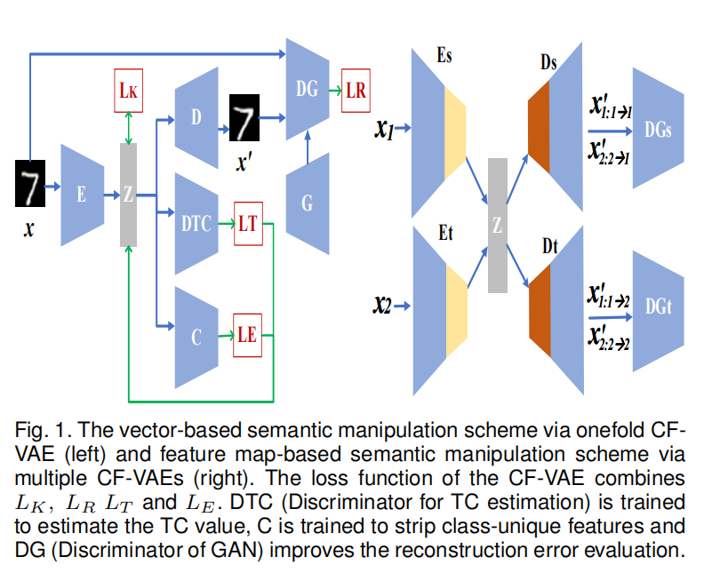

- 左图：单 CF-VAE 的向量型语义操控流程。
- 右图：多 CF-VAE 的特征图型语义操控流程。

**基于向量的解耦表示（vector-based disentangled representation）**

对于简单的图像类型（如手写数字），使用低维潜向量即可捕获主要语义特征。本文提出了一种 **单层 CF-VAE（Onefold CF-VAE）** 结构，以获得解耦且主题无关的潜变量表示。

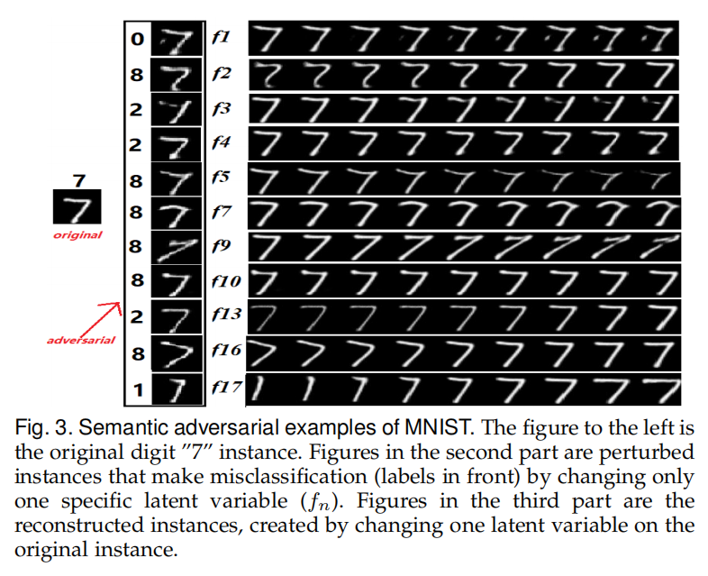

为了获得与类别标签无关的潜变量表示，引入一个额外的分类器 𝐶 来估计潜向量 𝑧 的类别信息。然后，通过对抗学习让编码器学习“欺骗”该分类器，从而实现主题无关的表示提取。

该分类器 $q_\xi(c|z)$ 的损失函数为交叉熵形式：

$$
L_C = -\mathbb{E}_{q_\phi(c|z)} \sum_c I(c = y) \log q_\xi(c|z)
$$

其中：
- $I(c=y)$为指示函数
- $q_\xi(c|z)$是分类器softmax输出概率

为使编码器提取的特征与类别无关，编码器同时被训练以最大化分类器的不确定性，即“欺骗”分类器：

$$
L_E = \mathbb{E}_{q_\phi(c|z)} \sum_c \frac{1}{C} \log q_\xi(c|z)
$$

该项被称为主题无关性损失（Irrelevance Term）。

然而，在实际训练中，不同潜变量之间往往会产生统计相关性（correlation），比如某个维度同时编码了“亮度”和“表情”的混合信息。这种耦合会让潜空间难以解释。为[增强潜变量之间的独立性](https://arxiv.org/abs/1802.05983)，本文引入**总相关性（Total Correlation, TC）** 正则项：

$$
TC(z) = KL(q(z) \| \tilde{q}(z)) = \mathbb{E}_{q(z)} \left[ \log \frac{q(z)}{\tilde{q}(z)} \right]
$$

其中：
- $q(z)$ 为潜变量的联合分布
- $\tilde{q}(z)$ 表示潜变量各维的独立分布乘积。

由于 TC 难以直接计算，本文通过训练一个判别器 $D_{TC}$,来估计样本是否来自$q(z)$ 或其打乱版本 $\tilde{q}(z)$ ，最终TC项被近似为：

$$
L_T = TC(z) \approx \mathbb{E}_{q(z)} \left[ \log \frac{D(z)}{1 - D(z)} \right]
$$

CF-VAE 的完整训练目标综合了四个部分：

$$
\frac{1}{N} \sum_{i=1}^{N} 
\left[
    \mathbb{E}_{q_\phi(z|x^{(i)})} [\log p_\theta(x^{(i)}|z)] 
    - D_{KL}(q_\phi(z|x^{(i)}) \| p(z))
\right]
- \gamma L_T - L_E
$$

重建损失$L_R$,KL 正则项$L_K$,TC 解耦项$L_T$,主题无关项$L_E$

- 编码器参数 $\phi$: 依据 $-\nabla_\phi(-L_R + L_K + \gamma L_T + L_E)$ 更新；
- 分类器参数 $\varsigma$: 依据 $-\nabla_\varsigma(L_C)$ 更新；
- 解码器参数 $\theta$: 依据 $-\nabla_\theta(L_R)$ 更新；
- TC 判别器参数 $\nu$: 依据 $-\nabla_\nu(L_T)$ 更新。

**基于 GAN 的增强模块**

在 CF-VAE 中，重建质量与解耦性存在权衡关系。为提高重建图像的自然度与细节质量，本文引入GAN-Based Booster:使用预训练 GAN 判别器的中间特征层作为“感知特征距离（feature-wise similarity）”，替代像素级的重建误差，从而使重建更加符合人类视觉语义

则感知层的重建误差定义为：

$$
L_R^F = - \mathbb{E}_{q(z|x)} [ \log p(F^l(x) | z) ]
\tag{10}
$$

等价地，使用特征层的欧氏距离表示：

$$
L_R^{\text{content}}(x, \hat{x}, l)
= \frac{1}{2} \sum_{i,j} (F_{i,j}^l - \hat{F}_{i,j}^l)^2
\tag{11}
$$

该重建策略结合了 GAN 的视觉表达能力与 VAE 的潜空间可控性，解决了重建模糊、细节缺失的问题。

本文扰动策略是通过在潜空间中以 **随机搜索（stochastic search）** 方式寻找最优（通用）扰动 $\Delta z^*$ 。

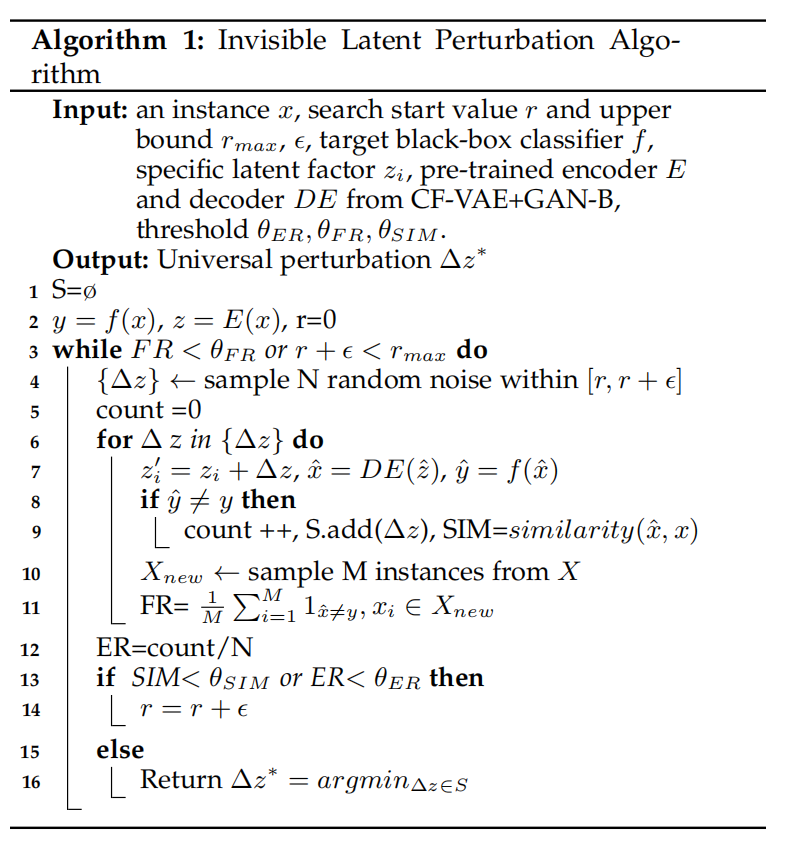

**基于特征图的语义操控（Feature Map-based Manipulation via Multiple CF-VAE）**

对于复杂语义图像（如人脸），
本文采用 **多 CF-VAE + 图像翻译（Image-to-Image Translation）** 联合框架。使用两个编码器 $E_s$、$E_t$ 与两个解码器 $D_s$、$D_t$ ，分别对应源域 $X_s$与目标域 $X_t$（例如普通脸 → 微笑脸）。

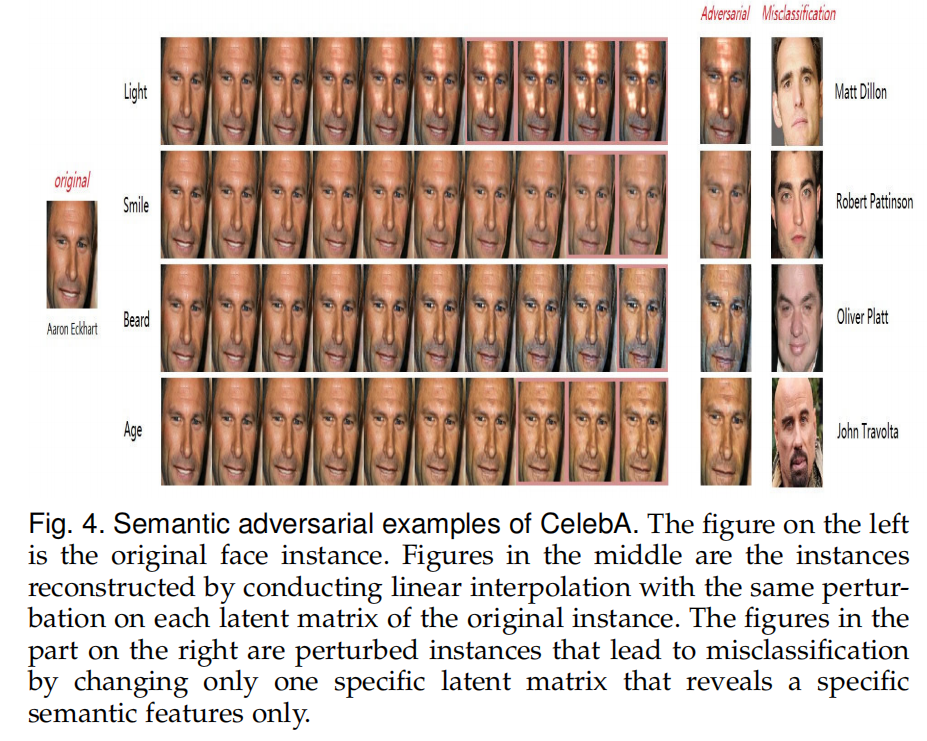

假设：

- 对应图像对 $(x_s, x_t)$ 满足共享潜空间表示 $z = E_s(x_s) = E_t(x_t)$；
- 解码器能重建原始图像：$x_s = D_s(z), \; x_t = D_t(z)$。

因此，可学习**定义转换函数**：

$$
F_{s \to t}(x_s) = D_t(E_s(x_s))
$$

该映射实现从源域到目标域的语义变换（如“无笑脸 → 微笑脸”）。  
为确保循环一致性（Cycle Consistency）：

$$
x_s = F_{t \to s}(F_{s \to t}(x_s))
$$

联合训练目标函数为：

$$
\min_{E_s, E_t, D_s, D_t}
\; L_{VAE_s} + L_{cc_s} + L_{GAN_s} + L_{VAE_t} + L_{cc_t} + L_{GAN_t}
$$

其中：

- $L_{VAE}$：重建约束；
- $L_{cc}$：循环一致性约束；
- $L_{GAN}$：对抗约束。

GAN 的目标函数定义为：

$$
L_{GAN_s}(E_t, D_s, D_{is})
= \lambda_g \mathbb{E}_{x_s} [\log D_{is}(x_s)]
+ \lambda_g \mathbb{E}_{z_t} [\log (1 - D_{is}(D_s(z_t)))]
$$

$$
L_{GAN_t}(E_s, D_t, D_{it})
= \lambda_g \mathbb{E}_{x_t} [\log D_{it}(x_t)]
+ \lambda_g \mathbb{E}_{z_s} [\log (1 - D_{it}(D_t(z_s)))]
$$

通过联合优化上述目标，可在保持解耦语义定义的前提下实现平滑的跨域转换。

## [Efficient Decision-based Black-box Patch Attacks on Video Recognition(STDE) \[ *ICCV 2023* \]](https://arxiv.org/abs/2303.11917)

**MOTIVATION：** 现有研究主要聚焦于图像领域的扰动式攻击，缺乏针对视频模型的决策式补丁攻击研究，导致视频识别模型的安全性评估存在空白。本文针对视频时空维度带来的高维参数与查询开销问题，提出了首个“决策式视频补丁攻击框架”STDE，通过空间-时间差分进化算法实现高效、低查询量、强攻击性的补丁生成，弥补了视频模型鲁棒性评估体系的不足

::: details 对抗性补丁攻击
攻击者不是在整个输入上添加微小扰动（像传统对抗样本那样），而是在输入图像/视频中的局部区域贴上一块显著的“补丁”（patch），从而误导模型做出错误预测。

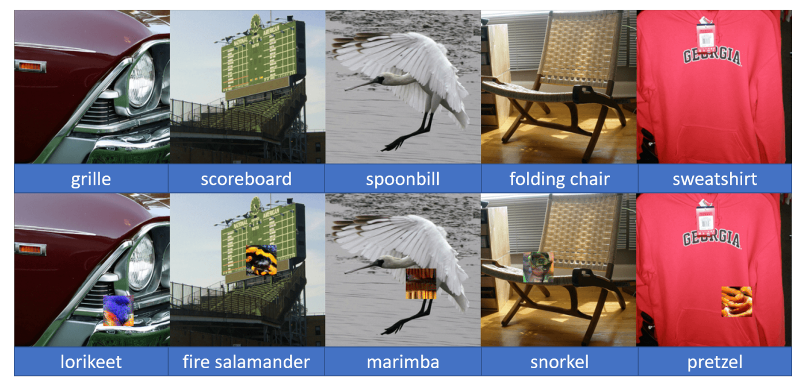
:::

<b>相关工作：</b>

视频领域对抗攻击与AVSD核心思想相同，均是通过确定视频关键帧去获取/攻击视觉层面的信息

早期确定关键帧的工作如通过[逐帧遮盖（masking）](https://arxiv.org/abs/1911.09449)并观察模型得分变化来确定关键帧，但该过程需要大量查询；[DeepSAVA](https://arxiv.org/abs/2111.05468)使用贝叶斯优化（Bayesian Optimization）来确定最具影响力的帧，但同样依赖分数反馈来评估质量。

<b>本文核心方法：</b>

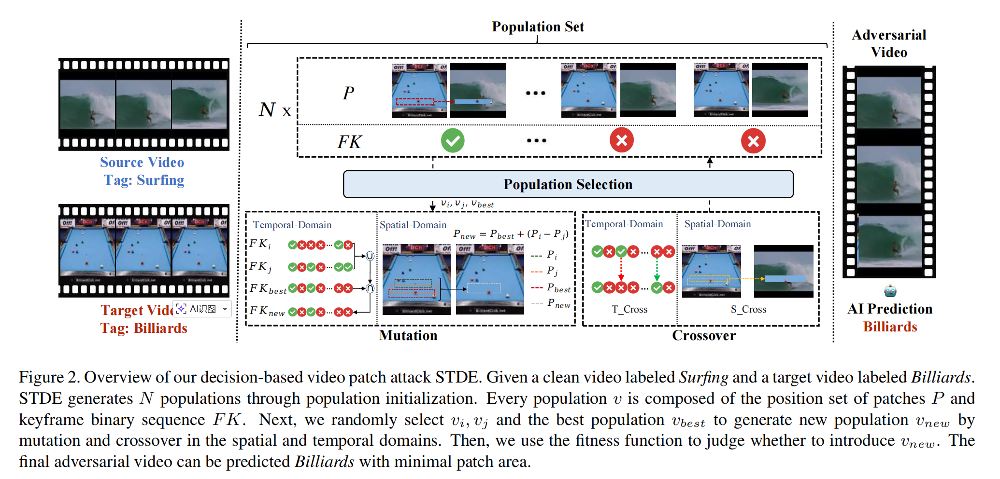

**空间域：** 生成补丁需要确定$M$ 以及 $\delta$ ，其中：

$M$：决定补丁的位置与形状，以补丁左上角与右下角坐标生成矩形补丁

$\delta$：决定补丁的纹理，原始像素级参数维度巨大且难以优化。本文引入目标视频 $x_{tar}$ 作为先验知识来填充补丁纹理，从而不再需要显式参数化

因此，生成的对抗视频为：$x^{\text{adv}} = \sim M \odot x + M \odot x_{\text{tar}}$

**时间域：** 为进一步减少参数，本文仅在关键帧（keyframes）上添加补丁。通过**时间差分（temporal difference）**方法对视频帧进行二值编码，只在帧间差异较大的位置选取关键帧。该机制会生成时序稀疏、分布分散的补丁，从而提升不可察觉性。

**时空差分进化总体流程：**

- 种群表示及初始化：每个种群个体表示：$v = (P, \mathrm{FK})$，其中$P$表示位置补丁的集合，$\mathrm{FK} \in \{0,1\}^{T}$是关键帧二值向量，$FK(t)=1$表示第 t 帧为关键帧。初始化时，随机采样$P$与$FK$；控制初始补丁大小与帧覆盖率，确保生成的对抗视频能成功误导模型；初始化后得到种群集 $V$、适应度集 $G$ 与查询次数 $q$ 。

- 适应度函数：在决策式场景下无法直接利用模型得分，因此本文重新定义了适应度函数来替代连续反馈信号。为衡量每个个体的优劣，定义：

$$
g(x^{\mathrm{adv}}) = 
\begin{cases}
\|x - x^{\mathrm{adv}}\|_{0} - \lambda \cdot I_{t}, & \text{若 } F(x^{\mathrm{adv}})=y_{\mathrm{adv}},\\[4pt]
\infty, & \text{否则。}
\end{cases}
$$

- 变异：从种群中随机选取三个个体 $v_i$，$v_j$，$v_{best}$，其中$v_{best}$为当前最优个体。采用空间与时间双域的差分变异，该操作在空间域实现位置差分，在时间域控制关键帧数量趋于稀疏，提高搜索效率：

$$
P_{\text{new}} = P_{\text{best}} + \gamma \cdot (P_i - P_j), \\
FK_{\text{new}} = FK_{\text{best}} \land (FK_i \lor FK_j),
$$

- 交叉：交叉操作提升种群多样性，避免陷入局部最优。其中，空间交叉$S_{Cross}$指在$P_{new}$的每个元素上随机添加噪声$k \in \{-1,0,1\}$；时间交叉$T_{Corss}$指的是随机选取$\alpha$ 个关键帧位置翻转其状态 $(1 \leftrightarrow 0)$，其中 $\alpha$ 为交叉率。

- 种群更新：计算新个体的适应度 $g(v_{new})$，若其优于当前最差个体 $v_{worst}$，则替换之；否则维持原种群。

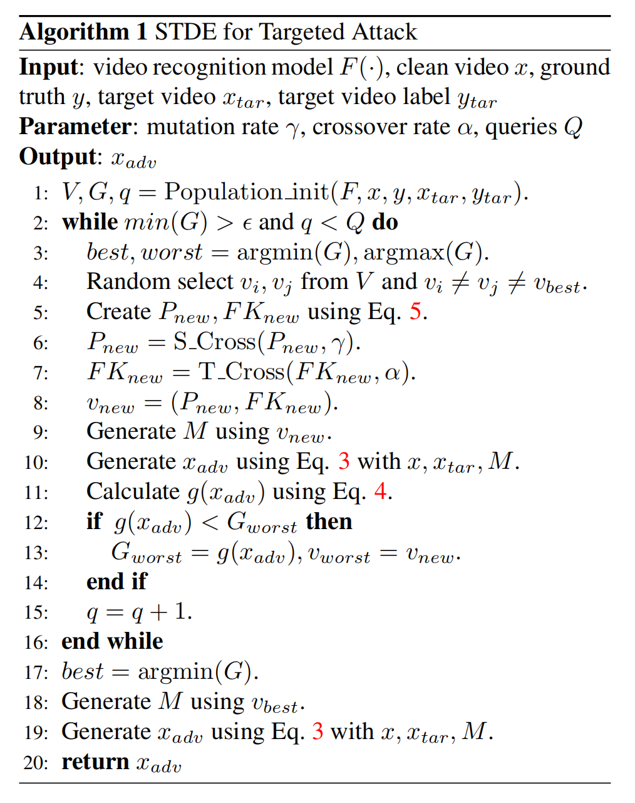

## [Attention-SA: Exploiting Model-Approximated Data Semantics for Adversarial Attack [IEEE TIFS 2024]](https://ieeexplore.ieee.org/abstract/document/10549527)

**以往的工作：** 1）传统受限对抗攻击的局限；2）现有语义攻击的不足； 3）防御评估与人类语义鲁棒性之间的错位

:::details 

**现有语义攻击的不足：**

大多依赖额外的预训练模型（如语义分割、着色、风格迁移网络），攻击语义范围被这些外部模型预设的属性所限制；

操作的语义往往是“人类预定义”的（改颜色、改光照、改纹理），而没有结合目标分类器本身学到的判别语义，无法保证这些变换真的是该模型决策的“关键因素”；

**防御评估与人类语义鲁棒性之间的错位：**

人类视觉的鲁棒性更接近“语义不变”的概念（如轻微裁剪、旋转、颜色变化后仍认为是同一物体），与小范数约束并不等价；因此即便在 $l_p$ 攻击下表现“鲁棒”的模型，仍可能对语义层面的可感知变换极其脆弱，其安全性被高估。作者据此提出一个核心疑问：基于数值扰动的鲁棒性评价，是否真的反映了与人类认知一致的“真实鲁棒性”？

:::

**MOTIVATION：** 作者希望直接利用目标模型已经学到的语义因子来构造对抗攻击，而不是仅在输入像素或人工预设的语义空间中“盲目”搜索

<b>本文核心方法：</b>

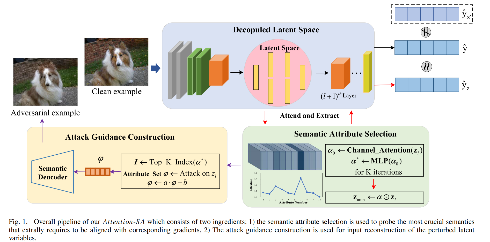

本文方法总结为：找到模型自己“觉得重要的语义”是哪些，只针对这些语义下手，再把对这些语义的修改反推回输入图像，形成对抗样本。具体而言：

1. 选一层特征作为语义空间，比如某个中高层卷积层 / Transformer Block 的输出

2. 插一个注意力模块。输入：这一层的特征 $z_l$;输出：注意力权重 𝛼，对每个通道打分

3. 训练这个注意力模块（在不改变主模型参数的情况下）继续往后算，预测结果要和原来相近；同时鼓励它与输入梯度敏感性对齐（选真正重要的通道）

4. 确定关键语义通道。根据 𝛼 的大小，知道哪些通道是“模型最在乎的语义”

5. 在这些通道上施加语义扰动。修改这些通道的值（掩蔽、缩放、替换等），使得最终输出朝着错误类别方向变化

6. 通过反向传播，把这种“语义层的改动”映射回输入，得到对抗图像 $x_{adv}$ 对人来说往往还是同一张物体图，对模型来说，内部的关键语义已经被破坏或重排，预测结果错了

7. 把生成的这些语义对抗样本拿来做对抗训练（ASA-AT）。让模型在训练时就见过这种“语义级别”的攻击，从而增强真正的语义鲁棒性。

**总结：** 本文不是在输入上“瞎加噪”，而是先从模型中间层里“找出它最在乎的那一小撮语义通道”，再精确地操控这些通道，并把这种语义扰动折返到输入图像上，从而得到既自然、又非常针对模型弱点的对抗样本。

## [Universal Adversarial Attack on Attention and the Resulting Dataset DAmageNet（AoA） [IEEE TPAMI 2022]](https://ieeexplore.ieee.org/abstract/document/9238430)

**MOTIVATION：** 本文提出白盒攻击在已知模型结构与参数时很容易成功，但真实场景下攻击者通常无法获得完整模型信息，因此更关心 黑盒攻击。黑盒攻击主要分为两类：一类是查询式（通过大量查询估计梯度），但查询次数大、容易被检测；另一类是迁移式（在替代模型上做白盒攻击并迁移到受害模型），但跨架构迁移往往不理想，通常只有在模型结构相近时效果才好，这与黑盒攻击希望“跨模型泛化”的目标矛盾。作者的核心思路为：要提升黑盒迁移性，应该攻击不同 DNN 共享的“语义层面脆弱性”，而不是依赖具体结构相似性。论文选择了一个被多种视觉模型共享的语义属性——注意力热力图（attention heat map）：即便架构不同，模型在同一图像上的注意区域往往呈现相似性，因此攻击“注意力”可能天然更可迁移。

:::details 注意力热力图

**前向可视化：** 通过观察输入变化所引起的输出变化来推断注意力。输入变化可以通过加入[噪声](https://arxiv.org/abs/1412.6856)、[遮挡（masking）](https://link.springer.com/chapter/10.1007/978-3-319-10590-1_53) 或[扰动](https://www.nature.com/articles/nmeth.3547) 来实现，但这类方法通常耗时较大，并可能引入随机性。

**[反向可视化](https://arxiv.org/abs/1412.6806)：**  是从输出向输入方向逐层计算相邻层之间的相关性（relevance）来获得热力图：本层的注意力由下一层的注意力以及本层的网络权重共同决定。

:::

<b>本文核心方法：</b>

如下图所示，三张图像在不同模型上的注意力热力图，其中逐像素热力图刻画了输入对预测的贡献。即使网络架构不同，各模型的注意力也表现出相似性。

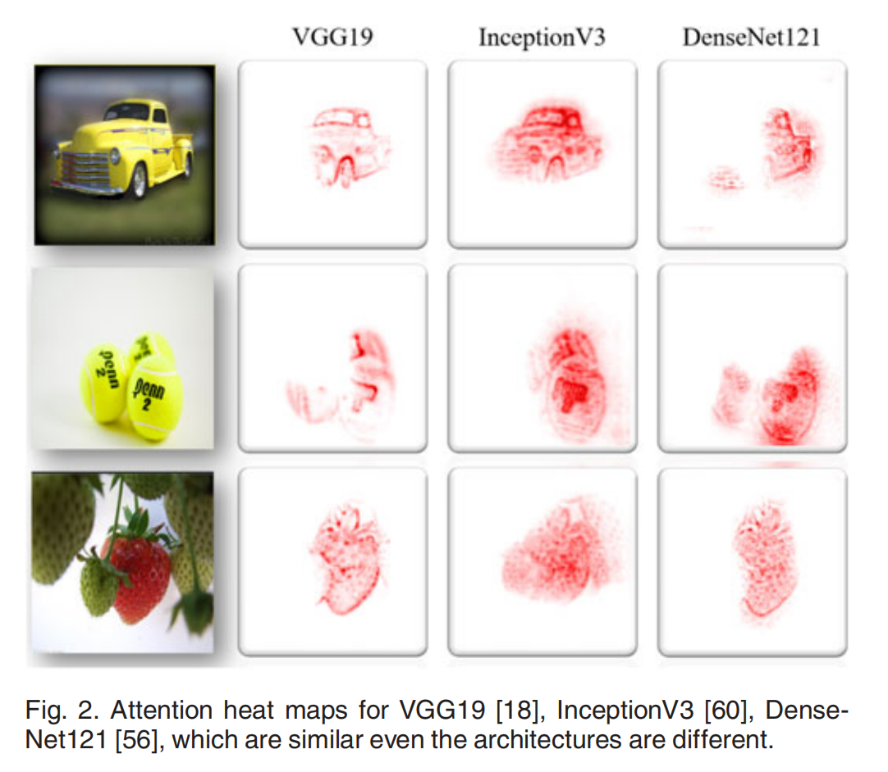

与现有主要针对输出进行攻击的方法不同，AoA 的目标是改变注意力热力图。本文使用 [SGLRP（Softmax Gradient LRP）](https://ieeexplore.ieee.org/abstract/document/9022542)来计算注意力热力图 ℎ(𝑥,𝑦) ，因为它更擅长区分目标类别的注意力与其他类别的注意力。

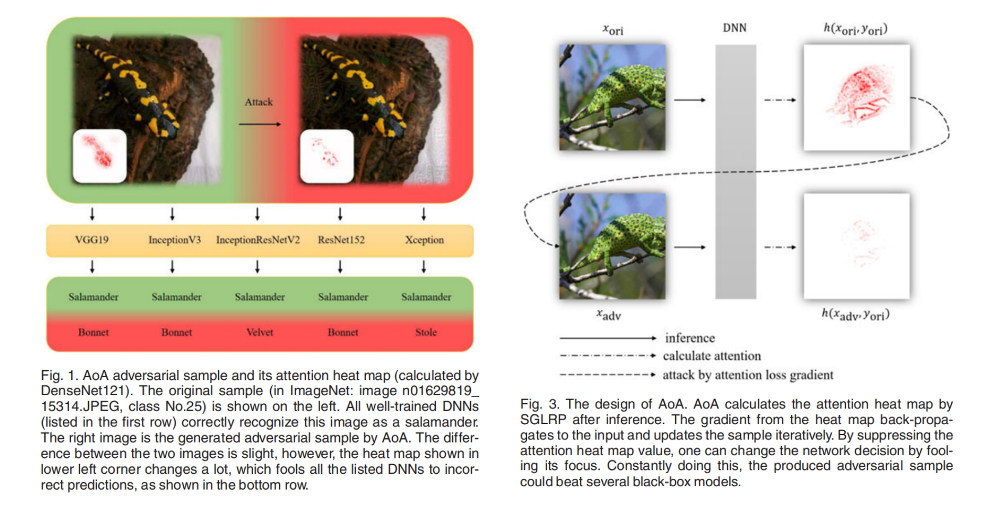

本文给出三种改变注意力热力图的潜在方式：

1. **抑制正确类别注意力热力图$h(x,y_{ori})$的幅值：**
    当网络对正确类别的注意力强度降低时，其他类别的注意力可能会上升并最终超过正确类别，导致模型转而去寻找其他类别的信息而不是正确类别的信息，从而产生错误预测。文中将其称为“抑制损失（suppress loss）”：
    $$
    L_{\text{supp}}(x)=\left\|h(x,y_{\text{ori}})\right\|_{1}.
    $$
    其中，$\left\|h(x,y_{\text{ori}})\right\|_{1}$表示逐分量的$l_1$范数

2. **分散$h(x,y_{ori})$的关注点：** 
    直觉上，当注意力从原本的感兴趣区域（ROI）被分散开，模型可能会失去预测能力。此时我们不要求网络把注意力集中到任何错误类别的信息上，而是引导其关注图像中的无关区域。对应的“分散损失（distract loss）”为：
    $$
    L_{\text{dstc}}(x)=\left\|
    \frac{h(x,y_{\text{ori}})}{\max\!\left(h(x,y_{\text{ori}})\right)}
    -
    \frac{h(x_{\text{ori}},y_{\text{ori}})}{\max\!\left(h(x_{\text{ori}},y_{\text{ori}})\right)}
    \right\|_{1}.
    $$
    这里使用了自归一化（self-normalization）以消除注意力幅值大小带来的影响。

3. **缩小$h(x,y_{ori})$与$h(x,y_{sec}(x))$的差距，其中$y_{sec}(x)$是预测概率第二大的类别：** 
    若第二类的注意力幅值超过正确类，网络会更关注错误预测对应的信息。这一思路受 C&W 攻击启发。本文称其为“边界损失（boundary loss）”，形式为：
    $$
    L_{\text{bdry}}(x)=\left\|h(x,y_{\text{ori}})\right\|_{1}-\left\|h(x,y_{\text{sec}}(x))\right\|_{1}.
    $$
    不同模型的注意力热力图数值尺度差异较大，因此自归一化可能提升对抗样本的可迁移性。于是，除了 $L_{bdry}$ 外，还可以考虑两者的比值，得到“对数边界损失（logarithmic boundary loss）”：
    $$
    L_{\log}(x)=\log\!\left(\left\|h(x,y_{\text{ori}})\right\|_{1}\right)
    -\log\!\left(\left\|h(x,y_{\text{sec}}(x))\right\|_{1}\right).
    $$

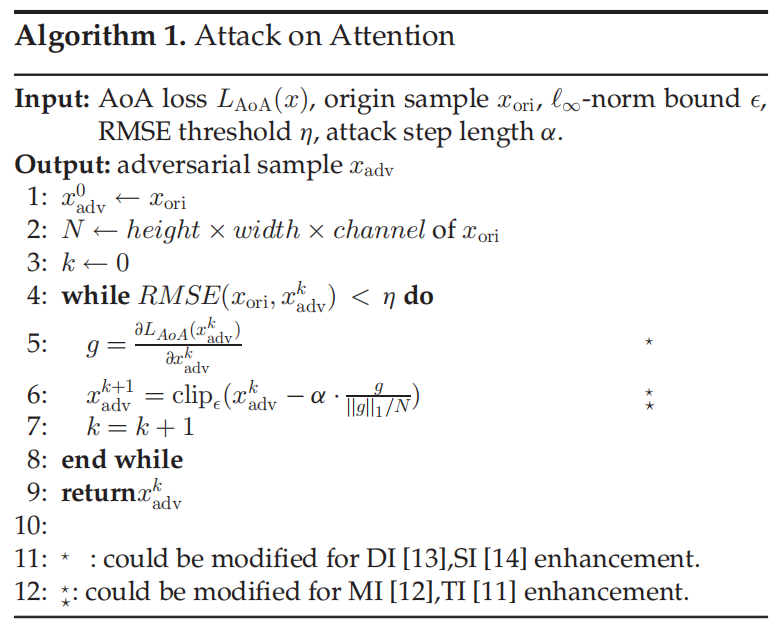

