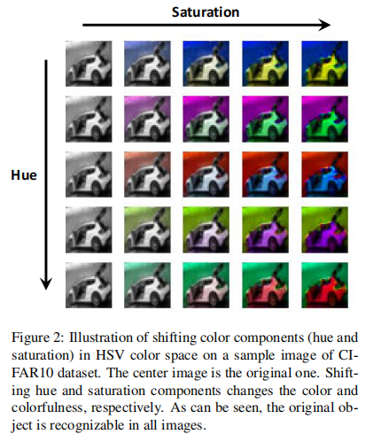
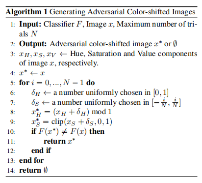
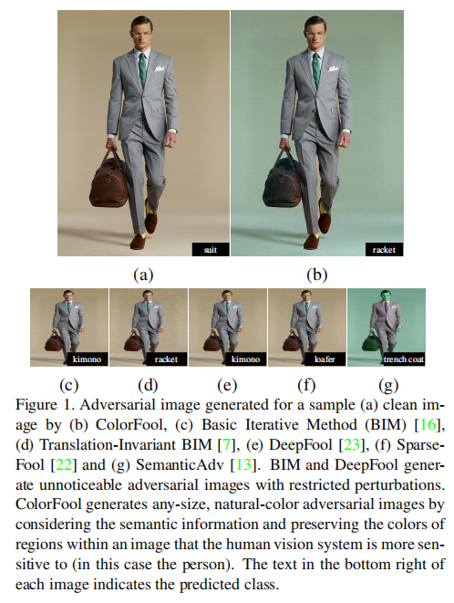
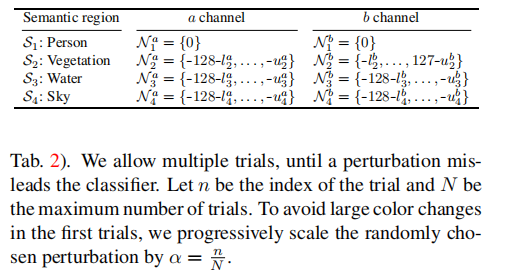
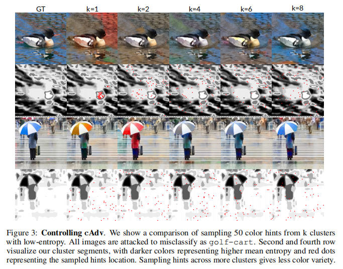
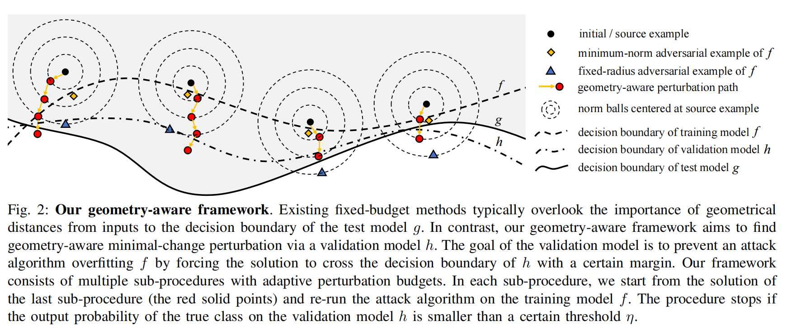
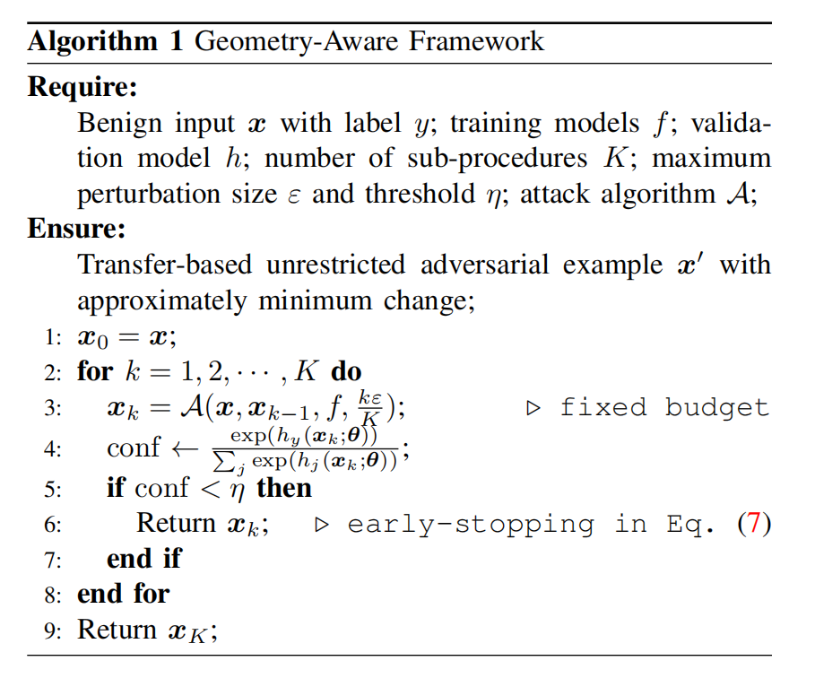
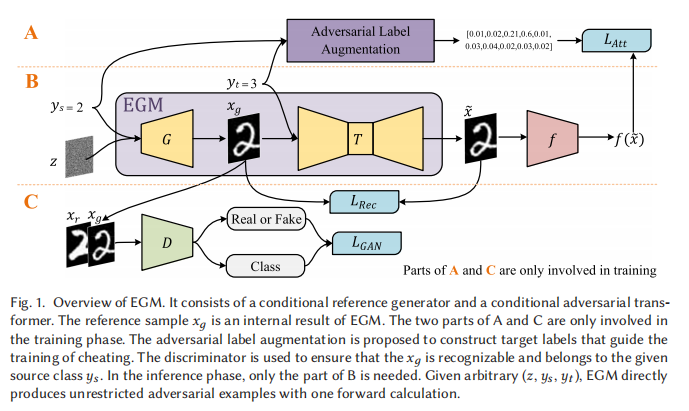
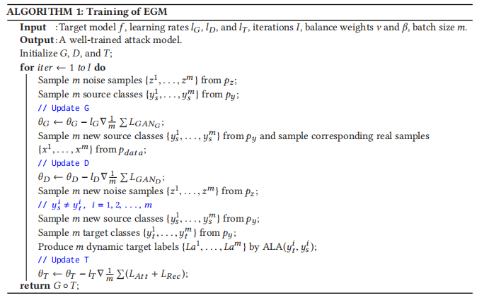

---

date: 2025-10-09
category:
  - 码头
tag:
  - 无限制对抗攻击样本

---

# 无限制对抗攻击（一）

A Complete List of All (arXiv) Adversarial Example Papers（Nicholas Carlini）:https://nicholas.carlini.com/writing/2019/all-adversarial-example-papers.html

>**实验相关：**
>
> 
> **指标：**
> - 攻击成功率（Success Rate, SR），即对抗样本能够误导分类器的比例（越高越好）
> - 对抗样本的迁移性：假设 对抗模型A在 被攻击模型$F_1$的攻击成功率为1，迁移到被攻击模型$F_2$后变得越低则越说明迁移性差
> - 鲁棒性：攻击方法在经过 防御后 的攻击成功率变化情况
> - 不可检测性 (Undetect.)：取值范围 0–1。数值越高，代表对抗样本更难被检测为“对抗的”，即防御方法越难发现攻击。
> - NIMA：图像质量，越大越好，将攻击后的图像与干净图像（Clean） 的 NIMA对比
> - 随机性影响：选取 N 张 干净 图像，对每张图像运行 M 次随机初始化（不同随机扰动选择），统计三项指标： Success rate [%]（对每张图像 500 次中的成功率）；trials（收敛所需的尝试次数，分布用箱线图或箱须图表示）；final classes（500 次实验最终收敛到多少不同的“目标类别”，反映收敛的稳定性）
> 

无限制对抗攻击样本相较于在𝐿𝑝-范数限制下的对抗攻击样本有更好的迁移性

---
## [Unrestricted Adversarial Examples[ *2018* ]](https://arxiv.org/abs/1809.08352)

**竞赛地址：** https://github.com/openphilanthropy/unrestricted-adversarial-examples

**MOTIVATION：** 现有研究设定过于狭窄 —— 只考虑小扰动攻击，并不能真实反映深度学习系统在最坏情况下面临的风险。高置信度错误难以避免 —— 模型往往在明显错误的预测上依然输出高置信度，导致在安全关键场景下可能出现灾难性后果（例如自动驾驶系统未能识别人）。

竞赛构建了两类无歧义数据集，其中所有图像要么是无歧义的鸟的图像，要么是无歧义的自行车的图像。

 竞赛说明：  

**防御者** 需要构建模型，将图像作为输入，并必须返回三种结果之一：鸟（bird）、自行车（bicycle） 或 弃权（abstain）。模型允许在任意对抗输入上弃权（通过返回低置信度预测来实现），但只要出现一次高置信度的错误预测，防御就算被攻破。

**攻击者** 必须提交一张无歧义的鸟或自行车图像，而该模型却错误地进行分类（这一点由一组人工评审来决定）。

**完全白盒：** 目标是找到不会产生高置信度错误的模型（而不仅仅是让攻击者难以找到错误），竞赛要求所有防御方法开源，并向攻击者公开。因此，攻击者可以针对特定模型设计对抗样本。这一设定提供了更现实的威胁模型来评估防御效果。

**攻击不受限制** —— 不受任何范数约束球（norm-ball）的限制。由于攻击不再局限于某个标注测试点附近的邻域，每张提交的图像都必须经过人工评审以确定其真实类别。若所有评审一致认为该图像无歧义地属于类别 A，而模型却高置信度地将其错误分类为类别 B（而非类别 A 或弃权），则攻击成功。

防止模型对所有输入都弃权，参赛模型必须在一个私有数据集（包含干净的“鸟或自行车”图像）上达到 80% 的准确率。

>**论文笔记：** 能否让模型输出 I'm not sure, 认识到自己的不确定性；从比赛里公布的优秀攻击、防御模型里面找相应的论文补充该领域思路

---
## [Semantic Adversarial Examples[ *CVPR 2018* ]](https://arxiv.org/abs/1804.00499)
**代码仓库:** https://github.com/HosseinHosseini/Semantic-Adversarial-Examples

**MOTIVATION：** 早期的对抗样本研究主要集中于寻找极小的像素扰动来误导模型分类，作者认为模型不仅应对抗“像素级微扰”，还应对抗语义层面上等价的变换（即人类仍认为是同一物体的图像），本文具体方法是：将原始 RGB 图像转换到 HSV（色调 Hue、饱和度 Saturation、明度 Value）颜色空间中，随机平移色调与饱和度分量，同时保持亮度（Value）不变。

本文提出 **“形状偏置”（Shape Bias）** 的概念，当人类面对一个新物体时，比起颜色、大小或纹理等其他特征，人类更倾向于依据物体的形状来判断它属于哪一类。卷积神经网络（CNN）在设计上利用卷积核滑动提取局部结构、层次化组合出边缘、形状、部件等高级语义特征。这使得 CNN 也应该具备一定的“形状偏置”——即对颜色或纹理变化不敏感，对几何形状信息更依赖。

本文核心方法：

::: details **颜色空间（HSV Color Space）**

HSV（色调 Hue、饱和度 Saturation、明度 Value）是 RGB（红、绿、蓝）颜色空间的一种替代表示方式，被认为更接近人类视觉对颜色的感知方式。

Hue（色调）：表示颜色在色轮上的位置。当 Hue 从 0 增加到 1 时，颜色从红色 → 橙色 → 黄色 → 绿色 → 青色 → 蓝色 → 品红色 → 再回到红色。

Saturation（饱和度）：表示颜色的“纯度”或“鲜艳度”。当饱和度为 0 时，图像为灰度图；当饱和度增加到 1 时，颜色最为鲜艳。

Value（明度）：表示亮度，即 RGB 三通道中的最大值。反映图像的整体明暗，而不影响颜色的色相。
:::

HSV 空间的一个优点是，颜色分量（Hue 与 Saturation）与物体结构分量（Value）是解耦的。因此，通过改变 Hue 与 Saturation，而保持 Value 不变，我们可以生成在形状结构上完全相同但颜色与色彩度不同的图像。

设图像 𝑥 的三个分量分别为 $x_H,x_S,x_V$ 。则生成语义对抗样本的问题可以表示为：
$$
\text{find } x^* \quad \text{s.t.} \quad x_V^* = x_V, \quad F(x^*) \neq F(x) \tag{3}
$$
也就是说,保持图像亮度结构（$x_V$）不变；改变色调与饱和度，使模型误分类。

一种最直接的方式是：随机生成图像的 Hue、Saturation 并测试是否能误分类。或者，从原图出发，在局部随机扰动 Hue 和 Saturation。但这些方法容易产生明显的噪声或不自然的颜色。由此作者提出：对所有像素的 Hue 与 Saturation 分量进行相同幅度的平移。即：
- 如果饱和度整体上升 → 图像更加鲜艳；
- 如果饱和度下降 → 图像更加灰暗；
- Hue 平移则改变整体色调（如蓝→绿，红→黄）。

若 Hue 或 Saturation 平移过大，会导致：
- 饱和度过低 → 图像变成灰度；
- 饱和度过高 → 图像过于夸张、非自然。

因此，为了保证生成的图像自然且平滑，作者增加如下约束：
$$
\min |\delta_S| \quad \text{s.t.} \quad
\begin{cases}
x_H^* = (x_H + \delta_H) \bmod 1 \\
x_S^* = \text{clip}(x_S + \delta_S, 0, 1) \\
x_V^* = x_V \\
F(x^*) \neq F(x)
\end{cases} \tag{4}
$$

其中：
- $\delta_H$ 和 $\delta_S$ 为全局平移量（标量）
- $mod1$ ：因为色调是环状变量（Hue=1 等价于 Hue=0）
- $clip(·，0，1)$：确保饱和度保持在合法区间。

为求解上述优化问题，作者采用 **随机搜索（Random Search）** 的策略。具体流程如下：
1. 从原图中提取 HSV 三个分量；
2. 随机采样 Hue 与 Saturation 的平移量；
3. 生成颜色平移后的图像；
4. 若模型误分类，则该图像即为语义对抗样本；
5. 否则继续迭代，直到达到最大尝试次数 𝑁 。

---
## [Constructing Unrestricted Adversarial Examples with Generative Models (AC-GAN) [ *NeurIPS 2018* ]](https://proceedings.neurips.cc/paper/2018/hash/8cea559c47e4fbdb73b23e0223d04e79-Abstract.html)

**MOTIVATION：** 作者认为传统对抗样本虽然在数值上接近原图，但有时在语义上并不合理，而真实世界的攻击往往是“语义层面”，因此本文意在解决三个问题：能否在不依赖原始样本的情况下“从零生成”合法图像？这些生成样本是否能够绕过当前所有强防御，包括经过认证的鲁棒模型？这种攻击是否能揭示更深层次的分类器脆弱性？。由此作者提出了一种更为通用的攻击机制(AC-GAN)：不再从现有样本出发进行微小扰动，而是完全从零生成新的对抗样本

本文核心方法：

文章介了绍两种基于 AC-GAN 的攻击方式

**基础攻击：**

设 $g_\theta(z, y)$ 与 $c_\phi(x)$ 分别为 AC-GAN 的生成器与辅助分类器，$f(x)$ 为目标分类器。本文关注 **定向攻击（targeted attack）** 情形，即希望生成的图像 $x$ 满足：

$$
o(x)=y_{source},o(x)=y_{target}
$$

为了生成此类样本，设计并最小化以下损失函数：

$$
L = L_0 + \lambda _1 L_1 + \lambda _2L_2
$$

其中:

$$
L_0 = -log f(y_{target}|g_\theta (z,y_{source}))
$$
- 该项为分类误导项，鼓励目标分类器将生成样本错误地预测为 $y_{\text{target}}$。

$$
L_1 = \frac{1}{m} \sum_{i=1}^m \max \left( |z_i - z_i'| - \epsilon, \, 0 \right)
$$

- 该项为潜向量约束项，用于保持潜向量 $z$ 接近随机采样的 $z' \sim \mathcal{N}(0, 1)$，从而保证生成样本的多样性和真实性。

$$
L_2 = -log c_\phi (y_{source}|g_\theta (z,y_{target}))
$$
- 该项为源类保持项，鼓励目标分类器将生成样本错误地预测为 $y_{\text{target}}$。

整体上，$L_0$ 驱动错误分类，$L_1$ 保持潜空间合理分布，$L_2$ 维持语义一致性。通过调节超参数 $\lambda_1, \lambda_2$ 可平衡攻击强度与图像质量。

**噪声增强机制：**

为了进一步提升生成器的表达能力，作者引入了一个噪声增强机制：

$$
g_\theta(z, \tau, y; \epsilon_{\text{attack}})
= g_\theta(z, y) + \epsilon_{\text{attack}} \,\tanh(\tau),
$$

其中 $\tau$ 是可训练变量，与生成图像形状相同。只要 $\epsilon_{\text{attack}}$ 较小，添加的噪声不会破坏图像的真实性，即：

$$
o(g_\theta(z, \tau, y; \epsilon_{\text{attack}}))
= o(g_\theta(z, y))
$$

随后，与基础攻击相同优化 $L$，但将生成函数替换为上式形式。并且，当生成器 $g_\theta$ 退化为直接输出原始数据集样本时，该方法可视作传统的 FGSM/PGD 的一种特例。

---

## [ColorFool: Semantic Adversarial Colorization [ *CVPR 2020* ]](https://arxiv.org/abs/1911.10891)

**代码仓库：** https://github.com/smartcameras/ColorFool

>**MOTIVATION：**
>
>现有的对抗攻击方法大多依赖于 受限扰动（restricted perturbations），即通过控制 𝐿𝑝-范数来限制扰动幅度。这类方法虽然在白盒场景下有效，但在以下方面存在显著问题：
>
> - 黑盒环境与未见分类器中的成功率低：限制性扰动往往严重依赖于模型梯度信息，因此在黑盒攻击或迁移到新模型时成功率明显下降。
>
> - 对防御方法缺乏鲁棒性：常见的图像预处理防御（如重量化、JPEG 压缩、滤波）能够轻易削弱高频扰动，从而使受限攻击失效。
>
> - 感知上不自然：部分攻击（如 HSV 空间的颜色扰动）虽然突破了范数限制，但容易造成明显不自然的颜色，使攻击对人类肉眼可见。

本文提出：基于图像语义的黑盒 非受限（unrestricted） 对抗攻击方法。

- 通过 仅修改特定语义区域（如天空、水、植被等）中的颜色，并限制在自然色彩范围内，从而保证对人眼自然、不可觉察。

- 在 Lab 颜色空间中操作，仅改变与亮度解耦的 a/b 通道，避免结构信息被破坏。（现有的方法要么依赖昂贵的训练过程要么在 HSV 色彩空间中任意改变色相和饱和度，往往导致明显不自然的色彩失真）

- 不依赖模型梯度，能够更好地适应黑盒场景，同时在防御和迁移上表现更佳。

本文核心方法：

需要识别图像中那些对人类观察者来说，颜色显得尤其重要的区域。这些 敏感区域（如人类皮肤）通常出现在特定颜色范围内。如果这些区域颜色异常，会立即引起人类注意。因此本文将图像分为两类区域：

敏感区域：人（skin）、天空、植被（水草、树木）、水体（河流、湖泊、海洋等）。

非敏感区域：其余部分。

为了获得这些区域，ColorFool 使用基于 **Cascade Segmentation Module**（采用 Pyramid Pooling R50-Dilated 架构，在 ADE20K 数据集上训练 [32]）的语义分割模型，将图像分解为 $K$ 个语义区域：  

$$
S = \{ s_k : S_k = X \cdot M_k \}_{k=1}^K ,
$$  

其中，$M_k \in \{0,1\}^{w \times h}$ 是一个二值掩码，指示区域 $S_k$ 所在的位置，"$\cdot$" 表示像素级相乘。  

这样就可以得到：**敏感区域集合**  $S^s = \{ S_k \}_{k=1}^S$ 以及 **非敏感区域集合** $S^n = \{ S_k \}_{k=1}^N$。并且满足$S = S^s \cup S^n .$

对敏感区域 $S^s$，ColorFool 将其转换到 Lab 空间后，在 **自然颜色范围** 内选择扰动。对第 $k$ 个敏感区域：  

$$
\hat{S}_k = \gamma(S_k) + \alpha [0, N_k^a, N_k^b]^T ,
$$

其中：  
- $\gamma(\cdot)$：将 RGB 转换为 Lab 空间；  
- $N_k^a, N_k^b$：在区域 $k$ 的自然颜色范围内随机选择的扰动；  
- 这些自然范围来源于人类正常给定物体 Lab 值的偏好 $[3,18,30]$；  
- $\alpha = \tfrac{n}{N}$：扰动缩放因子（第 $n$ 次尝试时使用），避免初始扰动过大。  

**例如：**  
- 对于 **人类 (person)** 区域，不做颜色修改（$N^a = N^b = 0$）；  
- 对于 **天空、植被、水体** 区域，则根据语义选择合适的自然颜色区间（见下表中列出）。  

对于非敏感区域 $S^n$，允许更大范围的颜色变化，因为人眼对其颜色不敏感。扰动定义为：  

- $N^a \in \{-127, \dots, 128\}$，  
- $N^b \in \{-127, \dots, 128\}$，  

即在整个颜色通道范围内随机选择扰动。

>**论文笔记：**
> 
> Fig1中所示的图片仔细观察人物周围可以看出原图的卡其色背景，结合图像分割更好的模型进行优化提升人眼不可察性
> 
> 本文在 Lab 颜色空间中操作，仅改变与亮度解耦的 a/b 通道，避免结构信息被破坏，能更好让人眼不可觉察
>
> 本文的典型两个领域结合的论文：图像分割 + 无限制对抗攻击样本(考虑多阅读 图像/视频领域 "通识性"文章长见识)

---
## [Unrestricted Adversarial Examples via Semantic Manipulation [ *ICLR 2020* ]](https://arxiv.org/abs/1904.06347)

**MOTIVATION：** 先前提出的无限制攻击仅限于MNIST、CIFAR 和 CelebA 等数据集，并且无法显示控制图像的语义表征，容易被人类识别。由此，本文提出基于纹理(tAdv)以及颜色(cAdv)两种攻击方式

本文核心方法：
**cAdv：**
本文采用 Zhang 等人（[Colorful image colorization](https://arxiv.org/abs/1603.08511) ;  [Real-time user-guided image colorization with learned deep priors](https://arxiv.org/abs/1705.02999)）提出的颜色化模型作为攻击基础进行两种优化。在他们的工作中，网络能够在 ImageNet 上生成自然的颜色化结果，条件是给定用户提示。

1. 优化模型参数：
$$
\theta^{*} = \arg\min_{\theta}\; J_{\mathrm{adv}}\big( F( C(X_L, X_{ab}, M; \theta) ),\; t \big)
$$

由于模型会倾向于直接生成“对抗性颜色”，而忽略颜色的自然性，该方法生成的颜色往往不真实。并且，作者发现这些颜色化结果通常与目标类别中常见的颜色相关联。这表明分类器在很大程度上依赖于某些颜色与类别之间的对应关系。

2. 优化提示与掩码
$$
M^{*},\; X^{*}_{ab} = \arg\min_{M,\,X_{ab}}\; J_{\mathrm{adv}}\big( F( C(X_L, X_{ab}, M; \theta) ),\; t \big)
$$

其中：
- 𝜃：模型参数
- 𝐶：颜色化网络
- $𝑋_𝐿$：图像灰度图
- $𝑋_{𝑎𝑏}$：颜色提示，在输入图像上给出少量带有颜色的像素补丁，形状为 𝐻×𝑊×2
- M：二值掩码，$𝑋_{𝑎𝑏}$的具体位置
- 𝐹(⋅)：受害模型，例如要攻击的图像分类器或 captioner。

- $𝐽_{adv} (⋅,𝑡)$：对抗损失（通常为交叉熵），表示希望使受害模型输出更接近目标类别 𝑡。
- 𝑡：目标类别。

作者认为现有的攻击方法缺乏对攻击位置的控制，往往对所有像素进行无差别操作。这在扰动较小的情况下无关紧要，但在 cAdv 中会导致大范围的无结构改动，从而显得突兀。为了生成更逼真的颜色化结果，我们需要避免在颜色明确的区域（如灰色道路）做大幅修改，而应专注于颜色模糊的区域（如雨伞可以有不同颜色）。

为此，对作者图像进行分割，确定哪些区域可以被攻击，哪些应被保留。具体方法是：
1. 对图像的 AB 色彩空间应用高斯滤波（σ=3）；
1. 使用 K-Means 聚类为 8 个簇；
1. 计算每个像素的颜色分布熵（由 Zhang 等人 2017 的网络输出提供），熵值越高，颜色越模糊；
1. 保留熵值低的簇（颜色明确），攻击熵值高的簇（颜色模糊）。

通过这种方式，作者了 $cAdv_𝑘$，即从熵值最低的 k 个簇中采样提示。

**tAdv：** 作者通过向$I_v$添加来自图像$I_t$的纹理来攻击，一个自然的纹理迁移策略是最小化两幅图像在某些层次的特征相关性统计（Gram 矩阵）之间的差异。基于 Yeh 等人（2020）的发现，作者认为对跨层（cross-layer）Gram 矩阵进行优化，相比于仅在单层内计算 Gram 矩阵，能产生更自然的对抗图像。所谓跨层 Gram 矩阵，与在同一层内计算特征统计的方式不同，它是在两个相邻层之间计算统计量。

在纹理源选择上，作者在特征空间里找到距离受害图像最近的那个目标类图像（nearest neighbor），并选其为 Ts。这样能确保被攻击图像与选定的目标图像在特征统计上更相似，因此最小化 Gram 矩阵的差异会变得更容易，从而能生成更自然的对抗图像。

具体而言tAdv的目标函数如下：
$$
L_{AtAdv} = \alpha L_{At}(I_v, I_t) + \beta J_{\mathrm{adv}}(F(I_v), t)
$$

其中：
$$
L_{At}(I_v, I_t) = \sum_{(m,n)\in \mathcal{L}} \frac{1}{C^2} \sum_{ij} 
\frac{\big\| G^{ij}_{m,n}(I_v) - G^{ij}_{m,n}(I_t) \big\|^2}{\mathrm{std}\!\left(G^{ij}_{m,n}(I_v)\right)}
$$

这个$Loss$度量了受害图像与目标图像在不同卷积层组合下的纹理统计差异。如果两者的跨层 Gram 矩阵相似，说明受害图像已经成功“注入”了目标图像的纹理。

$$
G^{ij}_{m,n}(I) = \sum_{p} \Big[ f_{m,i,p}(I) \Big] \; \Big[ U f_{n,j,p}(I) \Big]^T
$$

跨层Gram矩阵：表示第 𝑚 层的第 𝑖 个特征与第 𝑛 层的第 𝑗 个特征之间的相关性。通过它，可以捕捉到更复杂、更层次化的纹理特征。

---

## [Adversarial Color Enhancement: Generating Unrestricted Adversarial Images by Optimizing a Color Filter [ *BMVC 2020* ]](https://arxiv.org/abs/2002.01008)

**MOTIVATION：**

---
## [Towards Transferable Unrestricted Adversarial Examples with Minimum Changes [ *SaTML 2023* ]](https://arxiv.org/abs/2201.01102)

**代码仓库：** https://github.com/Equationliu/GA-Attack
>**MOTIVATION：** 以往的迁移型对抗攻击大多依赖固定半径的 `p` 范数扰动（例如 `ℓ∞` 球）。虽然这些方法在提升迁移性方面有效，但需要较大的扰动预算才能获得较好的攻击成功率，结果往往导致肉眼可感知的扰动，破坏了图像的自然性。而无限制对抗攻击通过语义保持（semantic-preserving）来实现不可感知性，但生成的对抗样本在迁移性方面较差，难以跨模型成功攻击这，但两类方法无法兼顾迁移性与不可感知性。并且不同样本距离目标模型决策边界的几何距离不同；因此 对每张样本应使用自适应（而非固定）的扰动预算。因为我们无法访问 𝑔 ，本文采用“可访问源模型的划分”+“验证模型 ℎ ”来近似判断扰动是否有望迁移，从而实现样本级自适应预算选择与早停。

 
**传统固定预算攻击的局限**

现有的固定预算攻击方法通常在一个预设的扰动半径（如固定的 ℓ∞ 范数 𝜀 球）中寻找对抗样本。

它们没有考虑输入与目标模型 g 决策边界的真实几何距离，因此往往需要较大的扰动预算。

图中的蓝色三角形表示这种“固定半径”的对抗样本，它可能距离较大，不一定是最小改动。

**几何感知框架的思路**

GA 框架通过引入验证模型 ℎ，来避免仅对训练模型 𝑓 过拟合。

它的目标是找到一条“几何感知”的最小改动路径，使扰动逐步逼近并跨越验证模型的决策边界，从而更有可能迁移到目标模型 𝑔 。

图中红色点和箭头表示这种逐步更新的过程：每个子过程在一个更大的扰动半径下重新运行攻击，如果在验证模型 ℎ 上的真实类别概率低于阈值 𝜂，则提前停止（early-stopping）。

**对比结果**

黄色菱形：虽然在训练模型 𝑓 上找到了最小范数解，但由于可能过拟合 𝑓，迁移性较差。

蓝色三角形：固定预算的攻击点可能超出必要的范围，改动过大且不够“干净”。

红色路径：GA 框架在训练模型与验证模型之间动态平衡，找到更小且更具有迁移性的对抗扰动。

本文核心方法：

1. **基于迁移的ℓ∞攻击**
本文将输入多样性迭代 FGSM（DI-FGSM）,带动量的迭代方法（MI-FGSM），平移不变迭代方法（TI-FGSM）结合起来，构造了一个更强的基线攻击 DTMI-FGSM：

$$
m_{t+1} = \gamma \cdot m_t + 
\frac{W * \nabla_{x_t} L(f(T(x_t,p);\theta), y)}
{\left\| W * \nabla_{x_t} L(f(T(x_t,p);\theta), y) \right\|_1},
$$

$$
x_{t+1} = \Pi_{B(x,\varepsilon)} 
\Big( x_t + \alpha \cdot \text{sign}(m_{t+1}) \Big),
$$

其中：
- $𝑚_0=0$；
- 𝑊 是预定义卷积核;
- ∗ 表示卷积操作；
- 𝛼 是步长；
- Π 是投影算子；
- 𝛾是动量衰减因子；
- $𝑇(𝑥_𝑡,𝑝)$表示以概率 𝑝 对 输入$𝑥_𝑡$进行随机变换。

特别地：
- 当 𝛾 = 0 时，DTMI-FGSM 退化为 DTI-FGSM；
- 当 𝑝 = 0 时，退化为 DMI-FGSM。

::: details **MI,DI,TI 三种经典迁移增强技巧**

MI：Momentum Iterative Method（动量迭代法）：普通的迭代攻击（如 I-FGSM）在每一步更新时只看当前梯度，容易陷入局部最优或过拟合到某个模型的细节。MI-FGSM 引入了 动量（momentum） 累积历史梯度，使更新方向更稳定、更具全局性。

$$
m_{t+1} = \mu \cdot m_t + \frac{\nabla_{x} L\big(f(x_t),\,y\big)}{\big\|\nabla_{x} L\big(f(x_t),\,y\big)\big\|_1},
$$

$$
x_{t+1} = \mathrm{Proj}_{B(x,\varepsilon)}\Big(x_t + \alpha\cdot\operatorname{sign}(m_{t+1})\Big),
$$

DI：Diverse Input Method（输入多样性法）：模型对输入分布敏感，如果只在固定输入上计算梯度，生成的扰动容易过拟合。DI-FGSM 在每次迭代中，先以一定概率对输入图像做 随机变换（如缩放、填充、裁剪，类似于数据增强），再计算梯度。

$$
x_{t+1} = \mathrm{Proj}_{B(x,\varepsilon)}\Big(x_t + \alpha\cdot\operatorname{sign}\big(\nabla_{x} L\big(f(T(x_t,p)),\,y\big)\big)\Big),
$$

TI：Translation-Invariant Method（平移不变法）：神经网络的卷积结构对平移有一定敏感性，单点像素噪声可能只在特定位置有效。TI-FGSM 把梯度与一个 卷积核（通常是高斯核） 做卷积，生成“平移平滑”的梯度：

$$
g_t \;=\; W * \nabla_{x} L\big(f(x_t),\,y\big),
$$

$$
x_{t+1} = \mathrm{Proj}_{B(x,\varepsilon)}\Big(x_t + \alpha\cdot\operatorname{sign}(g_t)\Big),
$$
:::

2. **模型划分方法**
本文将 𝑛 个预训练模型 $\phi={\phi_1 ,\phi_2,\phi_3,...,\phi_n}$ 训练集$T$和验证集𝑉。通过暴力遍历所有可能划分并查询目标模型 𝑔的复杂度过高，不切实际。

因此，本文提出了一种无查询的划分方法，仅利用预训练模型之间的迁移性信息。定义从源模型 $\phi_i$ 到目标模型 $\phi_j$ 的迁移成功率为 $w_ij$。则划分损失 $\ell_G$ 定义如下：

$$
\ell_G \;=\; \frac{1}{k}\sum_{i\in T}\ell_G(\phi_i)\;+\;\frac{1}{n-k}\sum_{j\in V}\ell_G(\phi_j),
$$

其中对训练组内某个模型 $\phi_i$ 的局部损失为：

$$
\ell_G(\phi_i)
\;=\;
\frac{1}{k-1}\sum_{\substack{t\neq i\\ t\in T}} w_{it}
\;+\;
\frac{1}{n-k}\sum_{t\in V} w_{it},
$$

对验证组内某个模型 $\phi_j$ 的局部损失为：

$$
\ell_G(\phi_j)
\;=\;
\frac{1}{n-k-1}\sum_{\substack{t\neq j\\ t\in V}} w_{jt}
\;+\;
\frac{1}{k}\sum_{t\in T} w_{tj}.
$$

直观理解：
- 最小化组内迁移性 → 鼓励组内多样性，使集成模型决策边界更一般化；
- 最小化跨组迁移性 → 惩罚组间相似性，避免训练集与验证集过于接近导致早停过早。

3. **基于迁移的无约束攻击**

本文提出的基于迁移的无约束攻击是将特征空间攻击（FSA）方法以及基于迁移的ℓ∞攻击结合而成。首先从特征层面描述图像风格，给定一个编码器（feature extractor）$\phi$，其输出形状为 $\phi(x) \in \mathbb{R}^{C \times H \times W}$。对每个通道 $c$ 计算均值与标准差（常被视为“风格统计量”）：

$$
\mu_c = \frac{1}{HW} \sum_{h=1}^H \sum_{w=1}^W \phi_c(x)_{hw}, 
\quad
\sigma_c = \sqrt{ \frac{1}{HW} \sum_{h,w} (\phi_c(x)_{hw} - \mu_c)^2 }.
$$

（此处风格迁移 / AdaIN 等常用的风格描述方式。）

在风格统计上施加扰动，并用预训练解码器投回图像，对通道均值与标准差分别施加扰动的缩放因子：

$$
\hat{\phi}(x) = e^{\tau_\sigma} \cdot (\phi(x) - \mu) + e^{\tau_\mu} \cdot \mu.
$$

其中 $\tau_\mu, \tau_\sigma$ 都是可学习/可优化的向量（长度为 $C$），通过对它们进行有限幅度修改来改变风格。

再用一个预训练的解码器 $\phi^{-1}$ 映射回图像域：

$$
x' = \phi^{-1}(\hat{\phi}(x)).
$$

考虑距离与约束部分（如何保证“不太大”的变化），把 $\tau$ 的无穷范数与可视化风格尺度联系起来：约束为  

$$
\|\tau_\mu\|_\infty \le \ln \epsilon, 
\quad 
\|\tau_\sigma\|_\infty \le \ln \epsilon.
$$

对应到像素/图像层面的距离度量可以表示为：

$$
D(x, x') = \max\big(e^{\|\tau_\mu\|_\infty}, e^{\|\tau_\sigma\|_\infty}\big) \le \epsilon.
$$

为了既攻击分类器又保持语义（对抗 + 内容保持），本文使用组合损失：

$$
L(x', y) = \lambda \cdot L_{\text{adv}}(f(x';\theta), y) + \|\phi(x') - \hat{\phi}(x)\|_2,
$$

其中：  
- $L_{\text{adv}}$：用于攻击（作者用 top-5 margin loss）；  
- 第二项：确保解码后的图像特征空间仍接近扰动后的目标特征（保持内容/局部结构）；  
- $\lambda = 128$（经验值，用以权衡攻击目标与内容保持）。

在 $\tau$ 空间上用 $\ell_\infty$ 攻击做优化（也可融合动量与输入变换）将问题转化为在 $\tau$ 空间上的优化，使用类似 FGSM/Iterative 的方法更新：

$$
m_{t+1} = \gamma m_t + 
\frac{\nabla_{\tau} L(T(x',p), y)}{\|\nabla_{\tau} L(T(x',p), y)\|_1},
$$

$$
\tau^{t+1} = \Pi_{B(0, \ln \epsilon)}\Big(\tau^t + \alpha \cdot \text{sign}(m_{t+1})\Big).
$$

其中：  
- $T(x',p)$：表示以概率 $p$ 对输入做随机变换（仅用于 margin loss 等）；  
- $\Pi_{B(0, \ln \epsilon)}$：投影算子，保证 $\|\tau\|_\infty \le \ln \epsilon$；  
- $\gamma$：动量因子；$\alpha$：步长。  

特别地，当 $\gamma=0$ 且无输入变换时，就退化为 **DI-FSA**。

4. **算法流程**

>扩展：
>
>**防御文章：** Perceptual adversarial robustness: Defense against unseen threat models；Theoretically principled trade-off between robustness and accuracy

>**论文笔记：** 本文通过攻击模型集群发现 迁移性 在“结构相似模型之间”更强，因此训练/验证两侧都应包含多样架构，且彼此尽量“非相似”。

---

## [EGM: An Efficient Generative Model for Unrestricted Adversarial Examples[ *ACM 2022* ]](https://dl.acm.org/doi/abs/10.1145/3511893)

**MOTIVATION：** 作者认为基于Usong方法每次攻击都需要大量迭代优化，并且在优化过程中持续访问目标模型，攻击成功率不高角度进行改良，直观的方案是：在传统 GAN 的训练过程中加入攻击损失，使其能够直接从任意噪声生成对抗样本，而不需要像 USong 那样搜索噪声向量。但作者发现，这种方式容易陷入极端情况：（1）生成样本攻击成功率很高，但无法被人类识别；（2）生成样本接近真实样本，但无法欺骗目标模型。这源于训练过程中的梯度冲突：传统对抗损失与攻击损失的梯度方向往往相互矛盾，导致训练难以收敛。已有研究提出过一些缓解策略，但都依赖于复杂的预训练，且对超参数非常敏感。并且，这些方法往往需要为每个目标类别单独训练一个攻击网络，又增加了成本。

本文核心方法：

由于将攻击损失与生成损失结合训练，容易产生梯度冲突，导致训练过程不稳定。因此，作者将生成过程解耦为两个步骤：

- 参考样本生成：生成一个属于源类别 $y_s$ 的自然样本 $x_g$；

- 对抗性变换：将 $x_g$ 转换为一个依旧可被识别为 $y_s$、但会被模型误分类为目标类别 $y_t$ 的对抗样本 $\tilde{x}$。

在训练阶段，源类别 $y_s$ 与目标类别 $y_t$ 从类别集合 $Y$ 中随机采样，且要求 $y_s \neq y_t$。在推理阶段，攻击者根据实际需求指定 $y_s$ 和 $y_t$。

这种解耦方式，将问题转化为：如何生成高质量的参考样本，以及如何将这些样本高效转化为对抗样本。

此外，由于传统的监督学习通常使用静态标签（如 one-hot 向量）会导致模型探索能力有限，容易陷入局部最优。作者提出对抗标签增强（ALA），在训练过程中为每个样本动态生成概率分布形式的标签，从而提升探索性与泛化性，进而提高攻击成功率（类似Distillation思想）。

**EGM整体框架定义为：** $EGM(z, y_s, y_t) = T(G(z, y_s), y_t)$ ,

**条件参考生成器（$G$）：**
$G$ 的任务是从噪声 $z$ 和类别条件 $y_s$ 中生成一个高质量的、语义明确的样本 $x_g$。为此，本文借鉴 AC-GAN（Auxiliary Classifier GAN） 的思想：
- 生成器 $G$：生成一个属于类别 $y_s$ 的样本 $x_g$；
- 判别器 $D$：同时进行“真伪判别”和“类别分类”，即既要判断输入是真实数据还是生成数据，又要预测它的类别。
生成器目标函数以及判别器目标函数分别为：
$$
L_G^{GAN} = -L_C + L_S
$$

$$
L_D^{GAN} = -L_C - L_S + \nu L_{Pen}
$$

其中：
$$
L_C
= \mathbb{E}_{x\sim p_{\text{data}}(x\,|\,y_s)}\big[\log p(y_s\!\mid x)\big]
\;+\;
\mathbb{E}_{z\sim p_z(z)}\big[\log p(y_s\!\mid x_g)\big]
$$

第1项让 判别器的类别头 在真实样本上预测为$𝑦_𝑠$；第2项让 生成样本$𝑥_𝑔$也被类别头预测为$𝑦_𝑠$，相当于推动生成器学会“按条件生成指定类别的自然样本”。

$$
L_S
= \mathbb{E}_{x\sim p_{\text{data}}(x\,|\,y_s)}\big[\log p(\text{real}\!\mid x)\big]
\;+\;
\mathbb{E}_{z\sim p_z(z)}\big[\log p(\text{fake}\!\mid x_g)\big]
$$

第1项鼓励 𝐷 把真实样本判成 real；第2项鼓励 𝐷 把生成样本判成 fake。当对生成器 𝐺 反向优化时，𝐺 会尝试降低第二项（$\log p(\text{fake}\!\mid x_g)$），从而促使 $𝑥_𝑔$ 更像 real（提高 $\log p(\text{real}\!\mid x_g)$ ）。

$$
L_{\text{Pen}}
= \mathbb{E}_{x'\sim p_{x'}}\!\left[\big(\,\lVert\nabla_{x'} D_S(x')\rVert_2 - 1\big)^2\right]
$$

𝑥′通常按 WGAN-GP 的做法，在真实样本𝑥与生成样本 $𝑥_𝑔$ 间线性插值采样，约束项 $\lVert\nabla_{x'} D_S(x')\rVert_2 \approx 1$能有效缓解 梯度爆炸/消失，使训练更稳定

**条件对抗变换器（$T$）**
在参考样本 $x_g$ 的基础上，将其转换为一个对抗样本 $\tilde{x}$，满足：对人类而言，$\tilde{x}$ 仍属于 $y_s$；并且对模型而言，$\tilde{x}$ 被误判为 $y_t$。目标函数设计为：

$$
\min_T \left( L_{Rec} + \beta L_{Att} \right)
$$

（𝛽控制“真实性 vs 攻击性”的权衡：𝛽大则更强调攻击成功；𝛽小则更强调视觉一致性。）

其中：

$$
L_{\text{Rec}}
= \mathbb{E}_{y_t\sim p_y(y_t)}\big[\ \|\,x_g - T(x_g, y_t)\|_2^2\ \big]
$$

约束对抗样本不要偏离参考样本 $𝑥_𝑔$ 太多，保证视觉语义仍像 $𝑦_𝑠$

$$
L_{\text{Att}}
= \mathbb{E}_{\substack{y_s\sim p_y(y_s)\\ y_t\sim p_y(y_t)}}
\Big[\ \big\|\, ALA(y_t, y_s) - f\big(T(x_g, y_t)\big)\,\big\|_2^2\ \Big]
$$

$ALA(y_t,y_s)$是动态概率向量,保证$y_t$最大，$y_s$第二大，其他类别随机分配后归一化，通过$L_2$回归让$f()$逼近该动态目标分布让模型更具探索性、不易陷局部最优。

**训练过程**

