---

date: 2025-10-09
category:
  - 码头
tag:
  - 无限制对抗攻击样本

---

# 无限制对抗攻击（二）

A Complete List of All (arXiv) Adversarial Example Papers（Nicholas Carlini）:https://nicholas.carlini.com/writing/2019/all-adversarial-example-papers.html

---
## [Highly Transferable Diffusion-based Unrestricted Adversarial Attack on Pre-trained Vision-Language Models(MDA) [*MM 2024*]](https://dl.acm.org/doi/abs/10.1145/3664647.3681538)

**MOTIVATION：** 以往针对VLMs的对抗攻击方法多数仅简单地将图像和文本模态分别扰动，或在联合优化时仅把另一模态的信息作为附加监督信号。忽略了图像与文本之间深层的语义对齐关系，导致跨模态信息未被充分利用，从而限制了攻击样本在不同模型间的迁移性；并且直接在图像的像素层面添加扰动；扩散模型内部多层交叉注意力模块能实现丰富的图文特征融合，对VLMs的多模态扩散攻击仍然鲜有探索。

作者认为在当前VLM能够同时处理图像和文本两种模态，并且二者之间存在内在的语义对齐与互补关系。若分别独立地扰动图像和文本，而不考虑它们之间的相互作用，可能会导致两种扰动相互抵消，从而使攻击失效。现有的多模态迁移攻击方法通常采用协同（collaborative）而非独立（independent）的方式来联合扰动图文对。**因此攻击目标应放在嵌入空间（embedding space）而非下游任务标签上。**

<b> 本文核心方法：</b>
MDA 主要包含两个阶段：

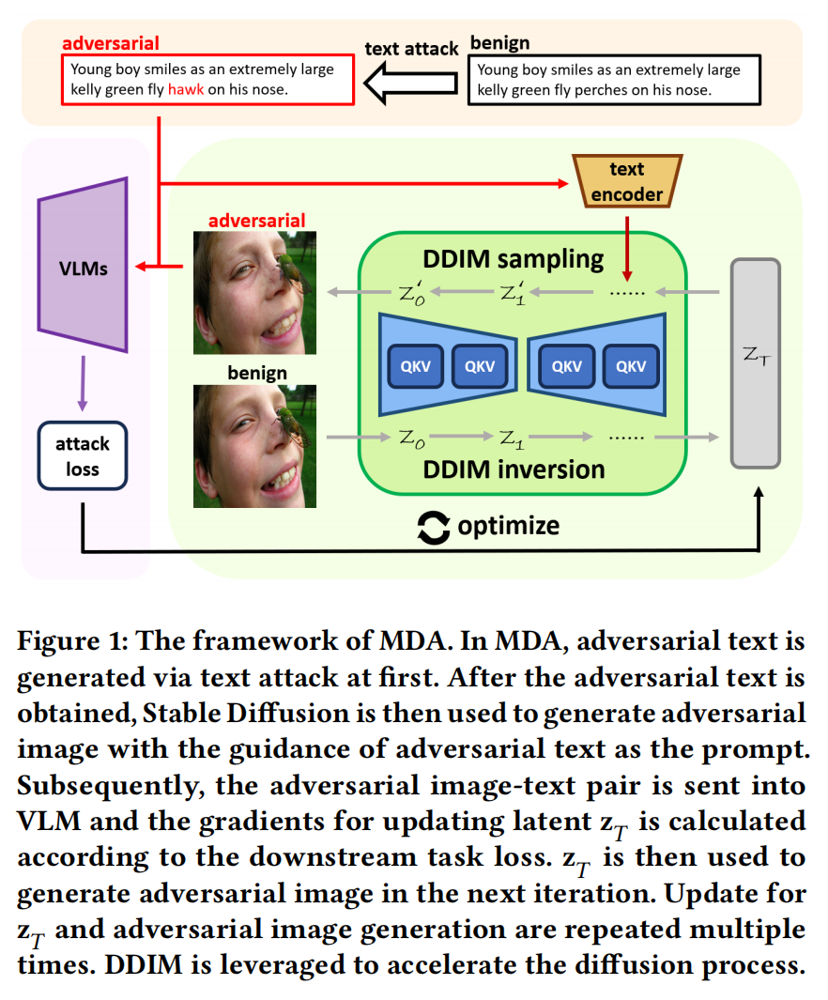

**文本模态攻击（Text Modality Attack） —— 生成对抗文本**

在实际实现中，本文采用 [BERT-Attack](https://arxiv.org/abs/2004.09984) 作为文本攻击算法。文本攻击的目标是生成一个与原文本在语义上尽可能不同的对抗文本 $x'_{\text{txt}}$。由于文本空间是离散的，不像图像像素可以直接通过梯度更新，因此无法直接基于下游任务的梯度修改token。相反，本文选择那些在特征空间中能造成最大变化的token进行替换，从而实现攻击。

对于对齐型模型（aligned model）（如 CLIP），其可以单独处理文本输入，攻击目标可表示为：

$$
\max_{x'_{\text{txt}}} \mathrm{KL}\big(E_t(x'_{\text{txt}}),\, E_t(x_{\text{txt}})\big)
$$
其中：
- $E_t(\cdot)$ 表示文本编码器（text encoder）的嵌入表示
- $\text{KL}(\cdot,\cdot)$ 为 Kullback–Leibler 散度，用于衡量干净文本与对抗文本特征的差异

对于融合型模型（fused models）（如 ALBEF与 TCL），由于其需要同时输入图像与文本，因此文本攻击目标为：

$$
\max_{x'_{\text{txt}}} \mathrm{KL}\big(
E_m(E_t(x'_{\text{txt}}), E_i(x_{\text{img}})),
E_m(E_t(x_{\text{txt}}), E_i(x_{\text{img}}))
\big)
$$

其中：
- $E_i(\cdot)$ 表示图像编码器（image encoder），
- $E_m(\cdot,\cdot)$ 表示多模态编码模块（multimodal encoder）。

**图像模态攻击（Image Modality Attack） —— 在扩散过程中根据对抗文本优化潜变量以生成对抗图像**

在图像模态上，本文采用在大量图文对上预训练的 Stable Diffusion 模型进行攻击。由于对抗攻击可被视作一种特殊的图像编辑任务，本文首先将干净图像映射到潜空间。具体地，使用 Stable Diffusion 的变分自编码器（VAE）编码器 $V_E(\cdot)$，对图像进行潜空间编码：

$$
z_T=V_E(x_{img})
$$

随后，通过 [DDIM反演（DDIM Inversion）](https://arxiv.org/abs/2010.02502) 将其逐步映射为带噪潜变量 $z_T$：

$$
z_T = \text{In}(z_{T-1}) = \text{In} \circ \cdots \circ \text{In}(z_0)
$$

其中每一步反演过程定义为：

$$
\ln(z_t) = 
\sqrt{\frac{\bar{\alpha}_{t+1}}{\bar{\alpha}_t}}\, z_t 
+ 
\sqrt{z_{t+1}}
\left(
    \sqrt{\frac{1}{\bar{\alpha}_{t+1}} - 1}
    - 
    \sqrt{\frac{1}{\bar{\alpha}_t} - 1}
\right)
\epsilon_{\theta}(z_t, t, \varnothing)
$$

其中：

$\alpha_t$ 为噪声缩放因子，

$\epsilon_\theta(\cdot)$ 表示噪声预测网络输出，

$\varnothing$ 表示空文本（null text prompt），

$t$ 为当前时间步，$T$ 为总时间步数。

得到反演潜变量 $z_T$ 后，我们通过去噪（denoising）过程生成对抗图像：

$$
z'_T =z_T, \quad z_0' = \text{De}(z_1') = \text{De} \circ \cdots \circ \text{De}(z'_T), 
\quad x'_{\text{img}} = V_D(z_0')
$$

其中 $V_D(\cdot)$ 是 VAE 解码器，$\text{De}(\cdot)$ 的定义如下：

$$
\text{De}(z_t') = \sqrt{\frac{\bar{\alpha}_{t-1}}{\bar{\alpha_t}}} \, z_t' 
+ \sqrt{z'_{t-1}} \left( \sqrt{\frac{1}{\bar{\alpha}_{t-1}} - 1} - \sqrt{\frac{1}{\bar{\alpha}_t} - 1} \right)
\, \epsilon_\theta(z_t', t, x'_{\text{txt}}, \varnothing)
$$

此时，对抗文本 $x'_{\text{txt}}$ 被作为提示词（prompt），参与每一步去噪，指导图像的生成方向。

为了控制模型在去噪过程中对条件信息（即文本提示）的依赖程度，本文采用 [CFG 技术](https://arxiv.org/abs/2207.12598)。其核心思想是通过引导系数 $\omega$ 平衡有条件与无条件生成：

$$
\epsilon_\theta(z_t', t, C,\varnothing) = \omega \cdot \epsilon_\theta(z_t', t, C) 
+ (1 - \omega) \cdot \epsilon_\theta(z_t', t, \varnothing)
$$

其中：
- $C$ 表示条件输入（此处为对抗文本）。
- $\omega$ 越大，模型越依赖文本提示信息，从而增强跨模态交互。

生成对抗图像后，通过下游任务的损失函数 $J(\cdot,\cdot)$ 计算梯度来更新潜变量 $z_T$，优化目标为：

$$
L_{\text{attack}} = -J(x'_{\text{img}}, x'_{\text{txt}})
$$

由于扩散模型具有生成性特征，若扰动过大将破坏图像的原始语义结构，使生成的图像与原图差异明显，失去攻击意义。

因此，为保持结构一致性，本文引入[自注意力约束（self-attention constraint）](https://ieeexplore.ieee.org/abstract/document/10716799/)，通过比较干净与对抗潜变量的自注意力图（self-attention maps）差异，定义结构保持损失：

$$
L_{\text{structure}} = \| sa_{\text{clean}} - sa_{\text{adv}} \|_2^2
$$

其中 $sa_{\text{clean}}$ 和 $sa_{\text{adv}}$ 分别表示干净潜变量与对抗潜变量的自注意力图。

最终的总体优化目标为：

$$
\min_{z'_T} L_{\text{total}} = \mu L_{\text{attack}} + L_{\text{structure}}
$$

其中 
- $\mu$ 为权重系数，用于平衡攻击损失与结构保持损失的相对重要性。
- $z'_T$ 会通过多次迭代更新，直到生成最终对抗样本。

注意：根据研究，扩散模型在早期时间步倾向于学习粗粒度语义（coarse semantics），而在后期时间步关注细粒度细节（fine details）。因此，更多的反演步数虽然能增强攻击强度，但会降低生成质量。本文遵循[经验](https://ieeexplore.ieee.org/abstract/document/10716799/)，在去噪过程的后半段（backward DDIM inversion steps）进行有限步数优化，以保留高层语义特征。

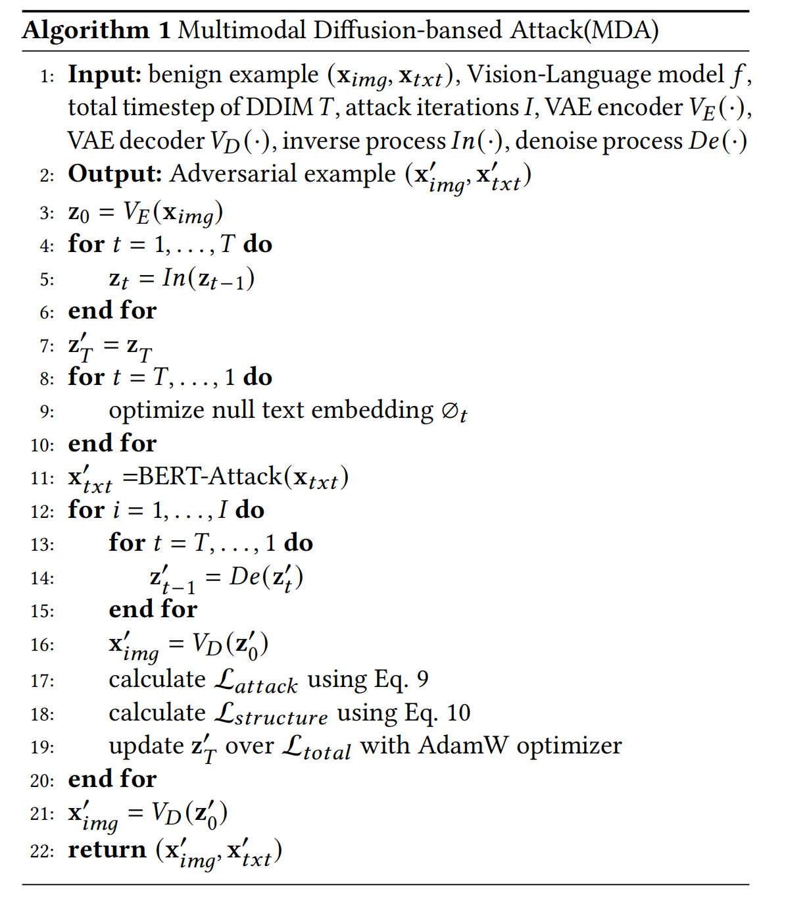

作者在图文检索（image-text retrieval）、视觉蕴含（visual entailment）、视觉指代（visual grounding） 等任务上进行了实验。

::: details 图文检索、视觉蕴含、视觉指代

图文检索（image-text retrieval）：在图文检索任务中，模型输入为图像，目标是检索出与其最相关的文本；而在文图检索任务中，输入为文本，输出为与之最匹配的图像。使用 [Flickr30K](https://direct.mit.edu/tacl/article-abstract/doi/10.1162/tacl_a_00166/43313)数据集：http://nlp.cs.illinois.edu/Denotation.html.

视觉蕴含（visual entailment）：视觉蕴含任务的目标是判断文本假设（hypothesis）是否能够从图像前提（premise）中推理得到。使用 [SNLI-VE](https://arxiv.org/abs/1901.06706)数据集：https://github.com/necla-ml/SNLI-VE

视觉指代（visual grounding）：视觉指代任务旨在识别并定位图像中与文本描述对应的对象或区域。使用 [RefCOCO](https://arxiv.org/abs/1608.00272)数据集：https://github.com/lichengunc/refer

:::

>论文笔记：
>本文结合BERT-Attack、Stable Diffusion两种框架以及多种trick（DDIM反演、CFG技术、自注意力约束（self-attention constraint））

---

## [Improving Visual Quality of Unrestricted Adversarial Examples with Wavelet-VAE(简写) [*ICML 2021*]](https://arxiv.org/abs/2108.11032)

**MOTIVATION：**

---

## [Multi-adversarial Faster-RCNN with Paradigm Teacher for Unrestricted Object Detection(简写) [*IJCV 2023*]](https://link.springer.com/article/10.1007/s11263-022-01728-z)

**MOTIVATION：**

---

## [AdvDiffuser: Natural Adversarial Example Synthesis with Diffusion Models(AdvDiffuser) [*ICCV 2023*]](https://openaccess.thecvf.com/content/ICCV2023/html/Chen_AdvDiffuser_Natural_Adversarial_Example_Synthesis_with_Diffusion_Models_ICCV_2023_paper.html)

**代码仓库：https://github.com/lafeat/advdiffuser**（原文作者一直没有提交代码，github上有其他用户提交了其实现： https://github.com/ChicForX/advdiff_impl）

**以往工作：** 1）范数约束攻击与人类感知不匹配；2）自然”无限制对抗样本（UAE）生成质量不高；3）攻击能力与自然性之间存在明显权衡
:::details 
近年的非限制对抗攻击方法，例如通过几何变换、颜色重映射等方式，或者在感知空间（如 LPIPS、SSIM）上加约束。另一条主线是利用GAN / VAE 等生成模型，在潜空间中对 latent code 施加扰动，再解码得到UAE。前者需要人为选择距离度量和代理模型，主观性强且难以保证视觉真实；后者虽然能从数据分布采样，但对 latent 的扰动往往会显著改变图像的高层语义，引入歧义甚至破坏原始概念，导致生成的UAE质量欠佳、语义不清晰，与原图分布偏差较大。

现有几类方法往往在“攻击成功率”和“感知自然性”之间难以兼得：几何/感知度量攻击可以做到很强的攻击能力，但容易产生显眼噪声或色彩失真；基于GAN的潜空间攻击自然性相对较好，但攻击成功率有限，且FID、LPIPS等指标明显弱于真实数据分布；更重要的是，大部分方法只能做“图像条件”的UAE，难以从头生成海量、高保真、且带攻击性的自然样本，为下游鲁棒性评估和训练提供的数据支持仍然不足。
:::

**MOTIVATION：** 本文希望设计一种既能从头或条件地生成“自然、高保真”的无限制对抗样本，又能保持极高攻击成功率、充分威胁当前最强鲁棒模型，并可进一步用于提升模型在“未知威胁模型”下的鲁棒性？

:::details 具体而言
在视觉上高度自然、语义忠实的前提下，对鲁棒模型实施极高成功率的攻击（接近 100%），并在 LPIPS、FID、SSIM 等感知指标上显著优于现有SOTA。

统一“合成样本”和“图像条件攻击”两种场景：既能从纯噪声出发生成带攻击性的自然图像，也能对给定原图进行细粒度的自然扰动。

生成过程可扩展、可控且适合对抗训练：能产生理论上无限多的自然对抗样本，从而支持对“未显式假设威胁模型”的鲁棒性训练与评估。
:::

<b> 本文核心方法：</b>

希望一个强大的扩散模型帮生成自然图像，同时在画图的过程中，往图里塞进能骗过分类器的对抗扰动 **（对抗引导）** ，最后再用“橡皮擦”把那些太丑太假的地方擦掉，只保留自然又有攻击性的部分 **（对抗修复）** 。

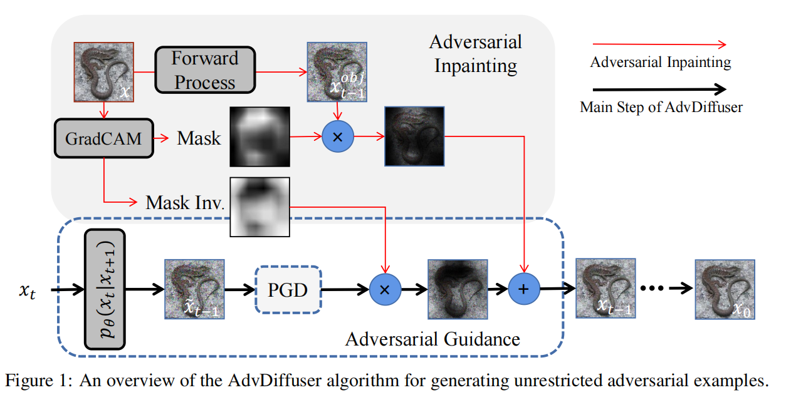

**对抗引导：** 利用扩散模型对 $\hat{x}_t$去噪得到中间结果$\hat{x}_{t-1}$，以$\hat{x}_{t-1}$为起点，对防御模型 $f$ 做一小步的PGD攻击得到"带攻击"的$\hat{x}_{t-1}$

这一小步攻击不是一次性极限攻击，而是在整个反向扩散过程中分散开来；噪声本来就很大的早期步骤，可以加稍大一点的对抗扰动而越到后面噪声越小，对抗扰动也自然减弱。这样做保证了：对抗扰动的尺度始终比扩散噪声小，后续去噪的“修图能力”可以把明显不自然的部分洗掉，只留下贴在数据流形上的那部分对抗扰动。

**对抗修复：** 用Crad-CAM在原图 $x_0$ 上跑一遍得到 “区域重要性” 热力图并进行归一化，其中 $m=1$ 的位置表示模型关心的区域，例如人脸、物体本体等；$m=0$ 的位置表示背景、边角料等不重要区域。在每个扩散步t中，从原图$x_0$出发加入对应时刻的噪声并去噪得到"原图风格版本"的 $x^{obj}_{t-1}$ (保留了原图结构和外观但是处在这一层噪声尺度下)，通过与对抗引导PGD攻击后的$\hat{x}_{t-1}$ 进行加权融合：

$$
x_{t-1} = m \odot x_{t-1}^{\text{obj}} + (1 - m) \odot \hat{x}_{t-1} .
$$

- 显著区域（m 接近 1）：更多用 $x^{obj}_{t-1}$  ，也就是“原图版本”，避免把目标物体改得面目全非；
- 不显著区域（m 接近 0）：更多用 $\hat{x}_{t-1}$ 的内容，允许形状、纹理、颜色大胆变化，只要能提升攻击效果。

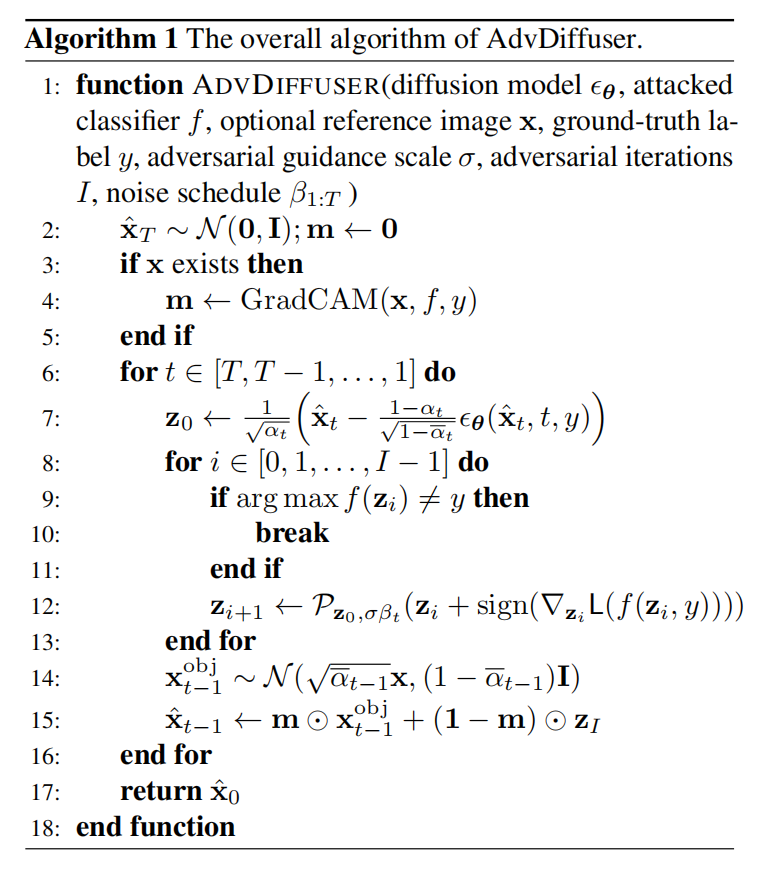

**算法流程：**

1. **初始化：**
   - 如果有参考图像 $x$，先用 Grad-CAM 计算掩膜 $m$；
   - 从高斯噪声采样一个初始 $\hat{x}_T$。

2. **从 $t = T$ 到 1 反向循环：**  
   对每个时间步 $t$：

   1. **扩散去噪一步：**  
      用条件扩散模型（条件是标签 $y$）将当前 $\hat{x}_t$ 去噪，得到一个参考图像 $z_0$（越往后越清晰）。

   2. **PGD 小步攻击：**  
      以 $z_0$ 为初始点，做 1 步 PGD：  
      - 最大化 normalized SCE；  
      - 约束扰动在 $\ell_2$ 球半径 $\rho \tilde{\sigma}_t$ 内；  
      - 得到攻击后的 $z_I$。

   3. **如果有参考图像，就做对抗修复：**
      - 从原图 $x$ 按当前噪声尺度生成 $x_{t-1}^{\text{obj}}$；  
      - 用 $m$ 把 $x_{t-1}^{\text{obj}}$ 和 $z_I$ 融合，得到新的 $\hat{x}_{t-1}$。

   4. **如果没有参考图像：**
      - 就直接让 $\hat{x}_{t-1} = z_I$，相当于“从噪声开始的纯生成攻击”。

3. **结束：**
   - 当 $t = 1$ 时，得到 $\hat{x}_0$；  
   - 这就是最终的自然对抗样本。

---

## [Pasadena: Perceptually Aware and Stealthy Adversarial Denoise Attack(简写) [*IEEE TMM 2022*]](https://ieeexplore.ieee.org/abstract/document/9531416)

**MOTIVATION：**

---

## [AccEar: Accelerometer Acoustic Eavesdropping with Unconstrained Vocabulary(AccEar) [*IEEE SSP 2022*]](https://ieeexplore.ieee.org/abstract/document/9833716)

**MOTIVATION：**

---
## [RAE-VWP: A Reversible Adversarial Example-Based Privacy and Copyright Protection Method of Medical Images for Internet of Medical Things(简写) [*IEEE IoT 2024*]](https://ieeexplore.ieee.org/abstract/document/10460291)

**MOTIVATION：**

---

## [Towards Transferable Adversarial Perturbations with Minimum Norm(简写) [*ICML 2021*]](https://openreview.net/forum?id=SktdCGNd3xI)

**MOTIVATION：**

---
## [AdvST: Generating Unrestricted Adversarial Images Via Style Transfer(Advst) [*IEEE TMM 2024*]](https://ieeexplore.ieee.org/abstract/document/10292904)

**MOTIVATION：**

---
## [Provable Unrestricted Adversarial Training Without Compromise with Generalizability(简写) [*IEEE TPAMI 2024*]](https://arxiv.org/abs/2301.09069)

**MOTIVATION：**

---

## [Enhancing Diffusion-based Unrestricted Adversarial Attacks via Adversary Preferences Alignment(APA) [*CVPR 2025*]](https://arxiv.org/abs/2506.01511)

**MOTIVATION：** 最近有研究尝试通过修改图像的 **语义属性（如形状、颜色、纹理）** 来生成更加自然的攻击样本，但：
- 形状攻击（Shape-based）导致结构变化但难以保持一致性；
- 纹理或颜色攻击（Texture/Color-based）虽自然但可迁移性差；
- Diffusion-based 攻击（如 ACA, DiffPGD）虽利用生成模型，但其潜空间扰动高度敏感，稍有噪声即会引起语义漂移，难以稳定生成高一致性的对抗样本。

而现有扩散模型的偏好对齐主要关注人类偏好（Human Preference Alignment），如审美或文字匹配，而忽略了“攻击者偏好（Adversary Preferences）”这一安全相关场景。
这些人类偏好方法（RLHF、DPO、Direct Reward）无法直接用于对抗样本生成，因为：
- 缺乏攻击偏好数据集，无法像人类偏好那样通过成对样本进行学习；
- 偏好冲突严重：视觉一致性与攻击有效性本质上互相制约，联合优化时易出现“Reward Hacking”（如牺牲图像质量换取攻击成功率）。

本文认为，无约束对抗样本的生成过程，本质上是“攻击者偏好（Adversary Preferences）”的对齐问题，其中包含两个相互矛盾的核心目标：

- 视觉一致性（Visual Consistency）：生成的对抗样本应尽可能保持与原图语义一致，使其看起来“自然”、“可信”。
- 攻击有效性（Attack Effectiveness）：样本必须能高效地欺骗目标分类器（尤其是黑盒模型），并在不同架构之间具有良好的迁移性。

因此。本文将这两个偏好“解耦”为两个独立阶段，分别优化视觉与攻击偏好，使模型先学会“生成稳定图像”，再学会“在该图像空间中进行攻击”。

<b> 本文核心方法：</b>
本文提出了一个两阶段的攻击者偏好对齐框架：
1. 首先，将无约束对抗样本生成任务重新定义为多偏好对齐问题（multi-preference alignment）；

1. 然后，通过将“视觉一致性”与“攻击有效性”进行解耦，分别构建独立的可微奖励模型。
  - 第一阶段：通过微调 LoRA 模块实现视觉一致性对齐；
  - 第二阶段：基于替代分类器反馈执行攻击优化（包括双路径引导与扩散增强）。 

这种“分而治之”的设计使 APA 能在保持视觉稳定性的前提下最大化攻击性能，从而逼近帕累托最优解（Pareto Optimality）。

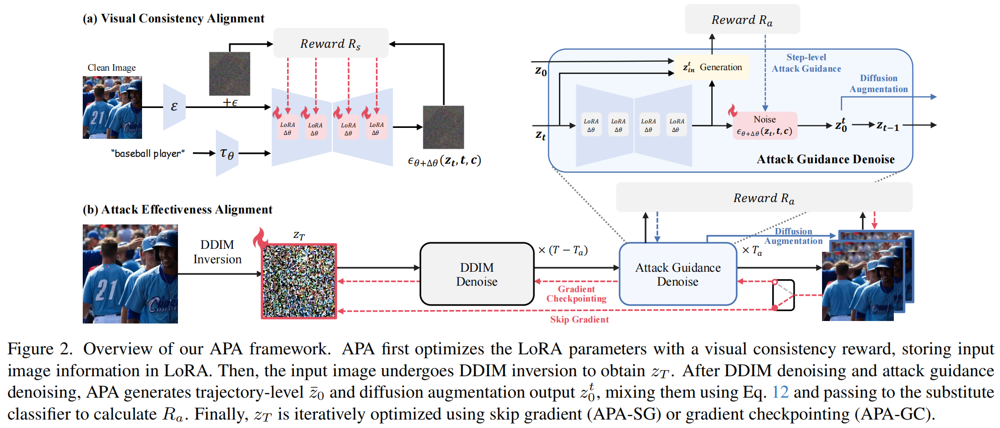

**视觉一致性对齐：** 

对经 DDIM 反演得到的 $z_T$ 不施加扰动，模型几乎可以完美重构原图。但即便是极微弱的噪声（尤其是对抗噪声）也可能造成语义偏移，导致生成图像与原始输入不再一致。

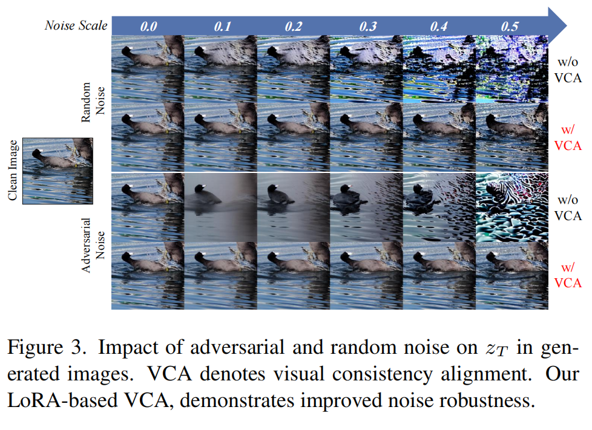

已有研究表明，[低秩适配(Low-Rank Adaptation, LoRA)](https://arxiv.org/abs/2106.09685)  能够以高效的方式将高维语义编码到模型的低秩参数空间中。因此，作者将 LoRA 参数 $\Delta\theta$ 作为策略模型（policy model），并定义视觉一致性奖励函数 $R_s(\cdot)$ 来优化它。

最直接的方式是计算输入图像 $x$ 与模型生成输出 $D(\bar{z}_0)$ 之间的相似性 $S(\cdot)$，即：

$$
\max_{\Delta\theta} R_s(\Delta\theta) = S(D(\bar{z}_0), x).
$$

其中 $\bar{z}_0$ 表示经过 $T$ 步 DDIM 去噪后的潜变量。

但在像素空间计算 $S(D(\bar{z}_0), x)$ 太耗时，作者将相似性从像素空间迁移到潜空间计算，并进行轨迹级近似，则奖励函数可改写为：

$$
R_s(\Delta\theta) = \mathbb{E}_{t, \epsilon} \left[ -\| \epsilon - \epsilon_{\theta+\Delta\theta}(z_t, t, c) \|^2 \right].
$$

**攻击有效性对齐：** 
1. 轨迹级引导（Trajectory-level Guidance）：作者将扩散生成过程看作一条从 $z_T \to \bar{z}_0$ 的轨迹；并用动量更新提升梯度稳定性
- 使用动量更新（momentum）提升梯度稳定性：

$$
g_{\mathrm{tr}} = \nabla_{z_T} R_a(f_\phi(x_{\mathrm{adv}}), y)
$$

$$
m_{\mathrm{tr}}^{(i)} = m_{\mathrm{tr}}^{(i-1)} + \frac{g_{\mathrm{tr}}}{\| g_{\mathrm{tr}} \|_1}, \quad 
z_T = \Pi_{z_T^0 + \epsilon_a} \left( z_T + \mu \cdot \mathrm{sgn}(m_{\mathrm{tr}}^{(i)}) \right)
$$

其中：
- $\Pi$ 保证 $z_T$ 不偏离原始潜变量太远；
- $\mu$ 为步长；
- $\epsilon_a$ 控制扰动强度。

2. 步级引导（Step-wise Guidance）：每一步去噪都会生成中间潜变量 $z_t$，其对图像结构与细节的贡献不同。因此 APA 在每一步都注入攻击信号：

$$
\epsilon_{\theta+\Delta\theta}(z_t, t, c)
\leftarrow
\epsilon_{\theta+\Delta\theta}(z_t, t, c)
-
\sqrt{1 - \bar{\alpha}_t}\,
\nabla_{z_t} R_a(f_\phi(D(z_t)), y)
$$

并通过**插值修正**来平衡噪声与原始结构：

$$
z_t^{\text{in}} = \sqrt{1 - \bar{\alpha}_t} z_0 + (1 - \sqrt{1 - \bar{\alpha}_t}) z_t'
$$

再引入步级动量：

$$
g_t^{st} = \nabla_{z_t} R_a(f_\phi(x_t^{in}), y),
\qquad
m_t^{st} = m_{t+1}^{st} + \frac{g_t^{st}}{\| g_t^{st} \|_1}
$$

使用 $\text{sgn}(m_t^{st})$ 替换梯度方向，使优化更加平滑，让模型在每个扩散步都能根据“攻击反馈”调整生成方向。

**扩散增强（Diffusion Augmentation）：** 为防止 APA 过拟合到替代分类器（即 reward hacking），论文引入“扩散增强”：在不同扩散步得到的中间结果 $z_t'$ 被解码为图像后，与最终输出混合形成增强样本：

$$
x_t^0 = \varrho \left( D\!\left(\frac{z_t' + D(\bar{z}_0)}{2}\right) \right)
$$

其中 $\varrho(\cdot)$ 表示随机可微增强操作（padding, resize, 亮度变化等）。  
最终攻击梯度为：

$$
g_{\mathrm{tr}} = \nabla_{z_T} \frac{1}{T} \sum_{t=0}^{T} R_a(f_\phi(x_t^0), y)
$$

---

## [SemDiff: Generating Natural Unrestricted Adversarial Examples via Semantic Attributes Optimization in Diffusion Models(SemDiff) [*会议/期刊名 2025*]](https://arxiv.org/abs/2504.11923)

**MOTIVATION：**

---

## [VENOM: Text-driven Unrestricted Adversarial Example Generation with Diffusion Models(简写) [*会议/期刊名 2025*]](https://arxiv.org/abs/2501.07922)

**MOTIVATION：**

---

## [SCA: Improve Semantic Consistent in Unrestricted Adversarial Attacks via DDPM Inversion(SCA) [*会议/期刊名 2024*]](https://arxiv.org/abs/2410.02240)

**MOTIVATION：** 现有的“无限制对抗攻击”方法虽能生成更自然的攻击样本，但在生成过程中容易出现语义偏移（semantic shift）——也就是图像中主体或场景的语义发生明显变化。这种偏移不仅破坏了攻击样本的“伪装性”，也降低了对抗攻击在现实中的可行性；近期方法（如AdvDiffuser、ACA）利用扩散模型生成对抗样本，虽然提高了样本的自然性，但这些方法需要 **上千步的去噪反演（denoising steps）** 才能重构图像，效率极低，同时反演过程的不精确会引入额外的语义噪声，产生失真与细节丢失；以往在latent space中施加扰动的策略过于依赖数值优化或简化梯度估计，缺乏对语义层面的约束，从而导致扰动方向不稳定、难以保持图像内容的可解释性与一致性。本文借助MLLM在整个生成过程中提供语义指导，在MLLM提供的丰富语义信息约束下，利用一系列可编辑噪声图进行每一步的DDPM去噪过程

<b> 本文核心方法：</b>

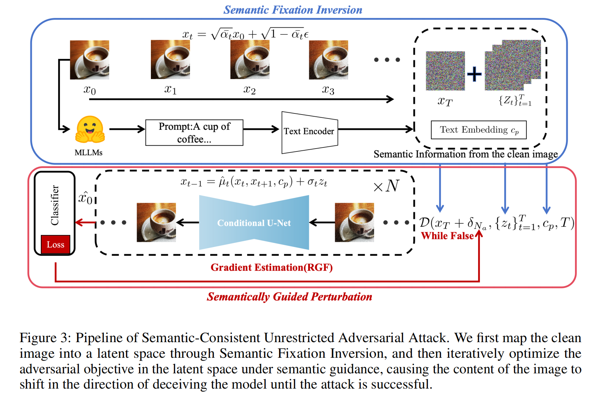

本文核心思想是在生成非限制性对抗样本（Unrestricted Adversarial Examples）的整个过程中，通过引入一种新的反演机制来增强语义控制（semantic control），使模型能够“更强地记住（imprint）”原始图像的语义信息。同时，借助 **多模态大语言模型（MLLM）** 提供的强大语义指导，限制潜空间扰动的方向，使其仅在保持语义一致性的前提下生成有效的对抗样本。具体而言，分为两个主要阶段：

**语义固定反演（Semantic Fixation Inversion）：** 将干净图像映射到潜空间中，提取语义可编辑的噪声图。

1. 反演机制优化

传统的反演过程（如 DDIM Inversion）往往需要大量步数才能达到较高还原度，效率低下。
因此，本文采用一种更高效的基于 DDPM 的反演机制，它能够在更少的步数内实现精确反演，并保持语义保真。

在此基础上，本文进一步引入 [DPM-Solver++](https://proceedings.neurips.cc/paper_files/paper/2022/hash/260a14acce2a89dad36adc8eefe7c59e-Abstract-Conference.html) 这一高阶数值求解器。DDPM 的反向扩散过程可被视为一阶随机微分方程（SDE）。通过使用高阶求解器（如 DPM-Solver++）求解该 SDE，可在显著减少步数的同时，保证反演稳定性与精度。

2. 引入多模态语义约束

多模态大语言模型（如 LLaVA-NeXT）在跨模态理解方面具备极强的能力，本文利用 MLLM 自动生成对输入图像 $x_0$ 的详细语义描述（caption）$P$ ，并将其编码为文本嵌入 $c_p=(P)$ 该语义向量作为条件输入，注入到预训练的扩散模型噪声预测器 $\hat{\epsilon}_\theta(x_t,c_p)$ 中，从而在反演与重建的每一步提供语义指导。反向扩散过程的计算式为：

$$
x_{t-1}=\hat{\mu_t}(x_t,x_{t+1},c_p)+\sigma_tz_t,t=T,...,1
$$

**语义引导扰动（Semantically Guided Perturbation）：** 在潜空间中，在语义约束下优化对抗目标，使图像逐步朝欺骗模型的方向变化，直至攻击成功。

1. 定义去噪过程

去噪过程可以递归展开为：
$$
\hat{x}_0 = D(x_T, \{z_t\}_{t=1}^T, c_p, T),
$$

其中 \( D(\cdot) \) 表示基于反演方程的多步去噪函数。

2. 对抗目标函数

优化目标为：

$$
\max_{\delta} L(F_\theta(\hat{x}_0), y), 
\quad \text{s.t.} \;
\|\delta\|_\infty \le \kappa, \;
d(x, x_{\text{adv}}) < \epsilon, \;
\hat{x}_0 = D(x_T, \{z_t\}_{t=1}^T, c_p, T),
$$

其中：

- 𝛿：潜空间中的扰动；

- 𝜅：控制扰动的幅度；

- 𝑑(⋅)：控制语义距离。

在[以往研究](https://proceedings.neurips.cc/paper_files/paper/2023/hash/a24cd16bc361afa78e57d31d34f3d936-Abstract-Conference.html)中，损失函数通常包含两部分：
- 分类交叉熵损失 $L_{ce}$：推动模型误分类；
- MSE 损失 $L_{mse}$：保证生成图像与原图在像素级接近。

但实验表明，$L_{mse}$ 对语义保持作用有限，反而会增加优化难度。因此，我们仅采用 $L=L_{ce}$作为主要优化目标。

3. 梯度估计与更新

直接在潜空间上计算梯度代价极高且容易导致内存溢出，因此我们采用[随机无梯度（Random Gradient-Free, RGF）估计方法](https://link.springer.com/article/10.1007/s10208-015-9296-2?sap-outbound-id=2CD06B7AA403BA98C16D249ED4695B3F132E3BBF&utm_source=hybris-campaign&utm_medium=email&utm_campaign=000_KUND01_0000013904_SRMT_Centralized_10208&utm_content=EN_internal_31000_20190821&mkt-key=005056A5C6311ED999AA0A5933FFAAE7&error=cookies_not_supported&code=b811c23c-fb9c-4957-859e-8eca5eb62a56)。
其思想是：将梯度视为方向导数的期望：
$$
\nabla_{x_T} L(F_\theta(\hat{x}_0), y)
\approx
\frac{1}{N\sigma}
\sum_{n=1}^N [ D(x_T + \sigma \delta_n) - D(x_T) ] \cdot \delta_n,
$$

其中：
- $\delta_n$为从单位球上随机采样的方向；
- 𝜎 为采样方差；
- 𝑁为查询次数。

当 𝜎→0且 𝑁→∞时，该估计趋于无偏。

4. 边界约束与动量更新

由于生成的图像可能超出像素范围，采用边界函数 $\varrho(\cdot)$ 将像素值限制在[0,1]。
同时，引入投影算子 $\Pi_\kappa$，将扰动限制在半径为 $\kappa$ 的球面内，以平衡攻击强度与自然性。

动量更新公式如下：

$$
g_k \leftarrow \mu g_{k-1} +
\frac{
\nabla_{x_T} L(F_\theta(\varrho(\hat{x}_0)), y)
}{
\| \nabla_{x_T} L(F_\theta(\varrho(\hat{x}_0)), y) \|_1
},
$$

$$
\delta_k \leftarrow \Pi_\kappa \bigl( \delta_{k-1} + \eta \cdot \operatorname{sign}(g_k) \bigr),
$$

其中：

- $\mu$：动量系数；  
- $\eta$：步长；  
- $\operatorname{sign}(\cdot)$：取符号函数。

该机制结合了动量与投影约束，在保持自然性的同时稳定了优化过程。

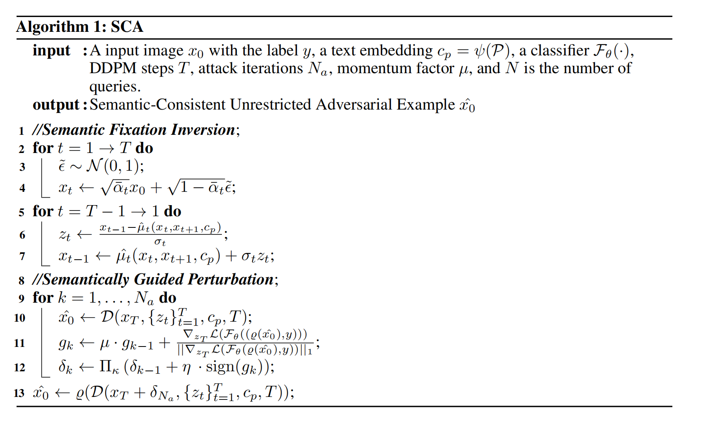

---

## [ReToMe-VA: Recursive Token Merging for Video Diffusion-based Unrestricted Adversarial Attack(ReToMe-VA) [*MM 2024*]](https://arxiv.org/abs/2408.05479)

**MOTIVATION：** 作者认为之前工作的缺陷存在：

（1）**受限攻击（Lp 范数约束）的局限**

（2）**非受限攻击自然但不够“能打”**，缺乏应用在视频领域的工作而直接把图像方法逐帧应用到视频，会带来三大问题：

1. 扩散过程早期加入的是**粗粒度语义信息**，过早修改潜变量会破坏图像结构，导致空间结构和语义严重变化；
2. 各帧独立优化，**没有利用时间维度的交互**，梯度单调、方向单一；
3. 整个扩散过程都算梯度，对多帧视频来说**显存开销极大、效率低**。

（3）**目前已有视频攻击大多是“受限 + 忽视扩散”**

- 现有可迁移视频攻击（如 TT、I2V、GCMA 等）本质上仍是受限攻击，或者把视频当成“无序图片集”处理，忽略了时序一致性和扩散模型的强生成能力。

<b>相关工作：</b>
已有的图像扩散式非受限攻击工作，通常采用 DDIM inversion 技术，将干净图像映射到扩散模型的潜空间中。随后，它们在潜空间中执行对抗攻击，并利用 DDIM sampling 从对抗潜变量中生成对抗图像。直接把这一路线扩展到视频上时，一个自然的想法是：先对视频的每一帧分别进行 DDIM inversion 得到潜变量，再在潜空间中对这些潜变量施加对抗扰动，最后分别通过 DDIM sampling 生成对抗视频帧。然而，将这种方法简单应用于视频会带来若干问题。首先，DDIM inversion 过程中早期时间步的操作通常会逐步加入粗粒度语义信息，而在这些早期时间步对潜变量进行修改，很容易导致生成的帧在语义上出现不一致和明显变化。这种空间上的不一致性，进一步会在对抗视频中表现为时间维度上的不一致。其次，在视频攻击中该框架需要**同时更新所有帧**，在整个去噪过程中进行梯度计算，会带来巨大的显存开销和时间消耗。

<b>本文核心方法：</b>

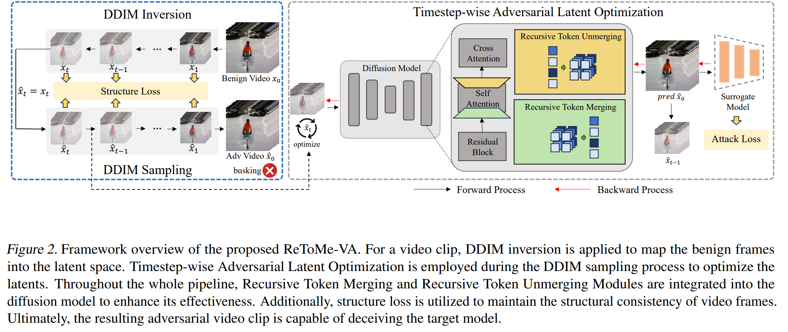

**TALO：** 作者希望在每一个去噪时间步中逐步更新潜空间中的扰动。具体而言，在完成 DDIM inversion 之后，从时间步 $ 0 $ 到 $T$ 得到一系列“反向”潜变量 $\{x_0, x_1, \ldots, x_T\}$ ，其中 $x_0 = x$。为了在“难以察觉性”和“对抗迁移性”之间取得折中，我们并不是从高斯噪声对应的时间步 $T$ 开始优化，而是从某个中间时间步 $t_s$ 的潜变量 $x_{t_s}$ 开始进行对抗优化。

记 $\hat{x}_t$ 为时间步 $t$ 的对抗潜变量，并以 $\hat{x}_{t_s} = x_{t_s}$ 作为初始化。对于每一个去噪时间步 $t$，我们先预测每一帧在时间步 $0$ 的最终输出 $\hat{x}_t^0$，并使用该输出替代对抗输出 $\hat{x}_0$ 来作为替代模型 $G_\phi$ 的输入进行预测。$\hat{x}_t^0$ 的计算，以及我们的对抗目标函数如下所示：

$$
\hat{x}_t^0
=
\frac{\hat{x}_t - \sqrt{1-\alpha_t}\,\epsilon_\theta(\hat{x}_t, t)}{\sqrt{\alpha_t}}
$$

$$
\arg\min_{\hat{x}_t} L_{\text{attack}}
=
- J\bigl(\hat{x}_t^0, y, G_\phi\bigr)
$$

其中，$\alpha_t$ 是调度器（scheduler）的参数，$\epsilon_\theta$ 表示 UNet 预测的噪声，$J(\cdot)$ 为交叉熵损失。

在优化得到对抗潜变量 $\hat{x}_t$ 之后，我们根据 DDIM 采样公式，从 $\hat{x}_t$ 生成下一时间步的潜变量 $\hat{x}_{t-1}$，以便于后续时间步的优化：

$$
\hat{x}_{t-1}
=
\sqrt{\alpha_{t-1}}
\left(
\frac{\hat{x}_t - \sqrt{1-\alpha_t}\,\epsilon_\theta(\hat{x}_t, t)}{\sqrt{\alpha_t}}
\right)
+
\sqrt{1-\alpha_{t-1}-\sigma_t^2}\,\epsilon_\theta(\hat{x}_t, t)
$$

最后，在时间步 $0$ 得到的 $\hat{x}_0$ 作为最终的对抗视频片段 $\hat{x}$，用来欺骗目标视频识别模型 $F_\theta$。

**保持结构相似性（Preservation of Structural Similarity）**

在每一个去噪时间步进行对抗优化，会导致潜变量逐渐偏离原始帧的分布。尽管为了加入对抗信息，干净帧不可避免地要发生变化，但核心挑战在于：**如何在添加对抗内容的同时，尽量保持对抗帧与干净帧在结构上的相似性。**

利用自注意力层的空间特征在决定生成图像结构和外观方面非常关键这一事实，TALO 在每个时间步 $t$ 上最小化干净潜变量与对抗潜变量的自注意力图之间的差异。具体地，我们在每个时间步 $t$ 上最小化自注意力图的平均差异：

$$
\arg\min_{\hat{x}_t} L_{\text{structure}}
=
\sum_{j \in \mathcal{N}_s}
\left\|
\hat{s}_t^{\,j} - s_t^{\,j}
\right\|_2^2
$$

其中，$s_t^{\,j}$ 和 $\hat{s}_t^{\,j}$ 分别表示时间步 $t$ 时，第 $j$ 个自注意力图在干净潜变量 $x_t$ 与对抗潜变量 $\hat{x}_t$ 上的输出，$\mathcal{N}_s$ 表示扩散模型中自注意力图的总数索引集合。

总体而言，ReToMe-VA 的总损失函数为：

$$
\arg\min_{\hat{x}_t} L_{\text{total}}
=
\gamma L_{\text{attack}} + \beta L_{\text{structure}}
$$

其中，$\gamma$ 与 $\beta$ 分别是各个损失项的权重系数。

本方法的优势在于：**按时间步优化 + 增量迭代** 使整个对抗生成过程更加可控且稳定，有助于生成空间上难以察觉、但更具攻击性的对抗视频片段；TALO 在每次更新时只涉及**单一时间步**的梯度计算，从而显著降低了梯度计算中的内存开销。

增量迭代策略（Incremental Iteration Strategy）：作者认为迭代次数太少，很难找到较优的扰动，从而导致对抗迁移性偏弱；迭代次数过多，则会使对抗帧与干净帧偏离得过远，损害对抗视频在空间维度上的难以察觉性。因此，需要在早期时间步使用较少的迭代次数，以尽量保留原有结构；在后期时间步逐步增加迭代次数，以注入更多对抗细节。本文以步长为 2 的间隔，在每若干个去噪时间步上增加一次迭代次数。

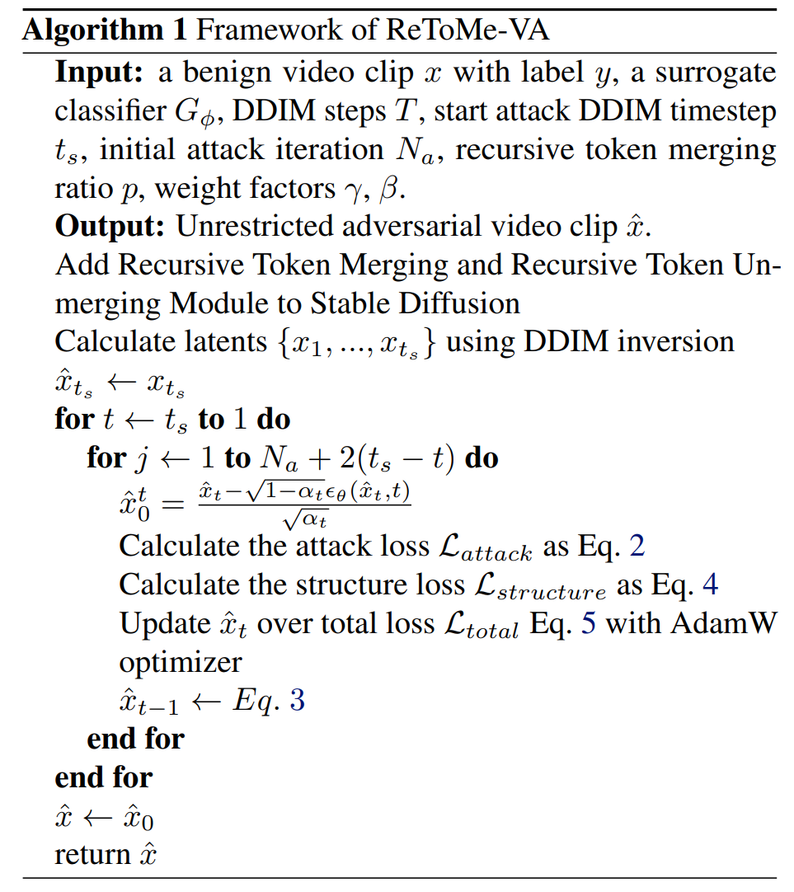

**ReToMe：**

由于TALO 策略对视频的每一帧分别进行扰动。这种**逐帧优化**会使各帧可能沿着不同的对抗方向被优化，从而导致运动不连续、时间不一致。进一步地，由于没有显式利用帧间交互，逐帧单独扰动会使梯度方向趋于单一、欠多样。为此，本文提出**递归 Token 合并**（ReToMe）策略，用来在多帧之间递归地匹配并合并相似的 tokens，使自注意力模块能够提取到更加一致的特征。

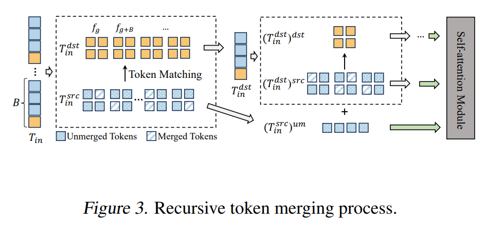

Token Merging（ToMe）最初被用于通过若干针对扩散模型的改进来加速扩散模型推理（Bolya & Hoffman, 2023）。一般而言，一组 tokens $T$ 会被划分为**源集合**（src）和**目标集合**（dst）。接着，我们为 src 中的每个 token 在 dst 中找到相似度最高的 token，并保留其中最相似的 $r$ 条“匹配边”。随后，我们将 src 中与这些匹配边相连的 tokens 合并到 dst 中，即用对应的 dst tokens 来替换这些 src tokens。为了保持 token 总数不变，在自注意力计算之后，我们会把 dst 的输出值再“分摊”回被合并的 src tokens。

形式化地，token 匹配、合并与反合并（unmerging）可表示为：

$$
e = \mathrm{match}(\mathrm{src}, \mathrm{dst}, r), \qquad
T_m = M(T, e), \qquad
T_{um} = UM(T_m, e)
\tag{6}
$$

其中，$\mathrm{match}(\cdot)$ 输出匹配映射 $e$，包含来自 src 到 dst 的 $r$ 条边；$M(\cdot)$ 与 $UM(\cdot)$ 分别表示根据匹配关系 $e$ 进行合并与反合并操作。合并后，
$T_m = \{(T^{\mathrm{src}})_{um}, T^{\mathrm{dst}}\}$，其中 $(T^{\mathrm{src}})_{um}$ 是 src 中未被合并的 tokens，而 $T^{\mathrm{dst}}$ 是 dst 中的 tokens；被合并的 src tokens $(T^{\mathrm{src}})_m$ 则由对应的 dst tokens 替代。

一个自注意力模块接收所有帧上的输入 tokens，并输出对应的 tokens。我们将输入与输出 tokens 分别记为
$T^{\mathrm{in}}, T^{\mathrm{out}} \in \mathbb{R}^{N \times L \times E}$，其中 $L$ 是每帧的 token 数，$E$ 是嵌入维度。为了在帧之间划分 src/dst，我们设定步长为 $B$：在前 $B$ 帧中随机选择一帧（例如第 $g$ 帧），并将之后每隔 $B$ 帧的帧都划入 dst 集合，对应的 tokens 构成 $T^{\mathrm{dst}}_{\mathrm{in}}$，其余帧上的 tokens 构成 src 集合 $T^{\mathrm{src}}_{\mathrm{in}}$。然后，我们对 src 进行一次合并操作：

$$
e_1 = \mathrm{match}\!\bigl(T^{\mathrm{src}}_{\mathrm{in}}, T^{\mathrm{dst}}_{\mathrm{in}}, r_1\bigr), 
\qquad
T^{\mathrm{rm}} = M\!\bigl(T^{\mathrm{in}}, e_1\bigr)
\tag{7}
$$

其中，$T^{\mathrm{rm}} = \{T^{\mathrm{dst}}_{\mathrm{in}}, (T^{\mathrm{src}}_{\mathrm{in}})_{um}\}$。我们令  
$r_1 = p (N - N_{d1}) L$，其中 $p$ 为合并比例系数，$(N - N_{d1})L$ 是首次合并过程中 src 中的 token 数量，$N_{d1}$ 是此轮中 dst 的帧数。

然而，上述合并过程中，dst 里的 tokens 本身并没有被进一步合并、压缩。为了最大化帧间信息融合，我们对 dst 中的 tokens **继续递归**地执行类似的合并过程：在下一轮中，将上一轮中“未被合并”的 $(T^{\mathrm{src}}_{\mathrm{in}})_{um}$ 也加入到 dst 中参与匹配，直至已经不再需要进一步合并为止。此时，新一轮的匹配与合并过程与式 (7) 类似，只是参与匹配的 src/dst 和 token 数量 $r_2$ 会随递归层数发生变化。

在完成多轮递归合并后，我们得到最终的压缩 tokens $T^{\mathrm{rm}}$，并将其送入自注意力模块，得到压缩空间上的输出 $(T^{\mathrm{out}})_{\mathrm{rm}}$。为了继续后续网络计算，我们还需要将这些输出 tokens 恢复到原始形状 $T^{\mathrm{out}}$。为此，在反合并阶段，我们按照与合并相反的顺序依次应用式 (6) 中的反合并操作 $UM(\cdot)$，从而得到恢复后的 $T^{\mathrm{out}}$。

本方法优势在于：

1. **时间一致性与难以察觉性：**
    ReToMe 使得跨帧最相似的 tokens 共享相同的输出，从而最大化 token 压缩效果，增强帧间特征的一致性；这既提高了帧间内部特征的统一性，又有助于保持时间上的连续性，进而实现良好的**时间难以察觉性**。
2. **减少扰动内部相互作用，缓解过拟合：**
    根据已有研究（Wang et al., 2020），对抗迁移性与扰动内部的相互作用呈负相关。通过合并 tokens，ReToMe 有效降低了扰动内部的相互作用程度，从而减轻在替代模型上的过拟合问题。
3. **显式帧间交互，提升迁移性：**
    合并后，dst 中的 tokens 与来自多个帧的 merged tokens 产生连接，在梯度计算中自然引入**帧间交互**。这有助于产生更加鲁棒、多样的梯度方向（Wang et al., 2023），从而显著提升对抗攻击的迁移性。

---

## [论文题目(简写) [*会议/期刊名 年份*]](下载链接)

**MOTIVATION：**

---