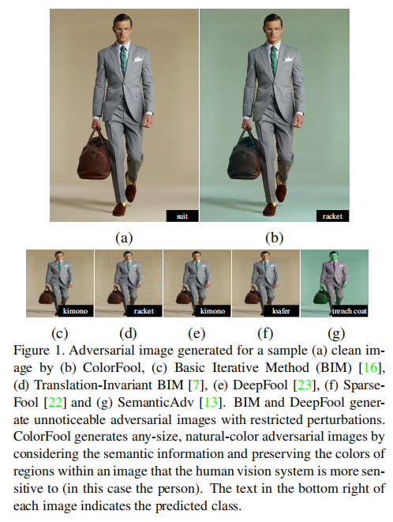
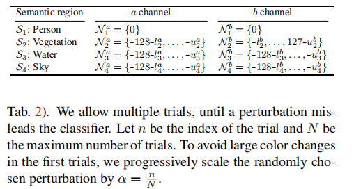

---

date: 2025-09-30
category:
  - 码头
tag:
  - 无限制对抗攻击样本

---

# 无限制对抗攻击

---
无限制对抗攻击样本相较于在𝐿𝑝-范数限制下的对抗攻击样本有更好的迁移性

>实验相关：
>
> 
> 
> 
> **指标：**
> - 攻击成功率（Success Rate, SR），即对抗样本能够误导分类器的比例（越高越好）
> - 对抗样本的迁移性：假设 对抗模型A在 被攻击模型$F_1$的攻击成功率为1，迁移到被攻击模型$F_2$后变得越低则越说明迁移性差
> - 鲁棒性：攻击方法在经过 防御后 的攻击成功率变化情况
> - 不可检测性 (Undetect.)：取值范围 0–1。数值越高，代表对抗样本更难被检测为“对抗的”，即防御方法越难发现攻击。
> - NIMA：图像质量，越大越好，将攻击后的图像与干净图像（Clean） 的 NIMA对比
> - 随机性影响：选取 N 张 干净 图像，对每张图像运行 M 次随机初始化（不同随机扰动选择），统计三项指标： Success rate [%]（对每张图像 500 次中的成功率）；trials（收敛所需的尝试次数，分布用箱线图或箱须图表示）；final classes（500 次实验最终收敛到多少不同的“目标类别”，反映收敛的稳定性）
> 

---
## [Unrestricted Adversarial Examples[ *2018* ]](https://arxiv.org/abs/1809.08352)

>### MOTIVATION：
> 
>现有研究设定过于狭窄 —— 只考虑小扰动攻击，并不能真实反映深度学习系统在最坏情况下面临的风险。
> 
>高置信度错误难以避免 —— 模型往往在明显错误的预测上依然输出高置信度，导致在安全关键场景下可能出现灾难性后果（例如自动驾驶系统未能识别人）。

### 竞赛说明：
竞赛构建了两类无歧义数据集，其中所有图像要么是无歧义的鸟的图像，要么是无歧义的自行车的图像。

**防御者** 需要构建模型，将图像作为输入，并必须返回三种结果之一：鸟（bird）、自行车（bicycle） 或 弃权（abstain）。模型允许在任意对抗输入上弃权（通过返回低置信度预测来实现），但只要出现一次高置信度的错误预测，防御就算被攻破。

**攻击者** 必须提交一张无歧义的鸟或自行车图像，而该模型却错误地进行分类（这一点由一组人工评审来决定）。

**完全白盒：** 目标是找到不会产生高置信度错误的模型（而不仅仅是让攻击者难以找到错误），竞赛要求所有防御方法开源，并向攻击者公开。因此，攻击者可以针对特定模型设计对抗样本。这一设定提供了更现实的威胁模型来评估防御效果。

**攻击不受限制** —— 不受任何范数约束球（norm-ball）的限制。由于攻击不再局限于某个标注测试点附近的邻域，每张提交的图像都必须经过人工评审以确定其真实类别。若所有评审一致认为该图像无歧义地属于类别 A，而模型却高置信度地将其错误分类为类别 B（而非类别 A 或弃权），则攻击成功。

防止模型对所有输入都弃权，参赛模型必须在一个私有数据集（包含干净的“鸟或自行车”图像）上达到 80% 的准确率。

>**论文笔记：** 能否让模型输出 I'm not sure, 认识到自己的不确定性；从比赛里公布的优秀攻击、防御模型里面找相应的论文补充该领域思路

---

## [Generating Unrestricted Adversarial Examples via Three Parameters[ ** ]](https://arxiv.org/abs/2103.07640)

---

## [ColorFool: Semantic Adversarial Colorization [ *CVPR 2020* ]](https://arxiv.org/abs/1911.10891)

>**MOTIVATION：**
>
>现有的对抗攻击方法大多依赖于 受限扰动（restricted perturbations），即通过控制 𝐿𝑝-范数来限制扰动幅度。这类方法虽然在白盒场景下有效，但在以下方面存在显著问题：
>
> - 黑盒环境与未见分类器中的成功率低：限制性扰动往往严重依赖于模型梯度信息，因此在黑盒攻击或迁移到新模型时成功率明显下降。
>
> - 对防御方法缺乏鲁棒性：常见的图像预处理防御（如重量化、JPEG 压缩、滤波）能够轻易削弱高频扰动，从而使受限攻击失效。
>
> - 感知上不自然：部分攻击（如 HSV 空间的颜色扰动）虽然突破了范数限制，但容易造成明显不自然的颜色，使攻击对人类肉眼可见。

本文提出：基于图像语义的黑盒 非受限（unrestricted） 对抗攻击方法。

- 通过 仅修改特定语义区域（如天空、水、植被等）中的颜色，并限制在自然色彩范围内，从而保证对人眼自然、不可觉察。

- 在 Lab 颜色空间中操作，仅改变与亮度解耦的 a/b 通道，避免结构信息被破坏。（现有的方法要么依赖昂贵的训练过程要么在 HSV 色彩空间中任意改变色相和饱和度，往往导致明显不自然的色彩失真）

- 不依赖模型梯度，能够更好地适应黑盒场景，同时在防御和迁移上表现更佳。

## 方法
需要识别图像中那些对人类观察者来说，颜色显得尤其重要的区域。这些 敏感区域（如人类皮肤）通常出现在特定颜色范围内。如果这些区域颜色异常，会立即引起人类注意。因此本文将图像分为两类区域：

敏感区域：人（skin）、天空、植被（水草、树木）、水体（河流、湖泊、海洋等）。

非敏感区域：其余部分。

为了获得这些区域，ColorFool 使用基于 **Cascade Segmentation Module**（采用 Pyramid Pooling R50-Dilated 架构，在 ADE20K 数据集上训练 [32]）的语义分割模型，将图像分解为 $K$ 个语义区域：  

$$
S = \{ s_k : S_k = X \cdot M_k \}_{k=1}^K ,
$$  

其中，$M_k \in \{0,1\}^{w \times h}$ 是一个二值掩码，指示区域 $S_k$ 所在的位置，"$\cdot$" 表示像素级相乘。  

这样就可以得到：**敏感区域集合**  $S^s = \{ S_k \}_{k=1}^S$ 以及 **非敏感区域集合** $S^n = \{ S_k \}_{k=1}^N$。并且满足$S = S^s \cup S^n .$

### 添加扰动
对敏感区域 $S^s$，ColorFool 将其转换到 Lab 空间后，在 **自然颜色范围** 内选择扰动。对第 $k$ 个敏感区域：  

$$
\hat{S}_k = \gamma(S_k) + \alpha [0, N_k^a, N_k^b]^T ,
$$

其中：  
- $\gamma(\cdot)$：将 RGB 转换为 Lab 空间；  
- $N_k^a, N_k^b$：在区域 $k$ 的自然颜色范围内随机选择的扰动；  
- 这些自然范围来源于人类正常给定物体 Lab 值的偏好 $[3,18,30]$；  
- $\alpha = \tfrac{n}{N}$：扰动缩放因子（第 $n$ 次尝试时使用），避免初始扰动过大。  

**例如：**  
- 对于 **人类 (person)** 区域，不做颜色修改（$N^a = N^b = 0$）；  
- 对于 **天空、植被、水体** 区域，则根据语义选择合适的自然颜色区间（见下表中列出）。  

对于非敏感区域 $S^n$，允许更大范围的颜色变化，因为人眼对其颜色不敏感。扰动定义为：  

- $N^a \in \{-127, \dots, 128\}$，  
- $N^b \in \{-127, \dots, 128\}$，  

即在整个颜色通道范围内随机选择扰动。

>**论文笔记：**
> 
> Fig1中所示的图片仔细观察人物周围可以看出原图的卡其色背景，结合图像分割更好的模型进行优化提升人眼不可察性
> 
> 本文在 Lab 颜色空间中操作，仅改变与亮度解耦的 a/b 通道，避免结构信息被破坏，能更好让人眼不可觉察
>
> 本文的典型两个领域结合的论文：图像分割 + 无限制对抗攻击样本(考虑多阅读 图像/视频领域 "通识性"文章长见识)
> 

---
## [Constructing Unrestricted Adversarial Examples with Generative Models [ *NeurIPS 2018* ]](https://proceedings.neurips.cc/paper/2018/hash/8cea559c47e4fbdb73b23e0223d04e79-Abstract.html)

**MOTIVATION：**

---

## [Unrestricted Adversarial Examples via Semantic Manipulation [ *ICLR 2020* ]](https://arxiv.org/abs/1904.06347)

**MOTIVATION：**

---

## [Adversarial Color Enhancement: Generating Unrestricted Adversarial Images by Optimizing a Color Filter [ *BMVC 2020* ]](https://arxiv.org/abs/2002.01008)

**MOTIVATION：**

---
## [Towards Transferable Unrestricted Adversarial Examples with Minimum Changes [ *CoRR 2023* ]](https://arxiv.org/abs/2201.01102)

**MOTIVATION：**

 

---

## [EGM: An Efficient Generative Model for Unrestricted Adversarial Examples[ *ACM 2022* ]](https://dl.acm.org/doi/abs/10.1145/3511893)

**MOTIVATION：**

---

## [Semantic Adversarial Examples[ *CVPR 2018* ]](https://arxiv.org/abs/1804.00499)

**MOTIVATION：**

---

## [论文题目(简写)](下载链接)

**MOTIVATION：**

---