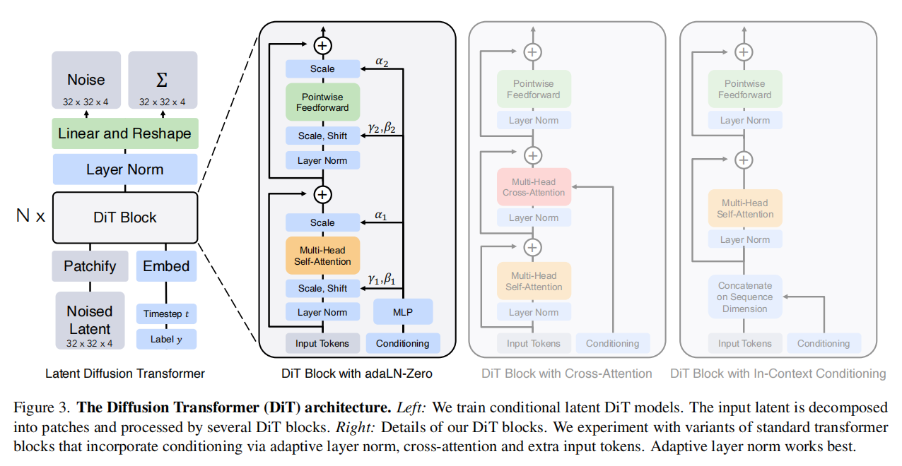
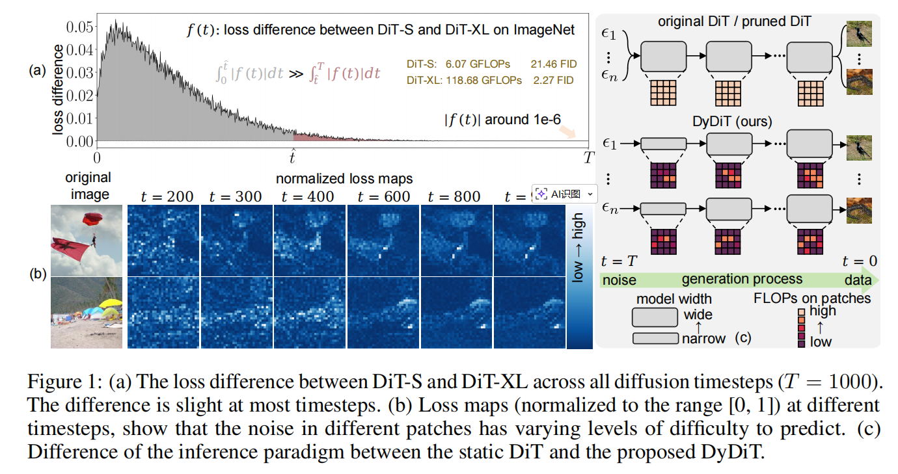
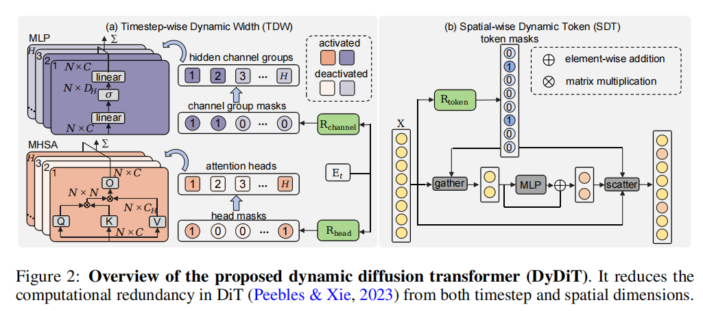

---

date: 2025-10-16
category:
  - 码头
  - 长见识
tag:
  - 通识

---
# Diffusion演化进程

## [Auto-Encoding Variational Bayes(VAE) [ *ICLR 2014* ]](https://arxiv.org/abs/1312.6114)

x 分布：真实的图片分布$p(x)$，无法估计

z 分布：$N(0,1)$

$q(z|x)$:Encoder 将图片分布映射到高斯分布

$p(x|z)$:Decoder 将高斯分布映射到真实图片分布

目标是最大化ELBO：

$$
\underbrace{\mathbb{E}_{q_\phi(z|x)}[\log p_\theta(x|z)]}_{\text{reconstruction term}}
\;-\;
\underbrace{D_{\mathrm{KL}}\big(q_\phi(z|x)\,\|\,p(z)\big)}_{\text{prior matching term}}
$$

其中：
- 重构项（reconstruction term）：衡量解码器重建输入的能力，也就是说解码器能否把压缩后的隐变量重新还原出原始输入；
- 先验匹配项（prior matching term）：通过 KL 散度约束隐变量分布接近先验分布，表示将图片映射到的分布约束成一个高斯分布让潜变量的分布更“规整”。

VAE的概念是将图片输入到一个 Encoder 里面使其映射到 Latent Space 再通过 Decoder    尽可能还原成原来的图片

## [Neural Discrete Representation Learning(VQ-VAE) [ *NeurIPS2017* ]](https://arxiv.org/abs/1711.00937)

对于图片来说，可能并不需要一个完整的高斯分布来表征整个的图片数据分布，由此VAE -> VQ ( **V**ecotr **Q**uantization 向量离散化 )-VAE：将VAE中整个高斯分布空间离散化成若干个空间的点（下图中的Embeding Space）

目标函数：
$$
L = \log p(x \mid z_q(x))
+ \| \operatorname{sg}[z_e(x)] - e \|_2^2
+ \beta \| z_e(x) - \operatorname{sg}[e] \|_2^2
$$

其中：
- $\log p(x \mid z_q(x))$：表示重构项，衡量解码器在给定量化后的隐变量 $z_q(x)$ 时，能否准确重建输入 $x$
- $\| \operatorname{sg}[z_e(x)] - e \|_2^2$：只用于更新codebook的 $e$，不反向传播到编码器，目的是让 $e$ 靠近编码器输出 $z_e(x)$
- $\beta \| z_e(x) - \operatorname{sg}[e] \|_2^2$：只更新编码器，约束编码器的输出不要频繁跳变，使其贴近量化后的 $e$

训练过程：
- encoder、decoder与VAE类似
- codebook：通过最小化 $z_e(x)$ 以及 $e_k$ 的 $L_2$-NORM

生成过程：VQ-VAE训练PixelCNN(自回归模型)作为Prior用来拟合 $p(z)$，通过 $p(z)$ 就能自回归采样得到 $z_q$，自回归的过程类似于gpt生成文本的过程，也就是已知 $z_q$ 前面的一部分特征 $z_{1:i}$,，预测并采样下一个特征 $z_{i+1}$。Prior模型生成的 $z_q$ 输入到decoder后便可生成图片$x'$

## [Generating Diverse High-Fidelity Images with VQ-VAE-2 [ *NeurIPS 2019* ]](https://arxiv.org/abs/1906.00446)

在VQ-VAE上加了多尺度的codebook，通过两层级联的方式让生成的图片分辨率更高

首先在top-level上自回归生成初始特征(不具备实际意义，人眼看上去并不是一张图片)作为bottom-level的condition。因此在生成图片的时候不仅考虑到之前的 $z_{1:i}$，还有top-level生成的的特征图

## [Zero-Shot Text-to-Image Generation (DALL-E) [ *2021* ]](https://arxiv.org/abs/2102.12092)

DALL-E沿用了VQ-VAE两阶段模型训练的范式：
- stage1：训练Encoder、Decoder，得到图像的codebook(size：512 -> 8192)
- stage2：训练Prior(PixelCNN -> 12B基于transformer的自回归模型(GPT))

Prior改进：图像单模态 -> 文本图像多模态

Reranking：同一个text生成多张图片，根据CLIP-score筛选得到好的生成结果

## [Denoising Diffusion Probabilistic Models (DDPM/Diffusion) [ *NIPS 2020* ]](https://arxiv.org/abs/2006.11239)

本节搬运于台大李宏毅教授的[Diffusion model原理解析](https://www.youtube.com/playlist?list=PLJV_el3uVTsNi7PgekEUFsyVllAJXRsP-)，diffusion公式推到可以参照[Understanding Diffusion Models: A Unified Perspective](https://arxiv.org/abs/2208.11970)

概念讲解：

模型内部中不用End2End直接产生去噪后的图片而是用Noise Predicter预测噪声后去噪是因为直接产生图片的难度可能太大，而通过预测噪声再去噪的间接方式能让整个pipeline更加平滑

图文匹配数据集对来源于[laion数据集](https://laion.ai/blog/laion-5b/)。
最终Noise Predicter的输入为：
- 当前的噪声图片
- 原始图像对应的caption
- step number：当前是第几次加噪

Ground Truth为本次添加的噪声

T越大加上的噪声越多

## [High-Resolution Image Synthesis with Latent Diffusion Models (Stable Diffusion) \[ *CVPR Oral 2022* \]](https://arxiv.org/abs/2112.10752)

 本节搬运于台大李宏毅教授的[Diffusion model原理解析](https://www.youtube.com/playlist?list=PLJV_el3uVTsNi7PgekEUFsyVllAJXRsP-)

 

 

  其中三个模块是分开训练

 **Decoder训练**

**Generation model训练**

**评价指标：**

- FID来 源于[Fréchet Inception Distance (FID)](https://arxiv.org/abs/1706.08500)

- CLIP-Score 来源于 [Learning Transferable Visual Models From Natural Language Supervision (CLIP)](https://arxiv.org/abs/2103.00020)

## [Scalable Diffusion Models with Transformers (DiT) \[ *ICCV Oral 2023* \]](https://arxiv.org/abs/2212.09748)

**代码仓库：** https://github.com/facebookresearch/DiT

**MOTIVATION：** 本文验证了卷积U-Net并非是影响扩散模型性能的关键因素，并探索了Transformer作为扩散骨干网络的可行性

<b> 本文核心方法：</b>

**Patchify:** DiT 的输入为空间表征 𝑧（对 256 × 256 × 3 的图像，𝑧的形状为32×32×4）。“patchify”将空间输入切分并线性嵌入为长度为 𝑇 的 token 序列。

**DiT block:**
- **上下文内条件（In-context conditioning）：** 将𝑡 与 𝑐 的向量嵌入作为两个额外 token 直接拼接到输入序列中，与图像 token 一视同仁处理。这有点类似于 ViT 的 cls token，可直接使用标准 ViT block 而无需修改；在最后一个 block 后再移除条件 token。该设计将条件当成“序列里的特殊词”，靠自注意力与图像 token 交互来传递条件影响。因此几乎不引入额外 Gflops。

- **交叉注意力 block（Cross-attention block）：** 将 𝑡 与 𝑐 的嵌入拼接为长度为2的独立序列，与图像 token 序列分开；在 self-attention 后新增一层 multi-head cross-attention（类似 Transformer 的原始设计，图像 token 作为 query，条件 token 作为 key/value，让图像特征显式“读取”条件信息）。交叉注意力会带来最多的 Gflops，约增加 15% 的开销。

- **自适应层归一化（Adaptive layer norm, adaLN）：** 不再把条件当 token，也不加 cross-attention，而是把标准 LayerNorm 换成 adaLN。由 (𝑡,𝑐)的嵌入向量（通常是相加后）通过一个小网络回归出该层的缩放 𝛾 与平移 𝛽 ；由 𝛾 与 𝛽 去调制 LayerNorm 的输出（相当于对所有 token 做同一种条件化的仿射变换）。也就是说这里的条件不是“参与注意力”，而是“调节每层的归一化”（类似很多扩散 U-Net / 条件 GAN 的条件注入习惯），但是这样的设计会让条件作用方式过于全局一致

- **adaLN-Zero block：**  在 adaLN 的基础上再回归一组逐维门控/缩放参数 𝛼并把它用在残差分支上；同时将产生 𝛼 的 MLP 零初始化，使得训练开始时 𝛼≈0，从而 每个 block 初始近似恒等映射。该设计进一步解决“训练初期 Transformer 堆叠很深时，如何更稳定、更容易优化”。它让网络从“基本不改动输入”的安全状态开始学，逐步打开残差分支。

本文将上述四类 block 纳入 DiT 设计空间。并且实验结论表明：

1. **Gflops 是决定生成质量（FID）提升的主导变量：** 实验显示，无论通过增大模型规模（更深/更宽）还是通过减小 patch size 增加 token 数，只要带来更高的 Gflops，FID 就会在训练过程中持续改善；并且在 Gflops 接近时，不同配置往往得到相近 FID，体现出强相关性

2. **在“怎么把条件喂给模型”上，adaLN-Zero 是关键设计点：** 四种 block 对比中，adaLN-Zero在计算效率最高的同时取得最低 FID，并显著优于普通 adaLN（说明“恒等初始化/零初始化残差”对训练与效果很关键）；后续所有实验都固定采用该设计。

3. **采样步数更多”无法替代“模型更强：** 即便给小模型增加采样步数、投入更多采样阶段计算量，整体仍难以追上大模型；结论是训练得到的高 Gflops 模型能力不可由采样阶段加计算完全弥补。

## [DyDiT_Dynamic Diffusion Transformer (DyDiT) \[ *ICLR 2025* \]](https://arxiv.org/abs/2410.03456)

**代码仓库：** https://github.com/NUS-HPC-AI-Lab/Dynamic-Diffusion-Transformer

**MOTIVATION：** 本文聚焦于 DiT 生成过程中的两类结构性冗余：
- 不同扩散时间步的噪声预测难度并不一致，但 DiT 却在所有时间步使用同一套计算规模；
- 同一时间步内不同空间 patch 的预测难度也不均衡，却被统一“等算力”处理。

基于此，本文要解决的问题可概括为：在不显著牺牲生成质量的前提下，让 DiT 的计算资源随时间步与空间区域的真实难度自适应分配。

图1(a)表示在更后期的时间步，预测任务会逐渐变得更容易，即便更小的模型也能有效处理。然而，DiT 在所有时间步都使用相同架构，导致在任务复杂度较低的时间步产生过高的计算成本。

图1(b)表示噪声预测的难度会随空间区域而变化。因此，对所有 patch 进行一致的计算处理会引入冗余，并很可能不是最优策略。

<b> 本文核心方法：</b>

- **按时间步动态宽度（Timestep-wise Dynamic Width, TDW）：** 作者在每个 Transformer block 里加了两个很轻量的“开关控制器”（router），它们只看当前时间步的嵌入向量 $E_t$，就能给出一组介于 0 到 1 的分数，分别表示每个注意力头、每个 MLP 通道组在这个时间步“需要被用到”的概率。然后用一个简单阈值（例如 0.5）把这些分数二值化（为 1 的头/通道组就参与计算，为 0 的就直接跳过）。这样一来，在更容易的时间步，模型会自动激活更少的注意力头和通道组；在更难的时间步，激活更多，从而实现“随时间步变化的宽度”。更关键的是，这种开关只依赖时间步而不依赖具体样本，因此训练完成后可以把每个时间步到底开哪些头、哪些通道组提前离线算好并固定下来。部署时，相当于每个时间步用一套预先确定的子网络做推理，避免了传统动态网络那种“每个样本结构都不一样”导致的 batch 难加速问题，因此更容易获得真实的硬件加速收益。

- **按空间动态 Token（Spatial-wise Dynamic Token, SDT）：** SDT 解决的是“同一时间步里，不同图像区域的计算也不该一刀切”的问题：主体区域往往更难、背景区域往往更容易，如果对每个 patch 都做同等强度的计算，就会把大量算力浪费在本来就简单的背景上。为此，作者在每一层的 MLP 之前加了一个 token 路由器，它直接看这一层的 token 特征 𝑋，为每个 token 预测一个“是否需要进入 MLP 进一步处理”的概率，再用阈值得到 0/1 决策：为 1 的 token 才送进 MLP，为 0 的 token 直接绕过 MLP（相当于不对它做这部分昂贵计算）。推理时为了真正省算力，不是把不用的 token 也丢进 MLP 再乘 0，而是先把需要计算的 token “挑出来”（gather）组成更小的集合送入 MLP，算完后再把结果“放回原位”（scatter）。作者强调 SDT 只作用在 MLP，而不去跳过注意力层：因为注意力层负责 token 之间的信息交互，跳过它更容易伤害生成质量；并且注意力层若 token 数在 batch 内变化，会让张量形状不一致，反而影响吞吐。由于 MLP 本身不需要 token 之间交互，gather/scatter 的开销又很小，所以 SDT 可以在不明显破坏 batch 推理效率的前提下，减少大量“空间上不必要”的计算。

::: details 微调稳定化（Fine-tuning stabilization）：

实践中，作者发现直接用 𝐿 微调 DyDiT 可能偶尔不稳定。为此采用两项稳定化策略：

1. Warm-up 阶段：先保持一个完整的 DiT 模型在相同扩散目标下监督训练，在总损失 𝐿 外额外加入 $L^{complete}_{DiT}$,完成 warm-up 后移除该项，再仅用 𝐿 继续训练。

2. 保证最关键组件始终激活：在微调前，根[据幅值准则](https://proceedings.neurips.cc/paper/2017/hash/8a1d694707eb0fefe65871369074926d-Abstract.html)对 MHSA 的注意力头与 MLP 的隐藏通道进行重要性排序；在 TDW 中始终选择最重要的那个头与通道组，确保在所有时间步、每个 MHSA/MLP 中至少有 1 个头与 1 个通道组被激活，从而缓解不稳定。

:::