---

date: 2025-10-16
category:
  - 码头
  - 长见识
tag:
  - 通识

---
# Diffusion演化进程

## [Auto-Encoding Variational Bayes(VAE) [ *ICLR 2014* ]](https://arxiv.org/abs/1312.6114)

x 分布：真实的图片分布$p(x)$，无法估计

z 分布：$N(0,1)$

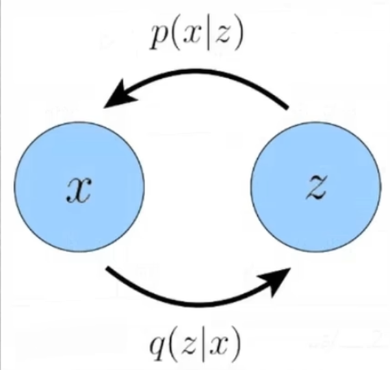

$q(z|x)$:Encoder 将图片分布映射到高斯分布

$p(x|z)$:Decoder 将高斯分布映射到真实图片分布

目标是最大化ELBO：

$$
\underbrace{\mathbb{E}_{q_\phi(z|x)}[\log p_\theta(x|z)]}_{\text{reconstruction term}}
\;-\;
\underbrace{D_{\mathrm{KL}}\big(q_\phi(z|x)\,\|\,p(z)\big)}_{\text{prior matching term}}
$$

其中：
- 重构项（reconstruction term）：衡量解码器重建输入的能力，也就是说解码器能否把压缩后的隐变量重新还原出原始输入；
- 先验匹配项（prior matching term）：通过 KL 散度约束隐变量分布接近先验分布，表示将图片映射到的分布约束成一个高斯分布让潜变量的分布更“规整”。

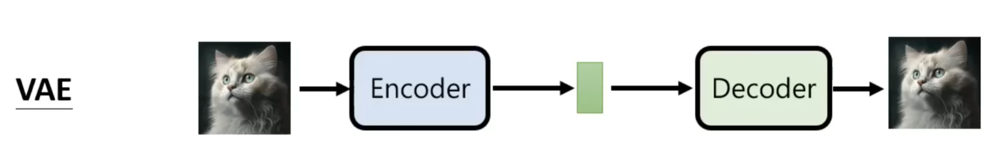

VAE的概念是将图片输入到一个 Encoder 里面使其映射到 Latent Space 再通过 Decoder    尽可能还原成原来的图片

## [Neural Discrete Representation Learning(VQ-VAE) [ *NeurIPS2017* ]](https://arxiv.org/abs/1711.00937)

对于图片来说，可能并不需要一个完整的高斯分布来表征整个的图片数据分布，由此VAE -> VQ ( **V**ecotr **Q**uantization 向量离散化 )-VAE：将VAE中整个高斯分布空间离散化成若干个空间的点（下图中的Embeding Space）

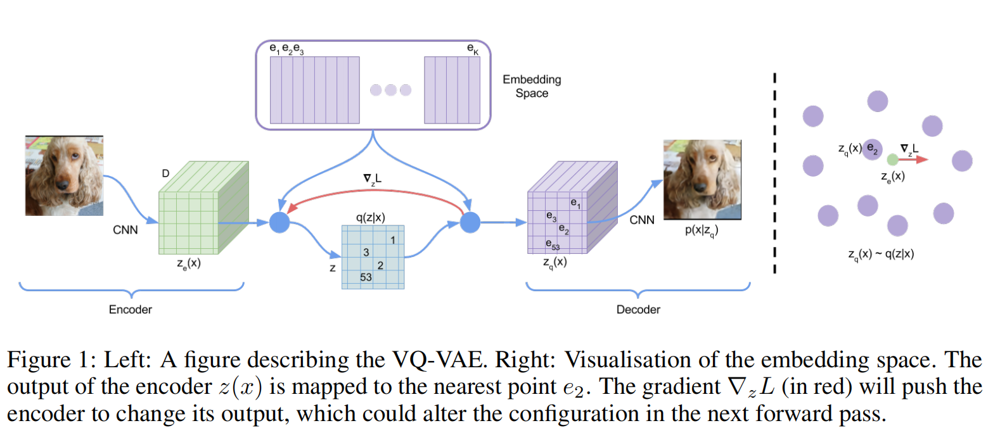

目标函数：
$$
L = \log p(x \mid z_q(x))
+ \| \operatorname{sg}[z_e(x)] - e \|_2^2
+ \beta \| z_e(x) - \operatorname{sg}[e] \|_2^2
$$

其中：
- $\log p(x \mid z_q(x))$：表示重构项，衡量解码器在给定量化后的隐变量 $z_q(x)$ 时，能否准确重建输入 $x$
- $\| \operatorname{sg}[z_e(x)] - e \|_2^2$：只用于更新codebook的 $e$，不反向传播到编码器，目的是让 $e$ 靠近编码器输出 $z_e(x)$
- $\beta \| z_e(x) - \operatorname{sg}[e] \|_2^2$：只更新编码器，约束编码器的输出不要频繁跳变，使其贴近量化后的 $e$

训练过程：
- encoder、decoder与VAE类似
- codebook：通过最小化 $z_e(x)$ 以及 $e_k$ 的 $L_2$-NORM

生成过程：VQ-VAE训练PixelCNN(自回归模型)作为Prior用来拟合 $p(z)$，通过 $p(z)$ 就能自回归采样得到 $z_q$，自回归的过程类似于gpt生成文本的过程，也就是已知 $z_q$ 前面的一部分特征 $z_{1:i}$,，预测并采样下一个特征 $z_{i+1}$。Prior模型生成的 $z_q$ 输入到decoder后便可生成图片$x'$

## [Generating Diverse High-Fidelity Images with VQ-VAE-2 [ *NeurIPS 2019* ]](https://arxiv.org/abs/1906.00446)

在VQ-VAE上加了多尺度的codebook，通过两层级联的方式让生成的图片分辨率更高

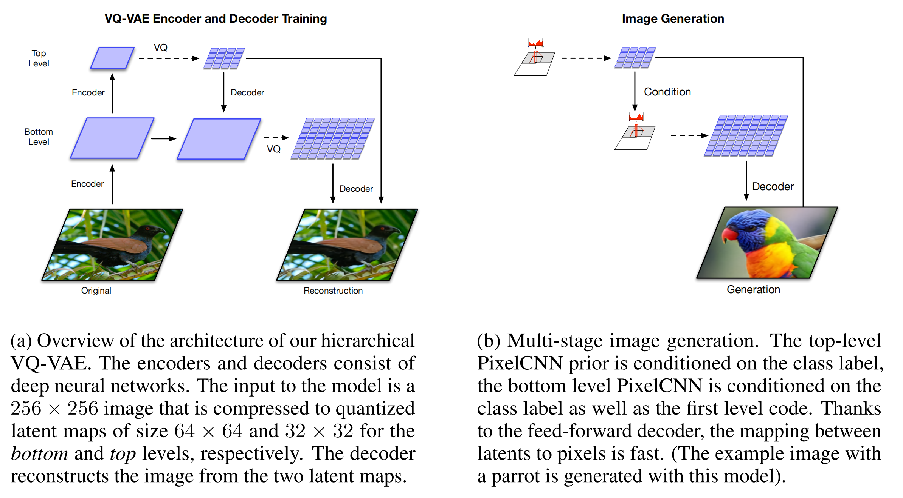

首先在top-level上自回归生成初始特征(不具备实际意义，人眼看上去并不是一张图片)作为bottom-level的condition。因此在生成图片的时候不仅考虑到之前的 $z_{1:i}$，还有top-level生成的的特征图

## [Zero-Shot Text-to-Image Generation (DALL-E) [ *2021* ]](https://arxiv.org/abs/2102.12092)

DALL-E沿用了VQ-VAE两阶段模型训练的范式：
- stage1：训练Encoder、Decoder，得到图像的codebook(size：512 -> 8192)
- stage2：训练Prior(PixelCNN -> 12B基于transformer的自回归模型(GPT))

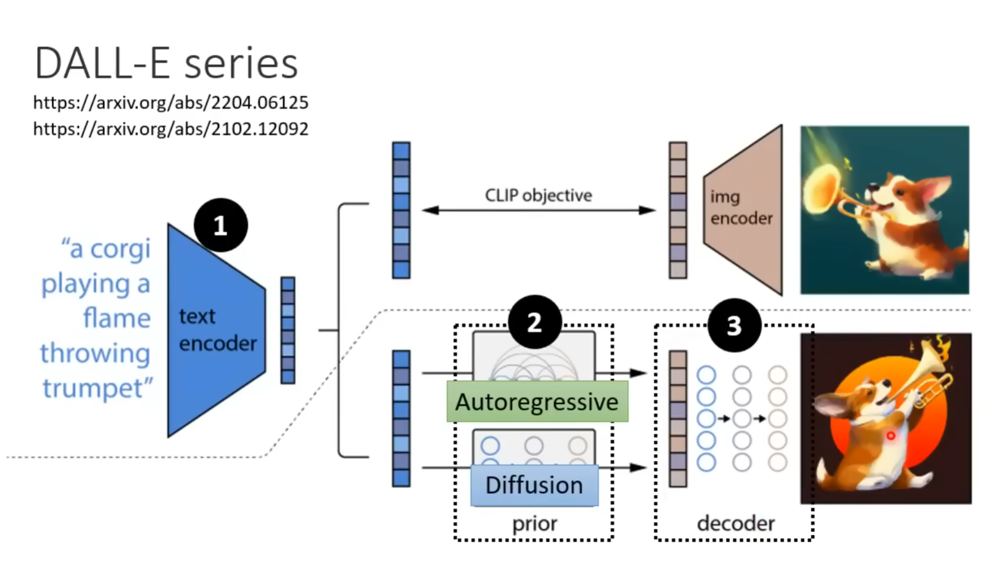

Prior改进：图像单模态 -> 文本图像多模态

Reranking：同一个text生成多张图片，根据CLIP-score筛选得到好的生成结果

## [Denoising Diffusion Probabilistic Models (DDPM/Diffusion) [ *NIPS 2020* ]](https://arxiv.org/abs/2006.11239)

本节搬运于台大李宏毅教授的[Diffusion model原理解析](https://www.youtube.com/playlist?list=PLJV_el3uVTsNi7PgekEUFsyVllAJXRsP-)，diffusion公式推到可以参照[Understanding Diffusion Models: A Unified Perspective](https://arxiv.org/abs/2208.11970)

概念讲解：

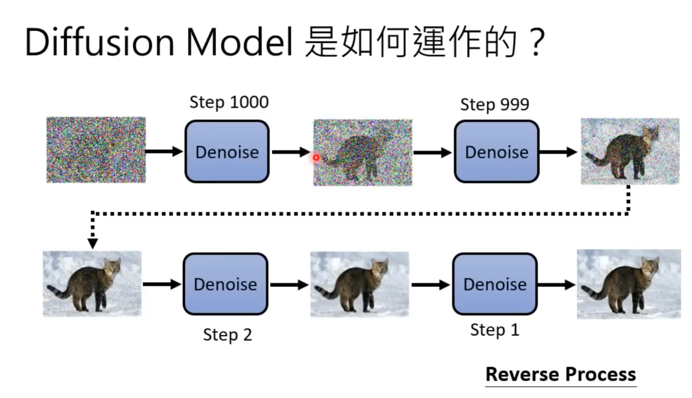

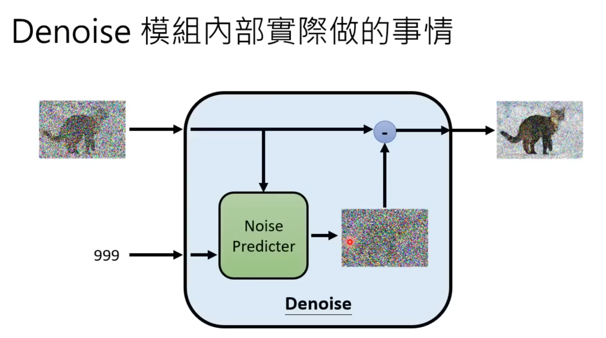

模型内部中不用End2End直接产生去噪后的图片而是用Noise Predicter预测噪声后去噪是因为直接产生图片的难度可能太大，而通过预测噪声再去噪的间接方式能让整个pipeline更加平滑

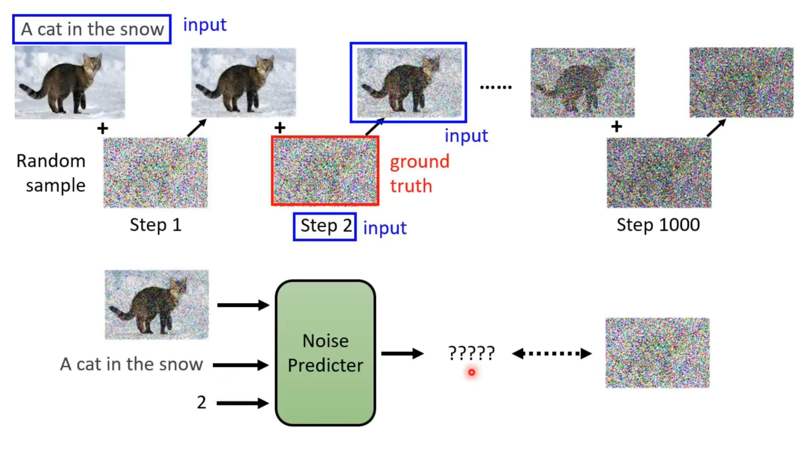

图文匹配数据集对来源于[laion数据集](https://laion.ai/blog/laion-5b/)。
最终Noise Predicter的输入为：
- 当前的噪声图片
- 原始图像对应的caption
- step number：当前是第几次加噪

Ground Truth为本次添加的噪声

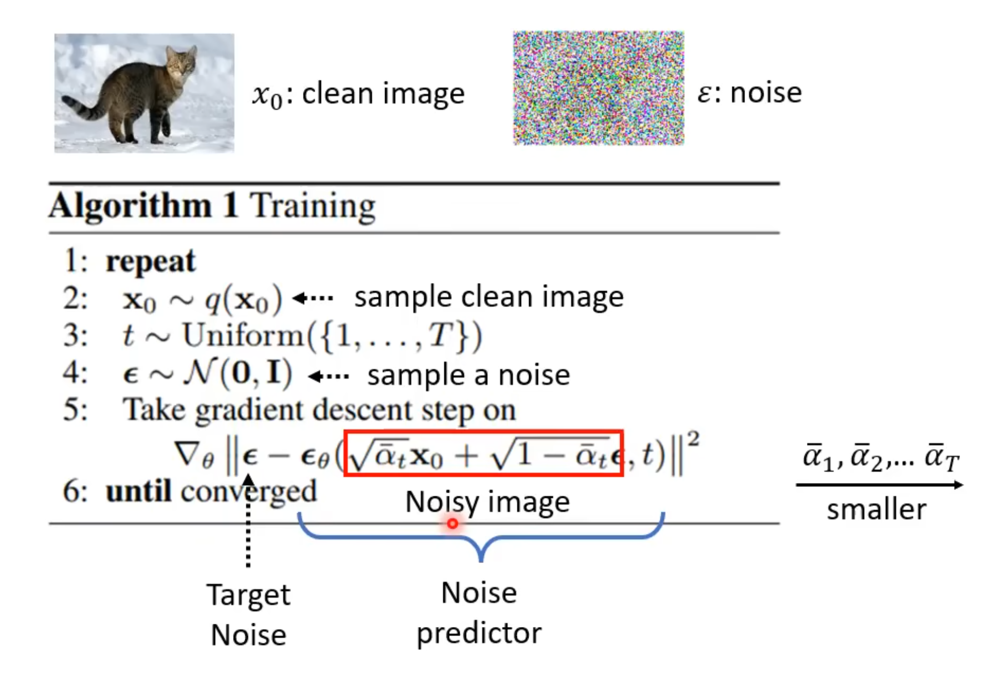

T越大加上的噪声越多

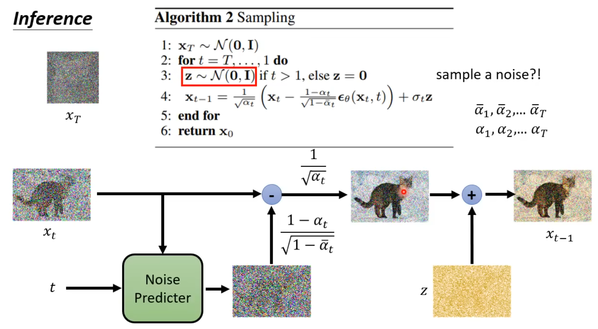

## [High-Resolution Image Synthesis with Latent Diffusion Models (Stable Diffusion) \[ *CVPR Oral 2022* \]](https://arxiv.org/abs/2112.10752)

 本节搬运于台大李宏毅教授的[Diffusion model原理解析](https://www.youtube.com/playlist?list=PLJV_el3uVTsNi7PgekEUFsyVllAJXRsP-)

 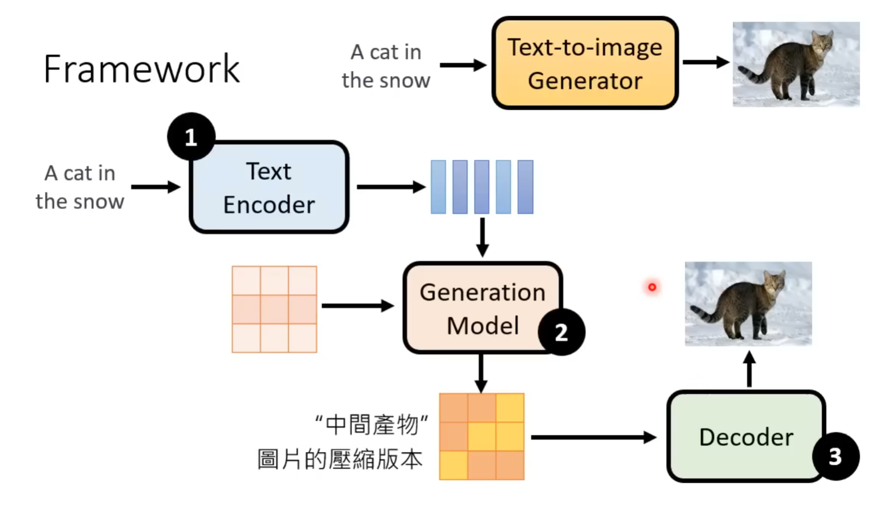

 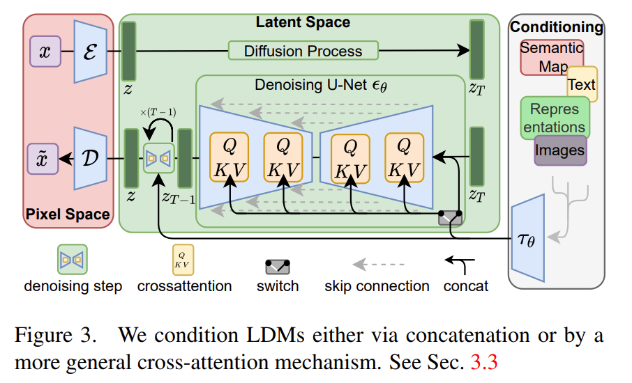

  其中三个模块是分开训练

 **Decoder训练**

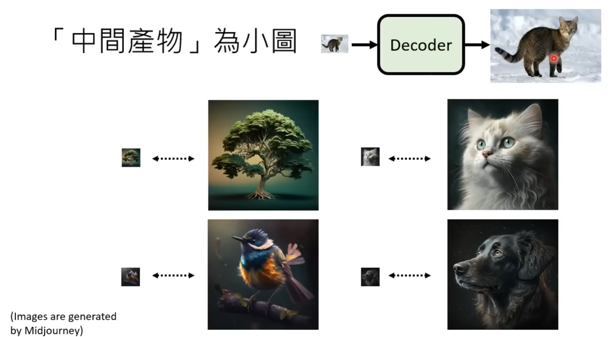

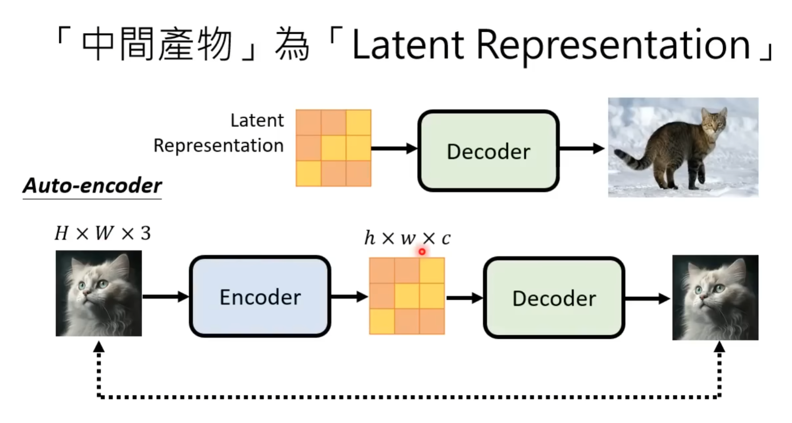

**Generation model训练**

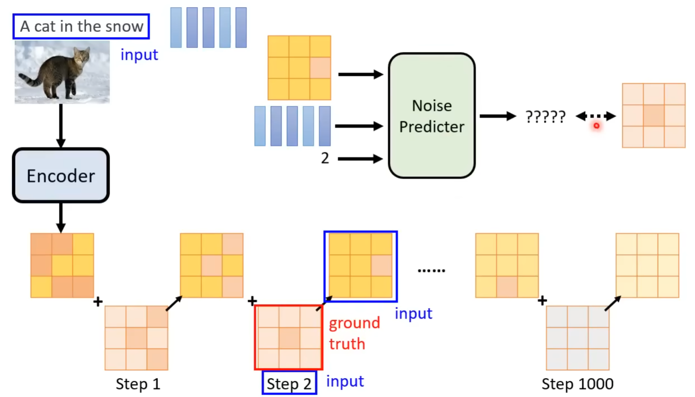

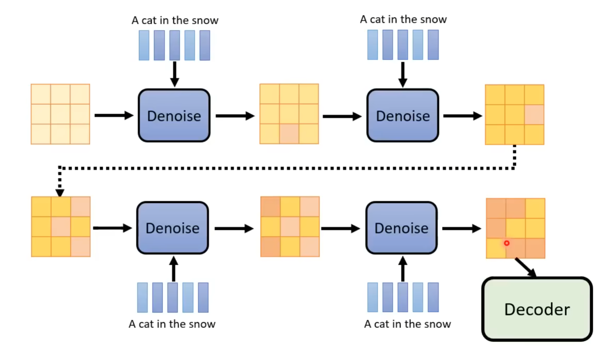

**评价指标：**

- FID来 源于[Fréchet Inception Distance (FID)](https://arxiv.org/abs/1706.08500)

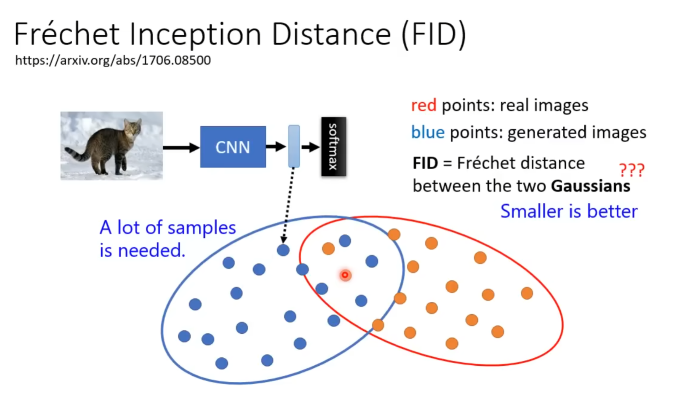

- CLIP-Score 来源于 [Learning Transferable Visual Models From Natural Language Supervision (CLIP)](https://arxiv.org/abs/2103.00020)

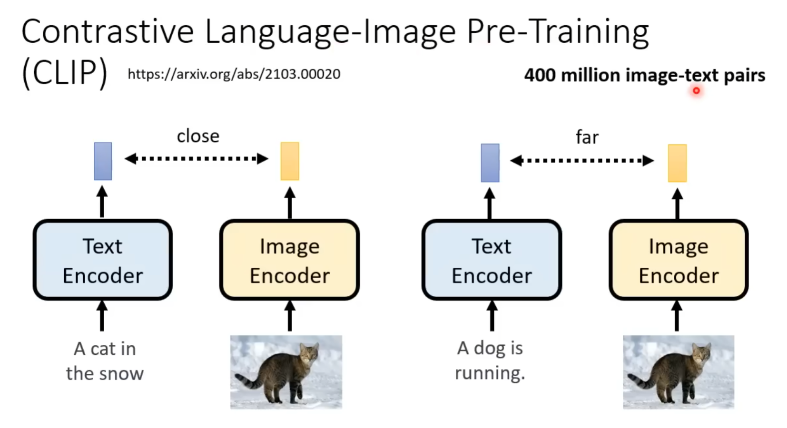

