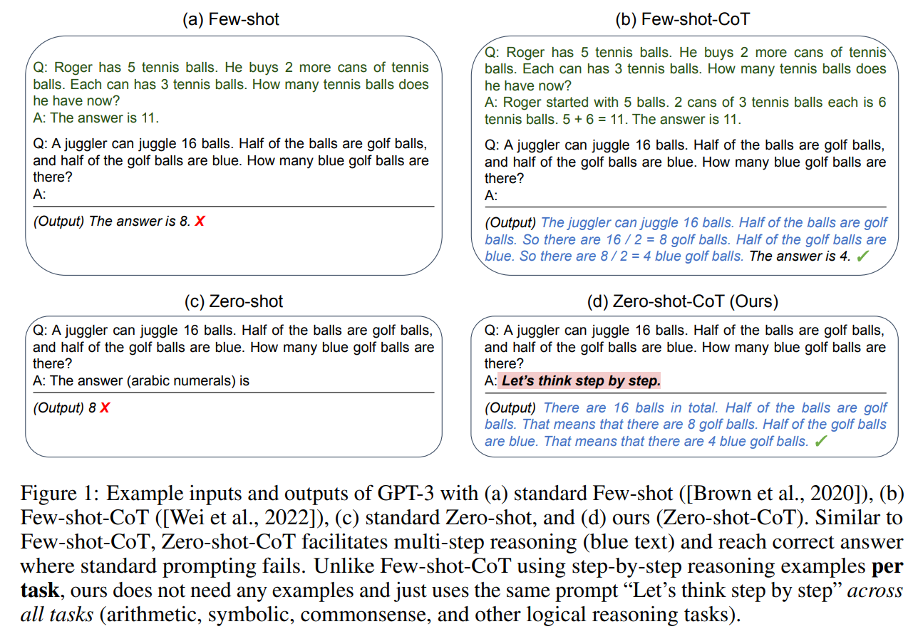
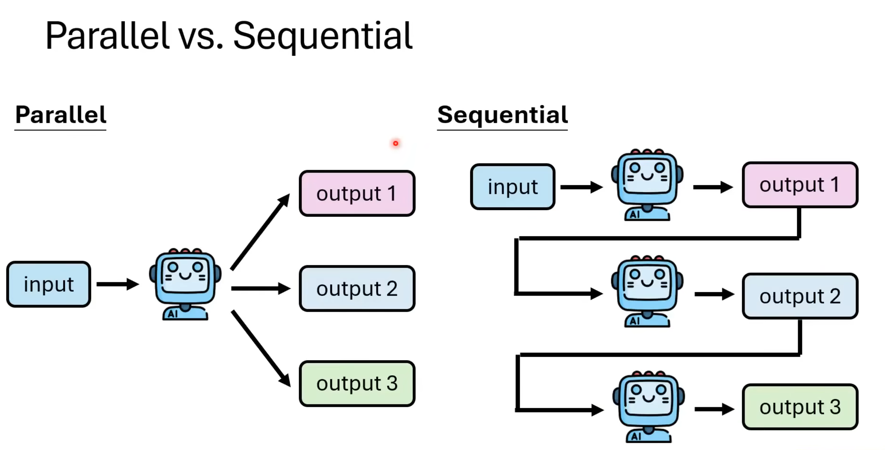
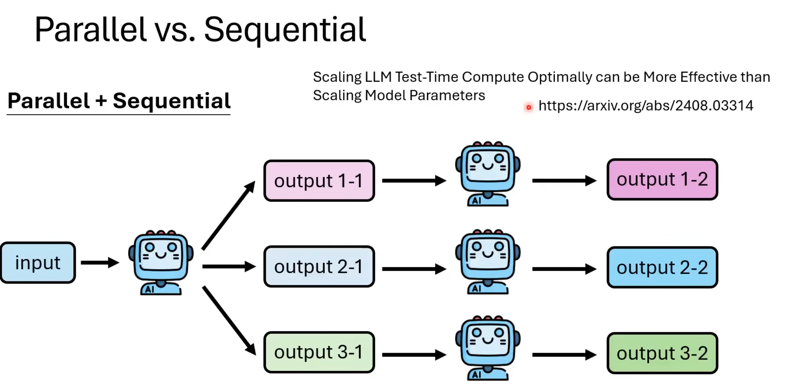
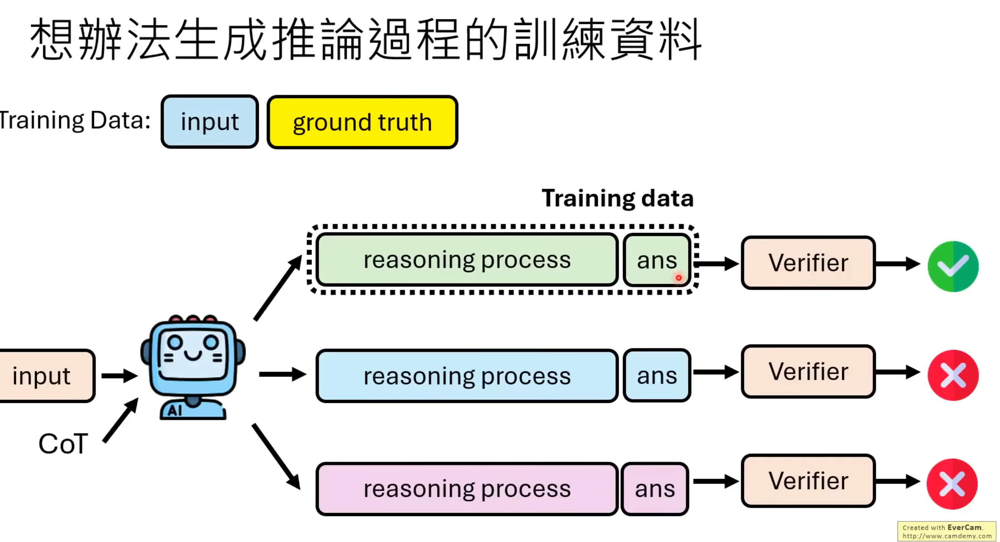
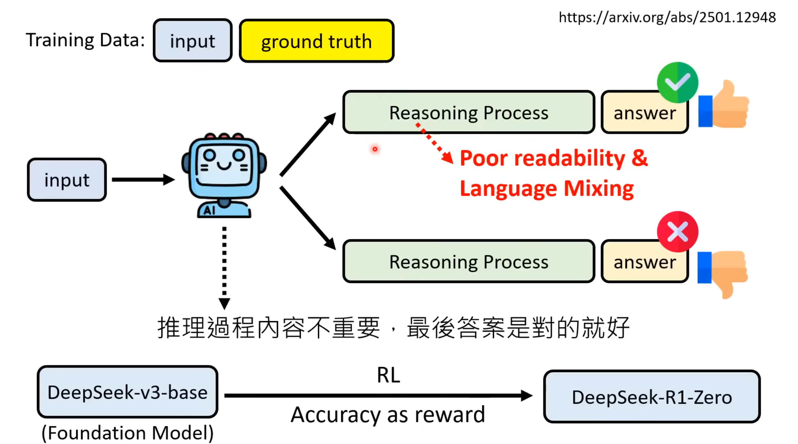
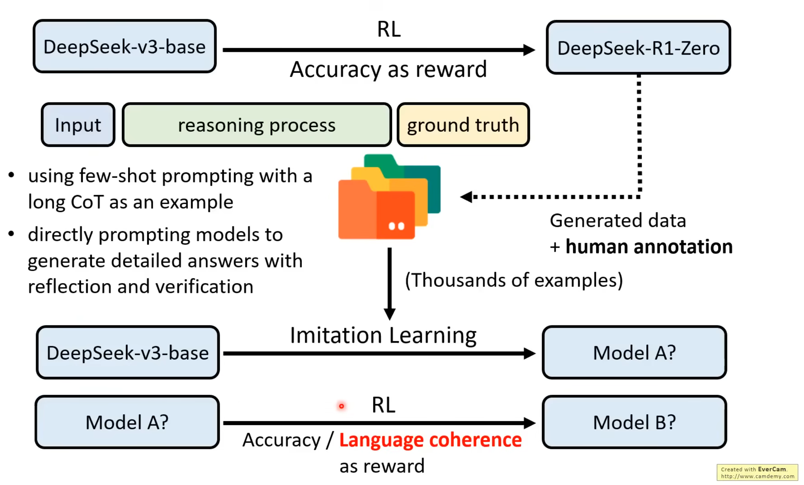

---

date: 2025-10-27
category:
  - 长见识
tag:
  - 通识

---

# 大语言模型如何进行思考(Reasoning)？

## 思维链（Chain-of-Thought，CoT）

**Short CoT：**

[Few-shot CoT](https://arxiv.org/abs/2201.11903)：给定QA的样例

[Zero-shot CoT](https://arxiv.org/abs/2205.11916)：Let's think step by step. 

**Long CoT：** https://arxiv.org/pdf/2503.09567

[Supervised CoT](https://arxiv.org/abs/2410.14198)：告诉模型如何think step by step

## 给模型推论工作流程

1. 通过同一个问题多问几次让模型Explore产生多个output，通过[Majority Vote（Self-consistency）](https://arxiv.org/abs/2203.11171)或者[Confidence（used in CoT decoding）](https://arxiv.org/abs/2402.10200)选定正确答案

1. 用其他的语言模型对每个输出的结果进行Verifier([Best-of-N](https://arxiv.org/abs/2110.14168))得到score

::: details LLM输出多个"结果" [Parallel or Sequential](https://arxiv.org/abs/2408.03314)

:::

## 教师模型推理过程（Imitation/Distill Learning）

 
## 以结果为导向学习推理（Reinforcement Learning，RL）

